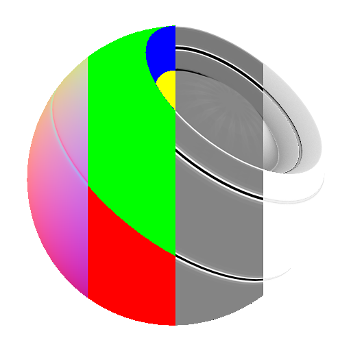

# 网格数据组合器

<table>
<tr style="border: 0;">
<td width="33.33%" style="border: 0;" valign="top">

{width="128px"}

<b>在</b>中基于网格的生成器>实用工具

</td>
<td width="100.00%" style="border: 0;" valign="top">

## 描述

这是一个非常简单的节点，它将烘焙的网格数据“打包”到一个组中，以便与“压缩材质模式”一起使用。

此节点主要是一个助手，可以更轻松地在库中的某些节点上处理大量烘焙输入，如[材料网格数据混合器](../../../../../../compositing-graphs/nodes-reference-for-com/node-library/mesh-based-generators/utilities-mesh-based-gen/material-mesh-data-ble/material-mesh-data-blender.md)。 这样，您就可以避免手动连接所有设备。

</td>
</tr>
</table>

## 参数

切换要启用哪些映射输入并输出到打包结果中。

|  |  |
|:---|:---|
| <b>Ambient occlusion</b> <i>False/True</i> |  |
| <b>UV 蒙版</b> <i>False/True</i> |  |
| <b>弯曲</b> <i>False/True</i> |  |
| <b>Height</b> <i>False/True</i> |  |
| <b>位置（灰度）</b> <i>False/True</i> |  |
| <b>Thickness</b> <i>False/True</i> |  |
| <b>正常</b> <i>False/True</i> |  |
| <b>位置(RGB)</b> <i>False/True</i> |  |
| <b>颜色ID</b> <i>False/True</i> |  |
| <b>世界空间方向</b> <i>False/True</i> |  |
| <b>世界空间正常</b> <i>False/True</i> |  |
