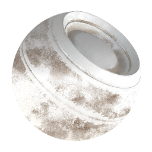

# 织物风化

<table>
<tr style="border: 0;">
<td style="border: 0;" valign="top">

{width="128px"}

## 织物风化

**在：** *基于网格的生成器**/Weathering*

**复杂**

</td>
<td style="border: 0;" valign="top">

## 描述

这是一种同时适用于多个通道的完全素材效果。 它增加了随机织物磨损效果，并控制其年龄和污浊度。\
除非插入了适当的烘焙AO和世界空间正常映射，否则此效果不会非常好，因为它需要这些函数来充分计算和生成所有内容。

在使用完整素材时，请确保完全了解[链接创建模式](../../../../../../interface/the-graph-view/link-creation-modes/link-creation-modes.md)。

## 参数

### 输入

* **环境遮蔽**： *灰度输入*\
  用于内部效果和蒙版的已烘焙贴图。
* **普通Wold空间**： *颜色输入*
* **蒙版** ：*灰度输入*\
  用于遮盖节点效果的遮罩槽。 可以使用“Mask”参数切换。

### 参数

* **频道**
  * 在此组中打开和关闭素材通道，例如，在使用“Specular/光泽度”映射而非“金属/粗糙度”时。
* **高级**
  * **普通格式**： *DirectX，OpenGL*\
    在不同正常映射格式之间切换（反转绿色通道）。
  * **蒙版**： *False/True*\
    启用或禁用蒙版图。
* **效果**
  * **Dust**： *0.0 - 1.0*&#x200B;根据世界空间正常映射中正对着的区域混合形成较暗的Dust效果。
  * **污迹**： *0.0 - 1.0*&#x200B;在全球Dirt/涂抹效果中混合，主要基于AO中遮蔽（深色）的区域。
  * **边缘磨损**： *0.0 - 1.0*&#x200B;根据“材质正常”为边缘添加锐化/强化效果。
  * **已使用**： *0.0 - 1.0*&#x200B;基于AO以折线形式混合在非常暗的累积Dirt中。 “最大值”和“最小值”往往非常极端，请谨慎使用这些值。
  * **年龄**： *0.0 - 1.0*&#x200B;混合于全局拼贴磨损模式。 下面的Treshold控件控制AO影响。 最大值和最小值往往非常极端。
  * **年龄阈值**： *0.0 - 1.0*&#x200B;设置AO影响Age参数的程度。
  * **年龄皱褶**： *0.0 - 1.0*&#x200B;控制年龄效果中其他细微皱褶的混合。
  * **锐边Scratches比例**： *1.0 - 32.0*&#x200B;设置小划痕的比例，这些小划痕主要刮掉“使用”和“老化”效果。
  * **锐边Scratches变形强度**： *0.0 - 1.0*&#x200B;为上述小划痕设置变形强度。
  * **旧结构饱和度降低**： *0.0 - 1.0*&#x200B;控制老化效果的饱和度降低。
  * **旧结构亮度**： *0.0 - 1.0*&#x200B;控制老化效果的亮度。 *这是用来更改以获得您喜欢的外观的一个非常重要的参数，但结果可能极端：与细微更改一起使用。*
* **混合**
  * **扩散强度**： *0.0 - 1.0*\
    扩散的混合强度。
  * **基色强度**： *0.0 - 1.0*\
    混合基色的强度。
  * **正常强度**： *0.0 - 1.0*\
    混合“正常”的强度。
  * **Specular强度**： *0.0 - 1.0*\
    混合Specular的强度。
  * **光泽强度**： *0.0 - 1.0*\
    混合光泽度的强度。
  * **粗糙度强度**： *0.0 - 1.0*\
    混合粗糙度的强度。
  * **环境遮蔽强度**： *0.0 - 1.0*\
    混合环境遮蔽的强度。
  * **Height强度**： *0.0 - 1.0*\
    混合Height的强度。

## 示例图像

</td>
</tr>
</table>
