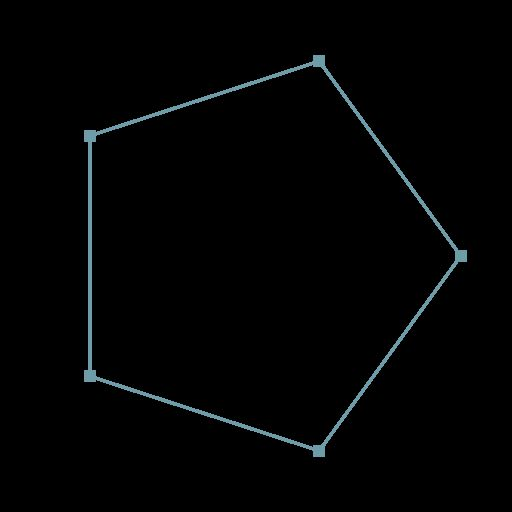

# 路径二维变换

<table>
<tr style="border: 0;">
<td width="33.33%" style="border: 0;" valign="top">

<b>在：</b>样条和路径工具>路径工具

</td>
<td width="100.00%" style="border: 0;" valign="top">

## 描述

使用线框变换路径。

</td>
</tr>
</table>

## 输入连接器

<b>路径</b> *颜色*\
已编码段路径的列表。 将此输入连接到[路径蒙版](../../../../../../compositing-graphs/nodes-reference-for-com/node-library/spline-paths-tools/path-tools/mask-to-paths/mask-to-paths.md)的结果或连接到另一个路径处理节点。

## 输出连接器

<b>路径</b> *颜色*\
变换后的路径。 您可以使用[预览路径](../../../../../../compositing-graphs/nodes-reference-for-com/node-library/spline-paths-tools/path-tools/preview-paths/preview-paths.md)了解结果所代表的内容，使用其他路径处理节点，或将其输入到[样条路径](../../../../../../compositing-graphs/nodes-reference-for-com/node-library/spline-paths-tools/path-tools/paths-to-spline/paths-to-spline.md)以进一步将其处理为样条。

## 参数

<b>转换矩阵</b> *浮点4*\
应用于样条的变换矩阵。 有三种编辑矩阵参数的模式可用：\
*— 变换Gizmo：*&#x200B;选择“样条2D变换”节点时，调整[2D视图](../../../../../../interface/2d-view/2d-view.md)中显示的Gizmo的手柄；\
*— 旋转/拉伸：*&#x200B;单独控制样条的旋转和拉伸。 请注意，这些值始终相对于当前变换应用。 例如，将50%宽度应用两次会产生25%宽度；\
*— 矩阵值：*&#x200B;单击“<b>编辑矩阵值</b>”按钮可直接输入矩阵的原始数值。

<b>偏移</b> *浮点2*\
将位置偏移应用于X（水平）和Y（垂直）中的样条。

## 示例

<table>
<tr style="border: 0;">
<td style="border: 0;" valign="top">

<table>
  <tr>
    <td>
      
       <i>之前</i>
    </td>
    <td>
      
       <i>之后</i>
    </td>
  </tr>
</table>

</td>
<td style="border: 0;" valign="top">

<table>
  <tr>
    <td>
      
       <i>之前</i>
    </td>
    <td>
      
       <i>之后</i>
    </td>
  </tr>
</table>

</td>
</tr>
</table>
