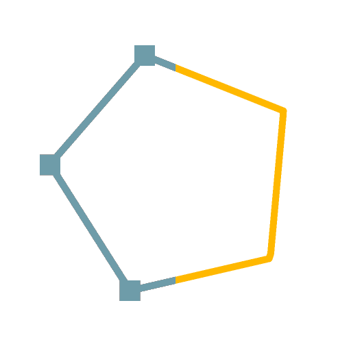

# 样条路径

<table>
<tr style="border: 0;">
<td width="33.33%" style="border: 0;" valign="top">

<b>在：</b>样条和路径工具>路径工具

</td>
<td width="100.00%" style="border: 0;" valign="top">

## 描述

将路径转换为样条，可使用[样条渲染](../../../../../../compositing-graphs/nodes-reference-for-com/node-library/spline-paths-tools/spline-tools/spline-render/spline-render.md)节点对其进行可视化并使用[样条节点](../../../../../../compositing-graphs/nodes-reference-for-com/node-library/spline-paths-tools/spline-tools/spline-tools.md)进行处理。

</td>
</tr>
</table>

>[!NOTE]
>
> 样条是曲线，因此不能保持路径的锐度。 在将路径转换为样条时，预计形状会出现一些平滑效果。

>[!TIP]
>
> 此节点可在[蒙版到路径](../../../../../../compositing-graphs/nodes-reference-for-com/node-library/spline-paths-tools/path-tools/mask-to-paths/mask-to-paths.md)节点之后使用，以形成将蒙版转换为样条的链。

## 输入

|  |  |
|:---|:---|
| <b>路径</b> <i>颜色</i> | 已编码段路径的列表。 将此输入连接到[路径蒙版](../../../../../../compositing-graphs/nodes-reference-for-com/node-library/spline-paths-tools/path-tools/mask-to-paths/mask-to-paths.md)的结果或连接到另一个路径处理节点。 |

## 输出

|  |  |
|:---|:---|
| <b>样条坐标</b> <i>颜色</i> | 以彩色图像的RGBA通道编码的输入样条点的坐标： <b>R</b> - X位置 <b>G</b> - Y位置 <b>B</b> -Height <b>A</b> — 压缩数据：  *符号：样条是闭合（负）或开放（正）；  *绝对值：Thickness+ 1。 |
| <b>样条数据</b> <i>颜色</i> | 以<b>颜色</b>图像的RGBA通道编码的输入样条的其他数据： <b>R</b> -正切X <b>G</b> -正切Y <b>B</b> — 未使用 <b>A</b> — 未使用 |
| <b>样条量</b> <i>整数</i> | 输入样条的数量。 |

## 参数

|  |  |
|:---|:---|
| <b>样条精度</b> <i>整数</i> | 在“路径”输入的每个路径中采样的顶点数的base-2对数(log2)以构建相应的样条。 |

## 示例

<table>
<tr style="border: 0;">
<td style="border: 0;" valign="top">

<table>
  <tr>
    <td>
      
       <i>之前</i>
    </td>
    <td>
      
       <i>之后</i>
    </td>
  </tr>
</table>

</td>
<td style="border: 0;" valign="top">

<table>
  <tr>
    <td>
      
       <i>之前</i>
    </td>
    <td>
      
       <i>之后</i>
    </td>
  </tr>
</table>

</td>
</tr>
</table>
