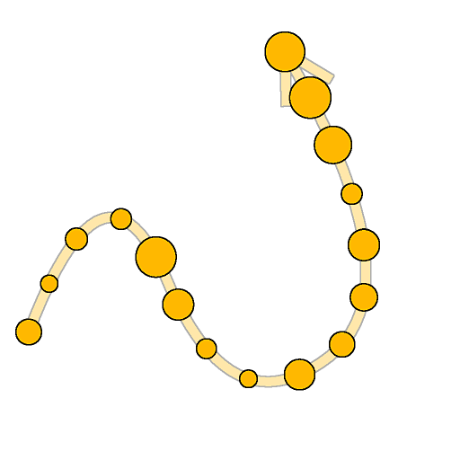

# 样条颜色散点

<table>
<tr style="border: 0;">
<td width="33.33%" style="border: 0;" valign="top">

引入：样条和路径工具>样条曲线工具

</td>
<td width="100.00%" style="border: 0;" valign="top">

## 描述

在输入背景上沿输入样条绘制指定图案。

</td>
</tr>
</table>

该节点提供了深度自定义选项，用于控制图案的分散方式

散射的某些方面可以使用来自图形中其他节点的图像来控制，以进一步改进结果的动态方面。

>[!NOTE]
>
> 另请参阅[样条灰度散点](../../../../../../compositing-graphs/nodes-reference-for-com/node-library/spline-paths-tools/spline-tools/scatter-spline-grayscale/scatter-on-spline-grayscale.md)。

## 输入连接器

<b>背景&#x200B;</b>*灰度*（主要）应在其上绘制样条的灰度图像。

<b>样条坐标&#x200B;</b>*颜色*&#x200B;在彩色图像的RGBA通道中编码的输入样条点的坐标：\
    <b>R</b> - X位置\
    <b>G</b> - Y位置\
    <b>B</b> -Height\
    <b>A</b> — 打包的数据：\
        *符号：样条是封闭的（负）或开放的（正）；\
        *绝对值：Thickness+ 1。

<b>样条数据</b> *颜色*&#x200B;编码在彩色图像的RGBA通道中的输入样条的其他数据。\
<b> R</b> — 切线X\
<b> G</b> — 切线Y\
<b> B</b> — 未使用\
<b> A</b> — 未使用

<b>样条量</b> *整数*&#x200B;输入样条的数量。

<b>模式输入#</b> *灰度*&#x200B;应沿样条散布的图案。

<b>比例图</b> *灰度*&#x200B;控制散布图案比例的地图。 此映射的效果由“比例映射输入乘数”参数控制，并与“大小”组中的其他参数组合。

<b>Height映射</b> *灰度*&#x200B;控制散布图案Height的地图。 此映射的效果由“Height输入乘数”参数控制，并与“颜色”组中的其他“颜色”参数组合。

<b>蒙版图</b> *灰度*&#x200B;控制散布图案蒙版的地图。 此映射的效果由“蒙版映射阈值”参数控制，并与“颜色”组中的其他“蒙版”参数组合。

## 输出连接器

<b>输出</b> *灰度*&#x200B;表示沿输入样条散布在输入背景上的图案的图像。

## 参数

<b>样条输入</b> *整数*&#x200B;选择应该用于散布图案的样条的方法：
* *所有样条*：使用输入列表中的所有样条；
* *单样条*：仅使用输入列表中的指定样条；
* *样条范围*：仅使用输入列表中指定范围内的样条。

<b>样条索引</b> *整数* （“样条输入”设置为“单样条”时可用）应该用于散射模式的样条的列表索引。

<b>样条范围</b> *整数2* （“样条输入”设置为“样条范围”时可用）列表索引的范围，包括应该用于散射图案的样条。

<b>散点模式</b> *整数*&#x200B;沿样条散布图案的方法，该方法影响每个样条上的图案量：
* 形状数量：指定数量的均匀分布图案散布；
* 形状间距：图案数量会自动调整以适应指定的偶数间距。\
  在这两种情况下，第一个和最后一个图案分别精确落在每个样条的起始处和结束处。

<b>形状数量</b> *整数*（在“散点模式”设置为“形状数量”时可用）沿每个样条散布的均匀间隔图案的数量。

<b>沿样条线的形状分布</b> *整数* （当“散点模式”设置为“形状数量”时可用）沿样条分布图案的方法：
* *从源*：图案的间距受样条点的切线影响，在长切线的点附近，图案的形状距离更远；
* *均匀*：图案沿样条均匀分布，无论其切线和轨迹如何。

<b>形状间距</b> *浮点* （“散点模式”设置为“形状间距”时可用）沿样条的最小距离，图案应按此距离隔开，同时仍分别在每个样条的起始处和结尾处固定第一个和最后一个图案。

<b>开始</b> *浮动*&#x200B;从散布开始的样条起点偏移点。 该值是每个样条的规范化长度。

<b>结束</b> *浮动*&#x200B;从散布结束处的样条起点偏移点。 该值是每个样条的规范化长度。

<b>形状透视</b> *浮点2*&#x200B;在样条切空间中偏移图案X和Y的透视。\
由于花键位于花键上，这样有效地沿花键或垂直于花键偏移图案。\
注意：透视的位置会影响“缩放”和“旋转（透视）”参数的效果。

+++图案
<b>图案</b> *整数*&#x200B;应沿样条散布的图案：\
*— 模式输入*：使用提供给“模式输入#”输入的模式；\
* — 方形；
* 磁盘；
* 抛物面；
* 贝尔；
* 高斯；
* 托恩；
* 金字塔；
* 砖块；
* 分级；
* 波浪；
* 半铃响；
* 脊铃；
* 弯；
* 胶囊；
* 圆锥体；
* 渐变w. 偏移；
* 半球。*

<b>模式输入编号</b> *整数*（当“Pattern”设置为“Pattern Input”时可用）选择应分散的输入模式的索引。

<b>模式输入分布</b> *整数* （当“Pattern”设置为“Pattern Input”时可用）用于选择在给定样条上散布哪些输入模式的方法：\
*— 随机*：随机选择了一个图案；\
*— 沿样条*：图案索引沿样条逐渐增加；\
*— 模式索引*：在每个样条上循环输入模式的索引；\
*— 样条索引*：循环访问输入样条列表中一个样条到下一个样条的输入图案索引。

<b>分发抖动</b> *浮点* （当“图案输入分布”设置为“沿样条”时可用）随机增加或减少样条上所选的图案索引。

<b>覆盖第一个模式</b> *布尔值*&#x200B;手动选择应放置在每个样条起始处的图案索引。

<b>第一个模式输入索引</b> *整数* （“覆盖第一个模式”设置为“True”时可用）应放置在每个样条开头的模式的索引。

<b>覆盖最后一个模式</b> *布尔值*&#x200B;手动选择应放置在每个样条末尾的图案索引。

<b>最后一个模式输入索引</b> *整数* （在“覆盖最后一个模式”设置为“True”时可用）应放置在每个样条末尾的模式的索引。

+++

+++重复项
<b>分发模式</b> *整数*&#x200B;用于放置重复图案的方法：\
*— 线性*：副本沿样条法向与图案原始位置均匀隔开；\
*— 圆形*：复制图案沿图案原始位置处以样条为中心的虚拟圆排列。

<b>重复金额</b> *整数*&#x200B;重复的图案数。

<b>偏移</b> *浮点2*（在“分布模式”设置为“线性”时可用）沿样条线的切线（平行）和法向（垂直）对重复项位置应用偏移。\
花键相对侧的重复项沿相反方向移动。

<b>偏移中心</b> *浮点2*（在“分布模式”设置为“线性”时可用）在X（平行）和Y（垂直）上沿样条对副本应用偏移。

<b>扩散角度</b> *浮点*（在“分布模式”设置为“圆形”时可用）虚圆的弧线（副本沿着该弧线分布），该弧线的角度为1，即全圆。

<b>偏移距离</b> *浮点* （在“分布模式”设置为“圆形”时可用）沿其分布副本的虚拟圆的半径。

<b>旋转</b> *浮动*&#x200B;旋转虚圆，副本将沿着虚圆分布。

<b>偏移起始/结束衰减</b> *浮点2*&#x200B;在对副本应用偏移时，考虑从样条的中点到其起点和终点的距离。\
这意味着减少接近样条极端的重复项的偏移。

<b>按Thickness的偏移衰减</b> 对重复项应用偏移时，样条的Thickness中存在&#x200B;*浮点*&#x200B;因素。\
对于具有较低Thickness的花键部分上的重复项，这装置减小了偏移。

+++

+++大小
<b>大小模式</b> *整数*&#x200B;设置散布图案大小的方法：\
*- Normal*：使用全局“Scale”参数统一控制大小；\
*— 使用样条的Thickness*：大小由样条的Thickness驱动。

<b>Thickness影响</b> *整数* （当“大小模式”设置为“使用样条的Thickness”时可用）指定图案的比例的哪个轴应由样条的Thickness驱动：
* X和Y：将Thickness与X轴和Y轴中的大小相乘；
* X：Thickness仅与X轴上的大小相乘；
* Y：仅将Thickness与Y轴上的大小相乘。\
  如果不进行相乘，图案的原始比例将是图像的整个范围。\
  这意味着在“X”模式下，Y轴中的大小是图像的完整范围，需要使用Size参数进行调整。 使用“Y”模式时，这同样适用于X轴中的大小。

<b>大小</b> *浮点2*&#x200B;在使用其他参数执行其他调整之前，图案在X和Y中的原始大小。

<b>大小随机</b> *Float2*&#x200B;将随机乘数应用于指定值，以减小X和Y中的图案大小。

<b>Thickness比例</b> *浮点* （“大小模式”设置为“使用来自样条的Thickness”时可用）由样条的Thickness驱动时，图案比例的附加乘数。

<b>缩放</b> *浮点* （在“大小模式”设置为“正常”时可用）所有图案大小的全局控件，其中1是图像的完整范围。\
相对于图案的透视应用缩放。 可以使用“形状透视”参数偏移中心点位置。

<b>随机缩放</b> *浮动*&#x200B;将随机乘数应用于指定值以减少图案大小。

<b>缩放映射输入乘数</b> *浮动*&#x200B;控制比例图输入的强度。 此映射充当图案当前大小的乘数。\
此映射的效果与“大小”组中的其他参数组合在一起。

<b>缩放输入采样模式</b> *纹理空间*&#x200B;将比例映射中的值映射到样条的方法：\
*— 纹理空间*：这些值将应用于样条，如果使用纹理的UV坐标将这些值放置在纹理中，则将这些值应用于样条。 这有效地将值应用于样条“就位”；\
*— 沿样条水平*：值直接应用于编码样条坐标（请参阅样条坐标输入），其中从上到下每行应用于不同的样条；\
*— 小时。 沿样条线(rand. 偏移X)*：值直接应用于已编码的样条坐标（请参阅样条坐标输入），并且在每个样条的“比例映射”（即，样条坐标中的每一行）中具有随机水平偏移；\
*— 小时。 沿样条线(rand. 偏移Y)*：值直接应用于已编码的样条坐标（请参阅样条坐标输入），并且在每个样条的“比例映射”（即，样条坐标中的每一行）中具有随机垂直偏移。

<b>开始/结束衰减</b> *浮点2*&#x200B;缩放图案时，考虑从样条中点到其起点和终点的距离。\
这意味着对于接近样条四端的图案，其大小会减小。

+++

+++位置
<b>本地偏移</b> *浮点2*&#x200B;沿样条的切线（平行）和法线（垂直）对图案的位置应用偏移。

<b>局部偏移随机</b> *浮点2*&#x200B;沿样条的切线（平行）和法线（垂直）向图案的位置应用额外的随机偏移。

<b>局部偏移随机中心</b> *浮点2*&#x200B;沿样条的切线（平行）和法向（垂直）偏移“局部偏移”随机参数应用的随机偏移的中心。

<b>局部偏移开始/结束衰减</b> *浮点2*&#x200B;将位置偏移应用到图案时，考虑从样条的中点到其起点和终点的距离。\
这意味着对于接近样条极端的图案，偏移被减小。

<b>按Thickness划分的局部偏移衰减</b> 向图案应用偏移时，样条的Thickness中存在&#x200B;*浮点*&#x200B;因素。\
对于具有较低Thickness的花键部分上的重复项，这装置减小了偏移。

<b>样条上的偏移</b> *浮动*&#x200B;沿样条向图案应用位置偏移。

<b>样条上的随机偏移</b> *浮动*&#x200B;向图案沿样条应用额外的位置偏移。

+++

+++旋转
<b>与切线对齐</b> *布尔值*&#x200B;旋转图案以匹配样条在其位置的方向。

<b>旋转（透视）</b> *浮动*&#x200B;围绕图案的透视旋转图案。\
可以使用“形状透视”参数偏移中心点位置。

<b>旋转随机（透视）</b> *浮动*&#x200B;向图案透视周围的图案应用额外的随机旋转。\
可以使用“形状透视”参数偏移中心点位置。

<b>旋转随机中心（透视）</b> *浮动*&#x200B;围绕图案的透视旋转旋转由“旋转随机”参数应用的随机旋转中心。

<b>旋转（居中）</b> *浮动*&#x200B;围绕图案中心旋转图案。

<b>旋转随机（中）</b> *浮动*&#x200B;向图案中心周围的图案应用额外的随机旋转。

<b>旋转随机居中（中）</b> *浮动*&#x200B;围绕图案中心旋转“旋转随机”参数应用的随机旋转中心。

+++

+++颜色
<b>背景颜色</b> *浮点4*&#x200B;输出图像中的背景颜色。

<b>混合模式</b> *整数*&#x200B;将图案的颜色与背景和其他重叠图案混合在一起的方法：\
*— 添加*：将颜色添加在一起；
* *Alpha混合*：使用图案的Alpha通道应用简单的透明度混合。 最后绘制的图案位于前面。

<b>颜色模式</b> *整数*&#x200B;混合选择每个图案颜色的方法：\
*— 基色*：基色应用于所有图案；
* *位置*：纹理空间中图案的位置用于驱动其颜色，以便X和Y坐标分别映射到红色和绿色通道。

<b>形状基色</b> *Float4*&#x200B;图案的基色。

<b>颜色输入乘数</b> *浮动*&#x200B;控制色图输入的强度。 此映射充当图案当前颜色的乘数。\
此映射的效果与“颜色”组中的其他参数组合在一起。\
注意：输出颜色是所有颜色乘数的加权结果。

<b>彩图输入采样模式</b> *整数*&#x200B;将颜色映射中的值映射到样条的方法：\
*— 纹理空间*：这些值将应用于样条，如果使用纹理的UV坐标将这些值放置在纹理中，则将这些值应用于样条。 这有效地将值应用于样条“就位”；\
*— 沿样条水平*：值直接应用于编码样条坐标（请参阅样条坐标输入），其中从上到下每行应用于不同的样条；\
*— 小时。 沿样条线(rand. 偏移X)*：值直接应用于已编码的样条坐标（请参阅样条坐标输入），每个样条在“颜色映射”中具有随机水平偏移（即，样条坐标中的每一行）；\
*— 小时。 沿样条线(rand. 偏移Y)*：值直接应用于已编码的样条坐标（请参阅样条坐标输入），每个样条在颜色映射中具有随机垂直偏移（即，样条坐标中的每一行）。

<b>随机颜色</b> *Float4*&#x200B;将随机偏移（最大为指定值）应用于HSV空间中的图案颜色及其Alpha。\
*注意：*&#x200B;输出颜色是所有颜色乘数的加权结果。

<b>随机颜色中心</b> *浮点*&#x200B;将偏移应用于随机颜色中应用的随机偏移范围\
值–1表示所有随机值都较高，值1表示所有随机值都较低。

<b>样条Thickness乘数</b> *浮动*&#x200B;每个图案的颜色与样条在其位置的Thickness相乘的强度。\
注意：输出颜色是所有颜色乘数的加权结果。

<b>形状缩放乘数</b> *浮动*&#x200B;每个图案的颜色相对于其比例相乘的强度。\
注意：输出颜色是所有颜色乘数的加权结果。

<b>形状索引乘数</b> *浮点*&#x200B;每个图案的颜色与其归一化索引相乘的强度。\
注意：输出颜色是所有颜色乘数的加权结果。

<b>样条Height乘数</b> *浮动*&#x200B;每个图案的颜色与样条在其位置的Height相乘的强度。\
注意：输出颜色是所有颜色乘数的加权结果。

<b>随机明亮度</b> *浮动*&#x200B;将随机乘数应用于指定值，以降低图案的明亮度。\
注意：输出颜色是所有颜色乘数的加权结果。

<b>样条Thickness乘数</b> *浮动*&#x200B;每个图案的Alpha与其所在位置的样条Thickness相乘的强度。\
注意：输出颜色是所有颜色乘数的加权结果。

<b>形状缩放乘数</b> *浮动*&#x200B;每个图案的Alpha与其比例相乘的强度。\
注意：输出颜色是所有颜色乘数的加权结果。

<b>形状索引乘数</b> *浮点*&#x200B;每个图案的Alpha与其归一化索引相乘的强度。\
注意：输出颜色是所有颜色乘数的加权结果。

<b>样条Height乘数</b> *浮动*&#x200B;每个图案的Alpha与其所在位置的样条Height相乘的强度。\
注意：输出颜色是所有颜色乘数的加权结果。

<b>随机明亮度</b> *浮点*&#x200B;将随机乘数应用于指定值，以减少图案的Alpha。\
注意：输出颜色是所有颜色乘数的加权结果。

<b>蒙版随机</b> *浮动*&#x200B;调整图案的随机蒙版范围，其中0表示不遮盖任何图案，1表示所有图案都遮盖。

<b>蒙版映射阈值</b> *浮点*&#x200B;蒙版映射中低于此阈值的值将被处理为黑色，而高于阈值的值将被处理为白色。\
这意味着蒙版图区域中低于此值的所有图案将被遮盖。

<b>蒙版映射输入采样模式</b> *整数*&#x200B;将蒙版映射中的值映射到样条的方法：\
*— 纹理空间*：这些值将应用于样条，如果使用纹理的UV坐标将这些值放置在纹理中，则将这些值应用于样条。 这有效地将值应用于样条“就位”；\
*— 沿样条水平*：值直接应用于编码样条坐标（请参阅样条坐标输入），其中从上到下每行应用于不同的样条；\
*— 小时。 沿样条线(rand. 偏移X)*：值直接应用于已编码的样条坐标（请参阅样条坐标输入），并且在每个样条的“比例映射”（即，样条坐标中的每一行）中具有随机水平偏移；\
*— 小时。 沿样条线(rand. 偏移Y)*：值直接应用于已编码的样条坐标（请参阅样条坐标输入），并且在每个样条的“比例映射”（即，样条坐标中的每一行）中具有随机垂直偏移。

<b>反转蒙版映射</b> *布尔值*&#x200B;使用“减一”操作(1 - x)反转蒙版映射的值。

<b>蒙版反转</b> *布尔值*&#x200B;反转图案的蒙版。

+++

<b>非方形校正</b> *布尔值*&#x200B;调整点的位置以保持样条形状的非方形分辨率。

## 示例

<table>
<tr style="border: 0;">
<td style="border: 0;" valign="top">

<table>
  <tr>
    <td>
      
       <i>之前</i>
    </td>
    <td>
      
       <i>之后</i>
    </td>
  </tr>
</table>

</td>
<td style="border: 0;" valign="top">

<table>
  <tr>
    <td>
      
       <i>之前</i>
    </td>
    <td>
      
       <i>之后</i>
    </td>
  </tr>
</table>

</td>
</tr>
</table>

<table>
<tr style="border: 0;">
<td style="border: 0;" valign="top">

</td>
<td style="border: 0;" valign="top">

</td>
</tr>
</table>
