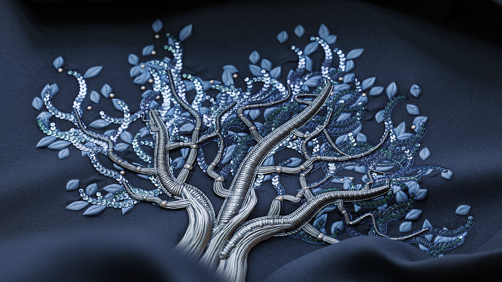

# 样条上的散点样条

<table>
<tr style="border: 0;">
<td width="33.33%" style="border: 0;" valign="top">

<b>In：</b>样条和路径工具>样条曲线工具

</td>
<td width="100.00%" style="border: 0;" valign="top">

## 描述

沿输入父样条放置样条。

该节点提供了深度自定义选项，用于控制样条的分散方式，并允许散点简单的直样条或您自己的自定义样条。

该节点允许您使用[样条映射器](../../../../../../compositing-graphs/nodes-reference-for-com/node-library/spline-paths-tools/spline-tools/spline-mapper-grayscale/spline-mapper-grayscale.md)节点创建用于映射颜色和图像的复杂结构，或使用[样条上的节点](../../../../../../compositing-graphs/nodes-reference-for-com/node-library/spline-paths-tools/spline-tools/scatter-spline-grayscale/scatter-on-spline-grayscale.md)散点用作放置形状的骨架。

</td>
</tr>
</table>

<table>
<tr style="border: 0;">
<td style="border: 0;" valign="top">

### 教程

单击右侧的图像以访问我们的<b>专用教程</b>，以便通过导览了解节点的功能及其在基于样条线的工作流程中的使用情况。

</td>
<td style="border: 0;" valign="top">

</td>
</tr>
</table>

## 输入

|  |  |
|:---|:---|
| <b>预览</b> *灰度* | 以灰度图像形式预览输入样条。 |
| <b>样条坐标</b> *颜色* | 在彩色图像的RGBA通道中编码的父样条点的坐标： <b>R</b> - X位置<b>G</b> - Y位置<b>B</b> -Height<b>A</b> — 压缩数据： — 符号：样条是闭合（负）或开放（正） -绝对值：Thickness+ 1 |
| <b>样条数据</b> *颜色* | 以彩色图像RGBA通道编码的父样条的其他数据： <b>R</b> -正切X <b>G</b> -正切Y <b>B</b> -正切Z <b>A</b> — 未使用 |
| <b>样条量</b> *整数* | 父样条的数量。 |
| <b>自定义样条坐标</b> *颜色* | 在彩色图像的RGBA通道中编码的自定义样条点的坐标： <b>R</b> - X位置<b>G</b> - Y位置<b>B</b> - Height<b>A</b> — 压缩数据： — 符号：样条是闭合（负）或开放（正） — 绝对值：Thickness+ 1 |
| <b>自定义样条数据</b> *颜色* | 在彩色图像的RGBA通道中编码的自定义样条的其他数据： <b>R</b> - Tangents X <b>G</b> - Tangents Y <b>B</b> - Tangents Z <b>A</b> — 未使用 |
| <b>自定义样条量</b> *整数* | 自定义样条的数量。 |
| <b>比例图</b> *灰度* | 灰度图控制散布样条的大小。  此映射的效果由<b>比例映射输入乘数</b>参数控制，并与<b>大小</b>组中的其他参数组合。 |
| <b>旋转贴图</b> *灰度* | 灰度映射控制散布样条的旋转。  此映射的效果由<b>旋转贴图输入乘数</b>参数控制，并与<b>旋转</b>组中的其他参数组合。 |

## 输出

|  |  |
|:---|:---|
| <b>预览</b> *灰度* | 作为灰度图像的散布样条的预览。 |
| <b>样条坐标</b> *颜色* | 在彩色图像的RGBA通道中编码的散射样条点的坐标： <b>R</b> - X位置<b>G</b> - Y位置<b>B</b> - Height<b>A</b> — 压缩数据： — 符号：样条是闭合（负）或开放（正） — 绝对值：Thickness+ 1 |
| <b>样条数据</b> *颜色* | 在彩色图像的RGBA通道中编码的散布样条的其他数据： <b>R</b> - Tangents X <b>G</b> - Tangents Y <b>B</b> - Unused <b>A</b> - Unused |
| <b>样条量</b> *整数* | 散布的样条数。 |

## 参数

|  |  |
|:---|:---|
| <b>侧</b> *整数* | 控制样条应散布在父样条的哪一侧，考虑到“向前”是&#x200B;*父*&#x200B;样条的方向：  -<b>左</b>将样条放在左侧。 -<b>右</b>将样条放在右侧。 -<b>左+右</b>将样条放在两侧。 -<b>左/右 — 替代</b>交替地将样条放在左侧，然后再放在右侧（例如，每隔一个）边)。 - <b>左/右 — 随机</b>为每个样条随机选取边。 |
| <b>数量模式</b> *整数* | 沿父样条散布样条的方法，会影响每个父样条上的散布样条量：  -<b>每个样条固定量</b>散布指定数量的均匀间隔样条。 -<b>间距</b>自动调整样条量以适合指定的均匀间距。  在这两种情况下，第一个和最后一个离散样条分别精确落在每个父样条的起始处和结束处。 |
| <b>每个样条的样条量</b> *整数* | 沿每个父样条散布的均匀间隔样条量。 |
| <b>样条间距</b> *浮动* | 沿父样条的最小距离，样条应按此距离隔开，同时仍在每个父样条的起点和终点分别放置第一个和最后一个样条。 |
| <b>样条类型</b> *整数* | 选择应在父样条上散布哪种类型的样条：   - <b>直线</b>简单、直的样条。 - <b>自定样条</b>为<b>自定样条</b>输入提供的样条。 将多个样条附加到一个列表中时，支持这些样条。 |
| <b>自定义样条选择</b> *整数* | 当使用多个附加在列表中的自定义样条时，此参数允许您选择这些样条在散布中的分布方式。  -<b>整个列表</b>所有样条作为一个组散布在一起。 -<b>顺序</b>每个单独的样条按顺序散布，围绕列表循环。 -<b>随机</b>从列表中为每个散布的样条选取一个随机样条。 |
| <b>开始</b> *浮动* | 从父样条的起始点偏移散布开始处的点。 该值是每个父样条的规范化长度。 |
| <b>结束</b> *浮动* | 从散布结束处的父样条起点偏移点。 该值是每个父样条的规范化长度。 |
| <b>翻转方向</b> *布尔值* | 反转散布样条的方向。 |
| <b>左/右对称模式</b> *整数* | 对称方法应用于散布在父样条每一侧的样条。  -<b>禁用</b>不应用对称，用简单的旋转将样条放置在每一侧。 -<b>左对称</b>左边的样条相对于父样条与右边的样条对称。 -<b>右对称</b>右边的样条相对于左边的样条对称。 |
| <b>左/右随机链接</b> *布尔值* | 控制在使用随机旋转、随机缩放等时，父样条每一侧的样条是否应使用相同的值。换句话说：   - <i>False： </i>每个样条使用单独的随机值 - <i>True： </i>两个样条共享相同的随机值 |
| <b>样条透视模式</b> *整数* | 设置放置散乱样条枢轴的方法，该方法影响旋转和缩放。 请注意，透视&#x200B;*始终位于父样条上*，其控件影响散布样条。 换言之，枢轴不移动，而是相对于其移动和缩放的散布样条。  -<b>沿样条定位</b>沿散布样条移动枢轴。 -<b>绝对位置</b>为枢轴设置任意位置。 |
| <b>沿样条线中心点位置</b> *浮动* | 沿散乱样条线的枢轴归一化位置，其中0是它的起点，1是它的终点。 请注意，枢轴沿离散样条的&#x200B;*方向*，并且样条方向可能改变，以保持枢轴相对于父样条的位置和旋转。 |
| <b>透视绝对位置</b> *浮点2* | 旋转透视表在UV空间中的位置。 |
| <b>非方形校正</b> *布尔值* | 调整样条位置和Thickness以保持其形状在非方形分辨率中。 <i>注意：</i>使用自定义样条时，自定义样条应使用&#x200B;*相同的图像比例*&#x200B;作为<b>样条上的散点</b>节点。 |
| <b>大小</b> |  |
| <b>样条缩放</b> *浮动* | 所有样条大小的全局控件，其中1是其完整的原始大小。 相对于样条轴应用缩放。 可使用<b>样条透视</b>参数偏移该中心点位置。 |
| <b>样条尺度随机</b> *浮动* | 将随机乘数应用到指定值，以减小样条的大小。 |
| <b>缩放映射输入乘数</b> *浮动* | 控制<b>比例图</b>输入的强度。 此映射充当图案当前大小的乘数。 此映射的效果已与<b>大小</b>组中的其他参数组合。 |
| <b>缩放映射输入采样模式</b> *整数* | 将<b>比例映射</b>中的值映射到样条的方法：   - <b>纹理空间</b>这些值将应用于样条，如果使用纹理的UV坐标将这些值放置在纹理中，则将这些值应用于样条。 这有效地将值应用于样条的“原位” -<b>沿样条水平方向</b>该值直接应用于编码后的样条坐标（请参阅<b>样条坐标</b>输入），其中每行从上到下应用于不同的样条 -<b>Hor。 沿样条线(rand. 偏移量X)</b>这些值直接应用于已编码的样条坐标（请参阅<b>样条坐标</b>输入），每个样条在<b>比例图</b>中具有随机水平偏移（即，<b>样条坐标</b>中的每一行） -<b>Hor。 沿样条线(rand. 偏移Y)</b>这些值直接应用于已编码的样条坐标（请参阅<b>样条坐标</b>输入），每个样条在<b>比例图</b>中具有随机垂直偏移（即，<b>样条坐标</b>中的每一行） |
| <b>开始/结束衰减</b> *浮点2* | 缩放样条时，将样条中点到其<b>起始</b>和<b>终点</b>的距离作为因子。 这意味着对于靠近样条四端的样条减小大小。 |
| <b>位置</b> |  |
| <b>本地偏移</b> *浮点2* | 沿父样条的正切（平行）和法向（垂直）向样条位置应用偏移。 |
| <b>样条范围偏移</b> *整数* | 设置沿父代样条应用于散布样条的偏移范围。  - <b>间隔</b>范围跨越每个散布样条&#x200B;*之间的间隔*。 - <b>父代样条</b>范围跨越父代样条的&#x200B;*全长*。 |
| <b>样条上的偏移</b> *浮动* | 沿父样条对样条应用位置偏移。 |
| <b>随机偏移范围</b> *整数* | 设置沿父代样条应用于散布样条的随机偏移范围。  - <b>间隔</b>范围跨越每个散布样条&#x200B;*之间的间隔*。 - <b>父代样条</b>范围跨越父代样条的&#x200B;*全长*。 |
| <b>样条上的随机偏移</b> *浮动* | 沿父样条向样条应用附加的位置偏移。 |
| <b>按Thickness偏移</b> *浮动* | 沿父样条的法线向散布的样条应用偏移，直至父样条Thickness。 实际上，值为1可使您将散布的样条放置在父样条包络的&#x200B;*曲面*&#x200B;上。 |
| <b>旋转</b> |  |
| <b>自定义样条对齐</b> *整数* | 控制自定样条在父样条上的初始方向。  - <b>第一点正切</b>样条根据其第一点的正切进行定向。 换句话说，它们会沿其第一个点设置的方向离开父样条。 - <b>图像空间</b>样条按其最初显示的方式放置，无需对其位置或方向进行额外调整，就好像代表它们的图像停留在父样条上一样。 |
| <b>旋转模式</b> *整数* | 设置散布样条的初始方向。  - <b>从样条</b>样条的方向与父样条&#x200B;*法线*&#x200B;在其位置上的方向一致。 - <b>绝对</b>无论父样条的方向如何，样条都以&#x200B;*相同方式*&#x200B;定向。 |
| <b>旋转</b> *浮动* | 按轮转次数围绕样条旋转样条。 可使用<b>样条透视</b>参数偏移该中心点位置。 |
| <b>旋转随机</b> *浮动* | 将额外的随机旋转应用到绕其轴心的样条上，轮转次数。 可使用<b>样条透视</b>参数偏移该中心点位置。 |
| <b>左/右角度</b> *浮动* | 控制应用于父样条每一侧上的样条的对称旋转角度（按匝数）。 |
| <b>左/右角度随机</b> *浮动* | 在父样条的每一侧上，按匝数向样条添加随机数量的对称旋转。 |
| <b>输入乘数</b>旋转贴图 *浮动* | 控制<b>旋转贴图</b>输入的强度。 此映射充当图案当前旋转的乘数。 此映射的效果与<b>旋转</b>组中的其他参数组合在一起。 |
| <b>输入采样模式</b>旋转贴图 *整数* | 将<b>旋转贴图</b>中的值映射到样条的方法：  - <b>纹理空间</b>这些值将应用于样条，如果使用纹理的UV坐标将这些值放置在纹理中，则将这些值应用于样条。 这有效地将值应用于样条的“原位”， -<b>沿样条水平线</b>这些值直接应用于编码后的样条坐标（请参阅<b>样条坐标</b>输入），其中每行从上到下应用于不同的样条， -<b>Hor。 沿样条线(rand. 偏移X)</b>这些值直接应用于已编码的样条坐标（请参阅<b>样条坐标</b>输入），每个样条的<b>旋转贴图</b>具有随机水平偏移（即，<b>样条坐标</b>中的每一行）。 -<b>小时。 沿样条线(rand. 偏移Y)</b>这些值直接应用于已编码的样条坐标（请参阅<b>样条坐标</b>输入），每个样条的<b>旋转贴图</b>具有随机垂直偏移（即<b>样条坐标</b>中的每一行）<b>。</b> |
| <b>输入影响旋转贴图</b> *整数* | 选择受<b>旋转贴图</b>：  -<b>样条旋转</b>影响的旋转参数映射影响样条顺时针全局旋转。 -<b>左/右角度</b>映射影响<b>左/右</b>样条对称旋转。 |
| <b>Height</b> |  |
| <b>启动Height模式</b> *整数* | 计算散布样条起始Height的方法。  -<b>手动</b>为所有散布样条设置相同的绝对值。 -<b>从父样条（+自定样条）</b>使用父样条的Height，然后使用<b>自定样条起始Heightmult.</b>添加自定样条的Height。 参数。 - <b>从自定义样条</b>按原样使用自定义样条的Height。  <i>注意：</i>将<b>样条类型</b>设置为“自定义样条”，并连接<b>自定义样条</b>输入以使用自定义样条的Height。 |
| <b>自定义样条起始HeightMult.</b> *浮动* | 控制自定样条自身的起始Height对散乱样条起始Height的贡献，其中1表示使用自定样条的全部Height。 根据所选的<b>启动Height模式</b>： -<i>从父样条（+自定义样条）：</i>将Height添加到父样条的 -<i>从自定义样条：</i>直接使用该Height |
| <b>开始Height偏移</b> *浮动* | 将绝对偏移应用于散乱样条的起始Height。 |
| <b>启动Height</b> *浮动* | 设置散布样条的起始Height的绝对值。 |
| <b>结束Height模式</b> *整数* | 计算散布样条结束Height的方法。  -<b>手动</b>为所有散布样条设置相同的绝对值。 -<b>从父样条（+自定样条）</b>使用父样条的Height，然后使用<b>自定样条结束Heightmult.</b>添加自定样条的Height。 参数。 - <b>从自定义样条</b>按原样使用自定义样条的Height。  <i>注意：</i>将<b>样条类型</b>设置为自定义样条，并连接<b>自定义样条</b>输入以使用自定义样条的Height。 |
| <b>自定样条端Height多项式。</b> *浮动* | 控制自定样条自身结束Height对散乱样条结束Height的贡献，其中1表示使用自定样条的全部Height。 根据所选的<b>最终Height模式</b>： -<i>从父样条（+自定义样条）：</i>将Height添加到父样条的 -<i>从自定义样条：</i>直接使用该Height |
| <b>结束Height偏移</b> *浮动* | 将绝对偏移应用于散乱样条的结束Height。 |
| <b>结束Height</b> *浮动* | 设置散布样条结束Height的绝对值。 |
| <b>Thickness</b> |  |
| <b>启动Thickness模式</b> *整数* | 计算散布样条起始Thickness的方法。  -<b>手动</b>为所有散布样条设置相同的绝对值。 -<b>从父样条</b>使用父样条的Thickness。 -<b>从自定义样条</b>使用自定义样条的Thickness。  <i>注意：</i>将<b>样条类型</b>设置为自定义样条，并将<b>自定义样条</b>输入连接以使用自定义样条的Thickness。 |
| <b>启动Thickness乘数</b> *浮动* | 缩放散布样条的起始Thickness，其中1是完整Thickness。 |
| <b>开始Thickness偏移</b> *浮动* | 将绝对偏移应用于散乱样条的起始Thickness。 |
| <b>启动Thickness</b> *Float* | 设置散乱样条起始Thickness的绝对值。 |
| <b>结束Thickness模式</b> *整数* | 计算散布样条结束Thickness的方法。  -<b>手动</b>为所有散布样条设置相同的绝对值。 -<b>从父样条</b>使用父样条的Thickness。 -<b>从自定义样条</b>使用自定义样条的Thickness。  <i>注意：</i>将<b>样条类型</b>设置为自定义样条，并将<b>自定义样条</b>输入连接以使用自定义样条的Thickness。 |
| <b>结束Thickness乘数</b> *Float* | 缩放散布样条的起始Thickness，其中1是完整Thickness。 |
| <b>结束Thickness偏移</b> *Float* | 将绝对偏移应用于散乱样条的结束Thickness。 |
| <b>结束Thickness</b> *Float* | 设置散乱样条结束Thickness的绝对值。 |
| <b>预览</b> |  |
| <b>显示方向助手</b> *布尔值* | 在<b>预览</b>输出中，在样条线的起始处显示一个点，在其结尾处显示一个箭头。 |
| <b>显示Thickness信封</b> *布尔值* | 在样条Thickness的边显示附加线。 |
| <b>Thickness（像素）</b> *Float* | 调整<b>预览</b>输出中样条可视化的Thickness（以像素数为单位）。 |
| <b>段数量</b> *整数* | 调整用于在<b>预览</b>输出中绘制样条可视化效果的段数。 值越高，线条越平滑。 |
| <b>背景强度</b> *浮动* | <b>预览</b>输出可视化中的<b>预览</b>输入的强度。 |

## 示例

<table>
<tr style="border: 0;">
<td style="border: 0;" valign="top">

{zoomable="yes"}

</td>
<td style="border: 0;" valign="top">

{zoomable="yes"}

</td>
</tr>
</table>

<table>
<tr style="border: 0;">
<td style="border: 0;" valign="top">

{zoomable="yes"}

</td>
<td style="border: 0;" valign="top">

{zoomable="yes"}

</td>
</tr>
</table>

## 渲染

<table>
<tr style="border: 0;">
<td style="border: 0;" valign="top">

{zoomable="yes"}

</td>
<td style="border: 0;" valign="top">

{zoomable="yes"}

</td>
</tr>
</table>

{zoomable="yes"}
