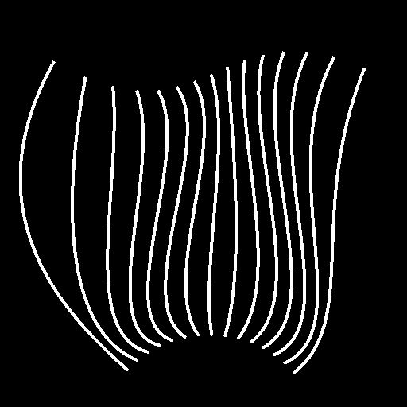

# 样条桥（2条样条）

<table>
<tr style="border: 0;">
<td width="33.33%" style="border: 0;" valign="top">

<b>In：</b>样条和路径工具>样条曲线工具

</td>
<td width="100.00%" style="border: 0;" valign="top">

## 描述

沿这些样条生成从<b>样条#1</b>到<b>样条#2</b>的样条。 生成的样条可以是线性（直线）或立方贝塞尔曲线（曲线）。

</td>
</tr>
</table>

>[!IMPORTANT]
>
> 如果提供给<b>样条#1</b>和<b>样条#2</b>输入的数据包含多个样条，则仅使用每个列表中的最后一个样条。

## 输入

|  |  |
|:---|:---|
| <b>预览#1</b> <i>灰度</i> | 输入样条灰度图像形式预览。 |
| <b>样条坐标#1</b> <i>颜色</i> | 输入样条点的坐标#1编码在彩色图像的RGBA通道中。 <b>R</b> - X位置 <b>G</b> - Y位置 <b>B</b> -Height <b>A</b> — 压缩数据：  — 符号：样条是闭合（负）或开放（正）；  -绝对值：Thickness+ 1。 |
| <b>样条数据#1</b> <i>颜色</i> | 输入样条的其他数据#1编码在彩色图像的RGBA通道中。 <b>R</b> -正切X <b>G</b> -正切Y <b>B</b> — 未使用 <b>A</b> — 未使用 |
| <b>样条量#1</b> <i>整数</i> | 输入样条#1数。 |
| <b>预览#2</b> <i>灰度</i> | 输入样条灰度图像形式预览。 |
| <b>样条坐标#2</b> <i>颜色</i> | 以彩色图像的RGBA通道编码的输入样条#2点的坐标。 <b>R</b> - X位置 <b>G</b> - Y位置 <b>B</b> -Height <b>A</b> — 压缩数据：  — 符号：样条是闭合（负）或开放（正）；  -绝对值：Thickness+ 1。 |
| <b>样条数据#2</b> <i>颜色</i> | 输入样条的其他数据#2编码在彩色图像的RGBA通道中。 <b>R</b> -正切X <b>G</b> -正切Y <b>B</b> — 未使用 <b>A</b> — 未使用 |
| <b>样条量#2</b> <i>整数</i> | 输入样条#2数。 |
| <b>起始切线长度曲线</b> <i>灰度</i>（在“桥样条类型”设置为“立方贝塞尔曲线”时可用） | 使用曲线第一行像素的值描述曲线的图像。 此输入用于控制沿样条#1生成的每个样条的起始点的“输出”正切的长度。 可以使用“曲线”节点创建曲线。 |
| <b>开始切线旋转曲线</b> <i>灰度</i>（在“桥样条类型”设置为“立方贝塞尔曲线”时可用） | 使用曲线第一行像素的值描述曲线的图像。 此输入用于控制生成的每个样条起始点的“输出”正切沿样条#1的旋转。 图像的灰度值表示若干圈。 您可以使用“曲线”节点创建曲线。 |
| <b>结束切线长度曲线</b> <i>灰度</i>（在“桥样条类型”设置为“立方贝塞尔曲线”时可用） | 使用曲线第一行像素的值描述曲线的图像。 此输入用于控制生成的样条曲线上每个端点#2“in”正切的长度。 可以使用“曲线”节点来编写曲线。 |
| <b>末端切线旋转曲线</b> <i>灰度</i>（在“桥样条类型”设置为“立方贝塞尔曲线”时可用） | 使用曲线第一行像素的值描述曲线的图像。 此输入用于控制生成的每个样条端点的入点正切沿样条#2的旋转。 图像的灰度值表示若干圈。 您可以使用“曲线”节点创建曲线。 |

## 输出

|  |  |
|:---|:---|
| <b>预览</b> <i>灰度</i> | 输出样条作为灰度图像的预览。 |
| <b>样条坐标</b> <i>颜色</i> | 以彩色图像的RGBA通道编码的输出样条点的坐标。 <b>R</b> - X位置 <b>G</b> - Y位置 <b>B</b> -Height <b>A</b> — 压缩数据：  — 符号：样条是闭合（负）或开放（正）；  -绝对值：Thickness+ 1。 |
| <b>样条数据</b> <i>颜色</i> | 以彩色图像的RGBA通道编码的输出样条的其他数据。 <b>R</b> -正切X <b>G</b> -正切Y <b>B</b> — 未使用 <b>A</b> — 未使用 |
| <b>样条量</b> <i>整数</i> | 输出样条的数量。 |

## 参数

|  |  |
|:---|:---|
| <b>桥样条数量</b> <i>整数</i> | 沿“样条”#1“样条”#2生成的样条数。 |
| <b>桥样条类型</b> <i>整数</i> | 生成的样条类型：    — 线性：从起点到终点的直样条；  — 三次Bezier：从起点到终点的曲线样条，曲线由起点和终点的长度和角度控制。 |
| <b>启动样条#1</b> <i>Float</i> | 沿样条#1从生成样条的位置偏移位置。 该值是样条#1的规范化长度。 值越大，相同数量的样条就会更加紧密地排列在一起。 |
| <b>启动样条#2</b> <i>Float</i> | 沿样条#2从生成样条的位置偏移位置。 该值是样条#2的规范化长度。 值越大，相同数量的样条就会更加紧密地排列在一起。 |
| <b>结束样条#1</b> <i>浮动</i> | 沿样条#1向直至生成样条的位置偏移位置。 该值是样条#1的规范化长度。 值越低，相同数量的样条就会更加紧密地排列在一起。 |
| <b>结束样条#1</b> <i>浮动</i> | 沿样条#2向直至生成样条的位置偏移位置。 该值是样条#2的规范化长度。 值越低，相同数量的样条就会更加紧密地排列在一起。 |
| <b>偏移样条#1</b> <i>浮动</i> | 沿样条#1对所有样条的起始点应用偏移。 该值是样条#1的规范化长度。 符合样条起始或结束的样条留在该处。 |
| <b>偏移样条#2</b> <i>浮动</i> | 沿样条#2对所有样条的起始点应用偏移。 该值是样条#2的规范化长度。 符合样条起始或结束的样条留在该处。 |
| <b>偏移随机起始</b> <i>浮动</i> | 将随机偏移应用于沿样条#1的每个样条的起始点。 该值是样条#1上样条之间的归一化距离。 当保持为0时，样条在“起始样条”#1点和“结束样条”#1点之间均匀分布。 |
| <b>偏移随机结束</b> <i>浮动</i> | 将随机偏移应用于沿样条#2的每个样条的终点。 该值是样条#2上样条之间的归一化距离。 当保持为0时，样条在“起始样条”#2点和“结束样条”#2点之间均匀分布。 |
| <b>正切长度起始</b> <i>Float</i>（在“桥样条类型”设置为“立方贝塞尔曲线”时可用） | 所有生成样条“样条”#1上起始点的“输出”正切长度。 |
| <b>正切长度结束</b> <i>Float</i>（在“桥样条类型”设置为“立方贝塞尔曲线”时可用） | 所有生成样条的样条上的终点#2的“in”正切的长度。 |
| <b>正切旋转开始</b> <i>Float</i>（在“桥样条类型”设置为“立方贝塞尔曲线”时可用） | 所有生成样条#1“样条”上的起始点的“输出”正切的旋转。 该值为循环次数。 |
| <b>正切旋转结束</b> <i>Float</i>（在“桥样条类型”设置为“立方贝塞尔曲线”时可用） | 所有生成样条的样条上的终点#2的“in”正切的旋转。 该值为循环次数。 |
| <b>预览</b> |  |
| <b>段数量</b> <i>整数</i> | 调整用于在“预览”输出中绘制样条可视化效果的段数。 值越高，线条越平滑。 |
| <b>显示方向助手</b> <i>布尔值</i> | 在“预览”输出中，在样条的起始处显示一个点，在其结尾处显示一个箭头。 |
| <b>显示Thickness信封</b> <i>布尔值</i> | 在样条Thickness的边显示附加线。 |
| <b>Thickness（像素）</b> <i>Float</i> | 调整预览输出中样条可视化的Thickness（以像素为单位）。 |

## 示例

<table>
<tr style="border: 0;">
<td style="border: 0;" valign="top">

<table>
  <tr>
    <td>
      
       <i>之前</i>
    </td>
    <td>
      
       <i>之后</i>
    </td>
  </tr>
</table>

</td>
<td style="border: 0;" valign="top">

</td>
</tr>
</table>
