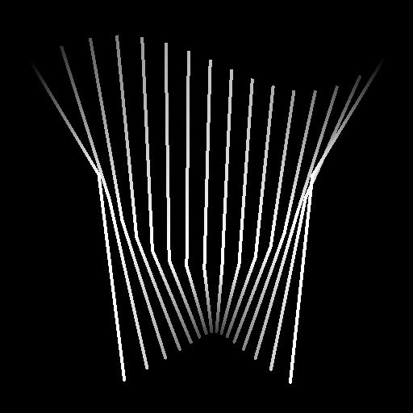

# 样条桥（列表）

<table>
<tr style="border: 0;">
<td width="33.33%" style="border: 0;" valign="top">

<b>In：</b>样条和路径工具>样条曲线工具

</td>
<td width="100.00%" style="border: 0;" valign="top">

## 描述

生成沿这些样条遍历输入列表中的所有样条的样条。

生成的样条可以是线性（直线）或二次贝塞尔曲线（曲线）。

</td>
</tr>
</table>

>[!TIP]
>
> 生成的样条从列表中的第一个样条转到最后一个样条，并严格遵循列表中这些样条的顺序来遍历中间样条。
> 
> 因此，您应留意预先将样条附加在一起的顺序。

## 输入

|  |  |
|:---|:---|
| <b>预览</b> <i>灰度</i> | 作为灰度图像的输入样条的预览。 |
| <b>样条坐标</b> <i>颜色</i> | 以彩色图像的RGBA通道编码的输入样条点的坐标： <b>R</b> - X位置 <b>G</b> - Y位置 <b>B</b> -Height <b>A</b> — 压缩数据：  — 符号：样条是闭合（负）或开放（正）；  -绝对值：Thickness+ 1。 |
| <b>样条数据</b> <i>颜色</i> | 以彩色图像的RGBA通道编码的输入样条的其他数据。 <b>R</b> -正切X <b>G</b> -正切Y <b>B</b> — 未使用 <b>A</b> — 未使用 |
| <b>样条量</b> <i>整数</i> | 输入样条的数量。 |

## 输出

|  |  |
|:---|:---|
| <b>预览</b> <i>灰度</i> | 输出样条作为灰度图像的预览。 |
| <b>样条坐标</b> <i>颜色</i> | 以彩色图像的RGBA通道编码的输出样条点的坐标。 <b>R</b> - X位置 <b>G</b> - Y位置 <b>B</b> -Height <b>A</b> — 压缩数据：  — 符号：样条是闭合（负）或开放（正）；  -绝对值：Thickness+ 1。 |
| <b>样条数据</b> <i>颜色</i> | 以彩色图像的RGBA通道编码的输出样条的其他数据。 <b>R</b> -正切X <b>G</b> -正切Y <b>B</b> — 未使用 <b>A</b> — 未使用 |
| <b>样条量</b> <i>整数</i> | 输出样条的数量。 |

## 参数

|  |  |
|:---|:---|
| <b>桥样条量</b> <i>整数</i> | 跨输入样条生成的样条数。 |
| <b>桥样条类型</b> <i>整数</i> | 生成的样条类型：   — 线性：将中间样条与从开始到结束的直线轨迹连接起来的锐样条；  — 二次贝塞尔曲线：将中间样条与从开始到结束的平滑轨迹连接起来的曲线样条。  注意：计算二次贝塞尔样条至少需要3条输入样条。 |
| <b>输入样条已关闭</b> <i>布尔值</i> | 控制是否应将输入样条的第一个点和最后一个点作为单个点来处理。 这防止了重复第一和最后遍历样条。 |
| <b>翻转方向</b> <i>布尔值</i> | 反转样条方向。 |
| <b>关闭Bridge样条</b> <i>布尔值</i> | 扩展遍历样条以连接到输入列表中的第一个样条。 |
| <b>第一个桥样条偏移</b> <i>浮点2</i> | 将偏移应用于所有遍历样条的起始点。 该值是输入样条的规范化长度。 生成的样条与所遍历样条的起始点或结束点相接合，并留在该处。 |
| <b>上次桥样条偏移</b> <i>浮点2</i> | 将偏移应用到所有遍历样条的末尾。 该值是输入样条的规范化长度。 生成的样条与所遍历样条的起始点或结束点相接合，并留在该处。 |
| <b>随机偏移范围</b> <i>整数</i> | 应用于样条的随机偏移所使用的最大距离。  - <i>父样条： </i>使用父样条的完整长度。 可能导致重叠。 - <i>间隔： </i>使用桥式样条之间的间隔。 这可以缓解重叠问题。 此距离随着桥式样条的增加而减小。 |
| <b>开始随机偏移</b> <i>浮动</i> | 应用于桥样条起始位置的随机偏移的乘数，其中最大距离由<b>随机偏移范围</b>参数指定。 |
| <b>结束随机偏移</b> <i>浮动</i> | 应用于桥样条的结束位置的随机偏移的乘数，其中最大距离由<b>随机偏移范围</b>参数指定。 |
| <b>全局随机偏移</b> <i>浮动</i> | 一个乘数，用于&#x200B;*相等数量*&#x200B;的随机偏移，应用于&#x200B;*双方*&#x200B;桥样条的起始位置和结束位置，其中最大距离由<b>随机偏移范围</b>参数指定。 |
| <b>均匀分布</b> <i>布尔值</i> | 如果为True，则生成的样条的点从起点到终点均匀隔开。 |
| <b>Thickness</b> |  |
| <b>Thickness模式</b> <i>整数</i> | 获取网桥样条的Thickness值的方法。  - <i>从父样条继承：</i>使用父样条在网桥样条起始位置和结束位置的Thickness - <i>覆盖：</i>使用您在<b>Thickness</b>参数中指定的任意值 |
| <b>Thickness</b> <i>浮动</i> | 应用于桥样条的绝对Thickness值。 |
| <b>Thickness随机</b> <i>浮动</i> | 桥样条Thickness的随机乘数，其中应用此乘数的初始Thickness由<b>Thickness模式</b>参数指定。 |
| <b>Height</b> |  |
| <b>Height模式</b> <i>整数</i> | 获取网桥样条的Height值的方法。  - <i>从父样条继承：</i>使用父样条在网桥样条起始位置和结束位置的Height - <i>覆盖：</i>使用您在<b>Height</b>参数中指定的任意值 |
| <b>Height偏移</b> <i>浮动</i> | 在将Height应用于桥式样条之前，应用于继承自父样条的Height的偏移量。 |
| <b>Height</b> <i>浮动</i> | 应用于桥样条的绝对Height值。 |
| <b>Height随机</b> <i>浮动</i> | 桥样条Height的随机调整量，其中调整取决于所选的<b>Height模式</b>参数：  - <i>从父样条继承：</i>该值是继承Height的乘数。 - <i>覆盖：</i>该值是添加到Height的偏移。 |
| <b>非方形校正</b> <i>布尔值</i> | 调整点的位置和Thickness以保持样条形状的非方形分辨率。 这也会影响均匀分布。 |
| <b>预览</b> |  |
| <b>显示方向帮助程序</b> <i>布尔值</i> | 在“预览”输出中，在样条的起始处显示一个点，在其结尾处显示一个箭头。 |
| <b>显示Thickness信封</b> <i>布尔值</i> | 在样条Thickness的边显示附加线。 |
| <b>段数量</b> <i>整数</i> | 调整用于在“预览”输出中绘制样条可视化效果的段数。 值越高，线条越平滑。 |
| <b>Thickness（像素）</b> <i>浮动</i> | 调整预览输出中样条可视化的Thickness（以像素为单位）。 |
| <b>背景预览强度</b> <i>浮动</i> | 预览可视化的强度。 |

## 示例

<table>
<tr style="border: 0;">
<td style="border: 0;" valign="top">

<table>
  <tr>
    <td>
      
       <i>之前</i>
    </td>
    <td>
      
       <i>之后</i>
    </td>
  </tr>
</table>

</td>
<td style="border: 0;" valign="top">

</td>
</tr>
</table>

