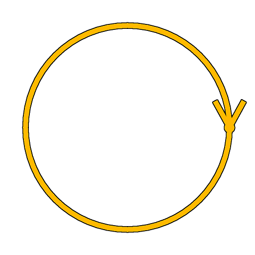

# 样条圆

<table>
<tr style="border: 0;">
<td width="33.33%" style="border: 0;" valign="top">

<b>In：</b>样条和路径工具>样条曲线工具

</td>
<td width="100.00%" style="border: 0;" valign="top">

## 描述

生成一个圆形的单个样条。

</td>
</tr>
</table>

## 输入

|  |  |
|:---|:---|
| <b>预览</b> <i>灰度</i> | 作为灰度图像的输入样条的预览。 |
| <b>样条坐标</b> <i>颜色</i> | 以彩色图像的RGBA通道编码的输入样条点的坐标： <b>R</b> - X位置 <b>G</b> - Y位置 <b>B</b> -Height <b>A</b> — 压缩数据：  — 符号：样条是闭合（负）或开放（正）；  -绝对值：Thickness+ 1。 |
| <b>样条数据</b> <i>颜色</i> | 以彩色图像的RGBA通道编码的输入样条的其他数据。 <b>R</b> -正切X <b>G</b> -正切Y <b>B</b> — 未使用 <b>A</b> — 未使用 |
| <b>样条量</b> <i>整数</i> | 输入样条的数量。 |

## 输出

|  |  |
|:---|:---|
| <b>预览</b> <i>灰度</i> | 输出样条作为灰度图像的预览。 |
| <b>样条坐标</b> <i>颜色</i> | 以彩色图像的RGBA通道编码的输出样条点的坐标。 <b>R</b> - X位置 <b>G</b> - Y位置 <b>B</b> -Height <b>A</b> — 压缩数据：  — 符号：样条是闭合（负）或开放（正）；  -绝对值：Thickness+ 1。 |
| <b>样条数据</b> <i>颜色</i> | 以彩色图像的RGBA通道编码的输出样条的其他数据。 <b>R</b> -正切X <b>G</b> -正切Y <b>B</b> — 未使用 <b>A</b> — 未使用 |
| <b>样条量</b> <i>整数</i> | 输出样条的数量。 |

## 参数

|  |  |
|:---|:---|
| <b>圆形半径</b> <i>浮动</i> | 调整纹理空间中的圆的半径。 |
| <b>圆形预旋转</b> <i>浮动</i> | 在应用“大小”之前，将旋转应用于基准圆。 |
| <b>圆形大小</b> <i>浮点2</i> | 调整圆的水平大小(X)和垂直大小(Y)。 |
| <b>圆形旋转后</b> <i>浮动</i> | 应用“大小”后，对基圆应用旋转。 |
| <b>圆形位置</b> <i>浮点2</i> | 设置纹理空间中圆心的位置。 |
| <b>启动Thickness</b> <i>浮动</i> | 调整圆起点的Thickness。 此Thickness沿样条插值到结束Thickness。 注意：Thickness由特定的样条节点使用。 |
| <b>结束Thickness</b> <i>浮动</i> | 调整圆端点的Thickness。 此Thickness沿样条插值到“起始”Thickness。 注意：Thickness由特定样条节点使用。 |
| <b>启动Height</b> <i>浮动</i> | 调整圆的起点Height，其中较低的值表示较低或较深的位置。 此Height沿样条插入到“终止”Height。 |
| <b>结束Height</b> <i>浮动</i> | 调整圆端点的Height，其中较低的值表示较低或较深的位置。 此Height从“起始”Height沿样条插值。 |
| <b>剪辑</b> <i>浮点2</i> | 沿圆偏移样条的起点和终点。 这些值已规范化。 |
| <b>螺旋线</b> <i>浮动</i> | 将圆的起点从其半径移动到其中心。 然后沿样条插入从中心到样条端点的距离。 该值已规范化。 |
| <b>螺旋形转折</b> <i>浮动</i> | 定义螺旋线围绕其中心旋转的圈数。 |
| <b>螺旋电源</b> <i>浮动</i> | 将功率曲线应用于距绘制螺旋线所用中心的距离。 大于1的值意味着螺旋线的更大部分仍然靠近中心。 |
| <b>翻转方向</b> <i>布尔值</i> | 反转样条方向。 |
| <b>均匀分布</b> <i>布尔值</i> | 为True时，样条点的间距从起点到终点均匀。 |
| <b>追加输入样条</b> <i>布尔值</i> | 将生成的样条添加到连接到<b>样条</b>输入的样条列表的末尾。 |
| <b>非方形校正</b> <i>布尔值</i> | 调整点的位置和Thickness以保持样条形状的非方形分辨率。 这也会影响均匀分布。 |
| <b>预览</b> |  |
| <b>显示方向助手</b> <i>布尔值</i> | 在“预览”输出中，在样条的起始处显示一个点，在其结尾处显示一个箭头。 |
| <b>显示Thickness信封</b> <i>布尔值</i> | 在样条Thickness的边显示附加线。 |
| <b>段数量</b> <i>整数</i> | 调整用于在“预览”输出中绘制样条可视化效果的段数。 值越高，线条越平滑。 |
| <b>Thickness（像素）</b> <i>浮动</i> | 在预览输出中调整样条可视化的Thickness（以像素为单位）。 |

## 示例

<table>
<tr style="border: 0;">
<td style="border: 0;" valign="top">

</td>
<td style="border: 0;" valign="top">

</td>
</tr>
</table>

<table>
<tr style="border: 0;">
<td style="border: 0;" valign="top">

</td>
<td style="border: 0;" valign="top">

</td>
</tr>
</table>
