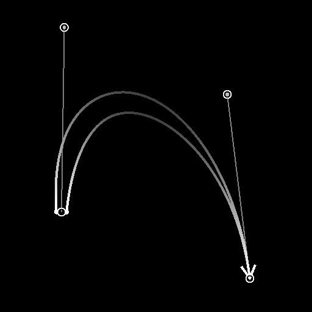

# 样条（三次）

<table>
<tr style="border: 0;">
<td width="33.33%" style="border: 0;" valign="top">

<b>In：</b>样条和路径工具>样条曲线工具

</td>
<td width="100.00%" style="border: 0;" valign="top">

## 描述

在任意位置生成两点<b>p1 </b>和<b>p2</b>之间的单个样条。

样条线的轨迹由<b>p1</b>的“出”切线和<b>p2</b>的“入”切线控制。

</td>
</tr>
</table>

## 输入

|  |  |
|:---|:---|
| <b>预览</b> <i>灰度</i> | 作为灰度图像的输入样条的预览。 |
| <b>样条坐标</b> <i>颜色</i> | 以彩色图像的RGBA通道编码的输入样条点的坐标： <b>R</b> - X位置 <b>G</b> - Y位置 <b>B</b> -Height <b>A</b> — 压缩数据：  — 符号：样条是闭合（负）或开放（正）；  -绝对值：Thickness+ 1。 |
| <b>样条数据</b> <i>颜色</i> | 以彩色图像的RGBA通道编码的输入样条的其他数据。 <b>R</b> -正切X <b>G</b> -正切Y <b>B</b> — 未使用 <b>A</b> — 未使用 |
| <b>样条量</b> <i>整数</i> | 输入样条的数量。 |

## 输出

|  |  |
|:---|:---|
| <b>预览</b> <i>灰度</i> | 输出样条作为灰度图像的预览。 |
| <b>样条坐标</b> <i>颜色</i> | 以彩色图像的RGBA通道编码的输出样条点的坐标。 <b>R</b> - X位置 <b>G</b> - Y位置 <b>B</b> -Height <b>A</b> — 压缩数据：  — 符号：样条是闭合（负）或开放（正）；  -绝对值：Thickness+ 1。 |
| <b>样条数据</b> <i>颜色</i> | 以彩色图像的RGBA通道编码的输出样条的其他数据。 <b>R</b> -正切X <b>G</b> -正切Y <b>B</b> — 未使用 <b>A</b> — 未使用 |
| <b>样条量</b> <i>整数</i> | 输出样条的数量。 |

## 参数

|  |  |
|:---|:---|
| <b>翻转方向</b> <i>布尔值</i> | 反转样条方向。 |
| <b>追加输入样条</b> <i>布尔值</i> | 将生成的样条添加到连接到<b>样条</b>输入的样条列表的末尾。 |
| <b>非方形校正</b> <i>布尔值</i> | 调整点的位置和Thickness以保持样条形状的非方形分辨率。 这也会影响均匀分布。 |
| <b>Height</b> |  |
| <b>启动Height</b> <i>浮动</i> | 调整p1点的Height，其中较低的值表示较低或较深的位置。 这会影响p1处的样条的Height。 |
| <b>结束Height</b> <i>浮动</i> | 调整p2点的Height，其中较低的值表示较低或较深的位置。 这会影响p2处的样条的Thickness。 |
| <b>自动切线Height</b> <i>布尔值</i> | 自动设置样条正切的Height，使其从“起始”Height线性插值到“终止”Height。 |
| <b>p1正切Height</b> <i>Float</i>（当“自动正切Height”为True时可用） | 调整p1点“输出”正切的Height，其中较低的值表示较低或较深的位置。 当样条从p1逐渐变淡时，这会影响样条的Height。 |
| <b>p2正切Height</b> <i>Float</i>（当“自动正切Height”为True时可用） | 调整p2点“in”正切的Height，其中较低的值表示较低或较深的位置。 当样条从p2逐渐变淡时，这会影响样条的Height。 |
| <b>Thickness</b> |  |
| <b>启动Thickness</b> <i>浮动</i> | 调整p1点的Thickness。 这会影响样条在p1处的Thickness。 注意：Thickness由特定的样条节点使用。 |
| <b>结束Thickness</b> <i>浮动</i> | 调整p2点的Thickness。 这会影响样条在p2处的Thickness。 注意：Thickness由特定的样条节点使用。 |
| <b>自动Thickness</b> <i>布尔值</i> | 自动设置样条正切的Thickness，以从“起始”Thickness线性插值到“终止”Thickness。 注意：Thickness由特定样条节点使用。 |
| <b>p1Thickness</b> <i>Float</i>（当“自动正切Thickness”为True时可用） | 调整p1点“出”正切的Thickness。 当样条从p1消失时，这会影响沿样条的Thickness。 注意：Thickness由特定样条节点使用。 |
| <b>p2正切Thickness</b> <i>Float</i>（当“自动正切Thickness”为True时可用） | 调整p2点“in”正切的Thickness。 当样条从p2逐渐变远时，这会影响样条的Thickness。 注意：Thickness由特定样条节点使用。 |
| <b>点坐标</b> |  |
| <b>p1</b> <i>浮点2</i> | 设置p1点在纹理空间中的位置。 |
| <b>p1正切</b> <i>浮点2</i> | 设置纹理空间中p1点“out”正切手柄的位置。 |
| <b>p2</b> <i>浮点2</i> | 在纹理空间中设置p2点的位置。 |
| <b>p2正切</b> <i>浮点2</i> | 设置纹理空间中p2点“in”正切手柄的位置。 |
| <b>预览</b> |  |
| <b>显示切线</b> <i>布尔值</i> | 在预览输出中显示p1点“出”正切和p2点“入”正切。 |
| <b>显示方向帮助程序</b> <i>布尔值</i> | 在“预览”输出中，在样条的起始处显示一个点，在其结尾处显示一个箭头。 |
| <b>段数量</b> <i>整数</i> | 调整用于在“预览”输出中绘制样条可视化效果的段数。 值越高，线条越平滑。 |
| <b>Thickness（像素）</b> <i>浮动</i> | 在预览输出中调整样条可视化的Thickness（以像素为单位）。 |

## 示例

<table>
<tr style="border: 0;">
<td style="border: 0;" valign="top">

</td>
<td style="border: 0;" valign="top">

</td>
</tr>
</table>

<table>
<tr style="border: 0;">
<td style="border: 0;" valign="top">

</td>
<td style="border: 0;" valign="top">

</td>
</tr>
</table>
