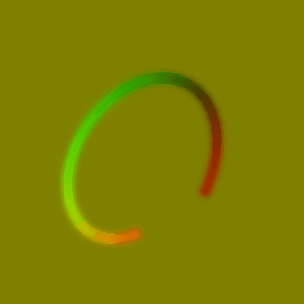

# 样条流映射器

<table>
<tr style="border: 0;">
<td width="33.33%" style="border: 0;" valign="top">

<b>In：</b>样条和路径工具>样条曲线工具

</td>
<td width="100.00%" style="border: 0;" valign="top">

## 描述

绘制流图，其中流矢量数据是沿着输入样条绘制的。

这样，您就可以使用样条控制流动的方向、轨迹、强度和Thickness，以及使用渐变斜坡将绘制的数据淡入中性背景。

</td>
</tr>
</table>

>[!IMPORTANT]
>
> 当使用极低的Thickness值时，结果可能包括样条包络外的不期望伪像。 这是一个已知问题。

## 输入连接器

<b>样条坐标</b> *颜色*&#x200B;在彩色图像的RGBA通道中编码的输入样条点的坐标：\
<b> R</b> - X位置\
<b> G</b> - Y位置\
<b> B</b> -Height\
<b>A</b> — 打包的数据：\
*符号：样条是封闭的（负）或开放的（正）；\
*绝对值：Thickness+ 1。

<b>样条数据</b> *颜色*&#x200B;编码在彩色图像的RGBA通道中的输入样条的其他数据。\
<b> R</b> — 切线X\
<b> G</b> — 切线Y\
<b> B</b> — 未使用\
<b> A</b> — 未使用

<b>样条量</b> *整数*&#x200B;输入样条的数量。

<b>衰减剖面曲线</b> *灰度*&#x200B;使用第一行像素的值描述曲线的图像。\
当衰减配置文件参数设置为“输入配置文件曲线”时，此输入用于控制沿样条绘制的流矢量数据的衰减的渐变斜坡。\
您可以使用[曲线](../../../../../../compositing-graphs/nodes-reference-for-com/atomic-nodes/curve/curve.md)节点来创作曲线。

## 输出连接器

<b>输出</b> *颜色*&#x200B;以彩色图像编码的输出流图。

## 参数

<b>段数量</b> *整数*&#x200B;样条在矢量流数据遍历之前被简化为段。\
段数越多，沿曲线绘制的流图就越平滑。

<b>模式</b> *整数*&#x200B;选择矢量流数据应沿其绘制的样条的方法：\
*- Draw样条列表*：使用输入列表中的所有样条；\
*— 绘制单样条*：仅使用具有指定索引的样条；\
*- Draw样条范围*：仅使用指定范围中包含索引的样条。

<b>绘制样条索引</b> *整数* （“模式”设置为“绘制单样条”时可用）绘制矢量流数据所应沿的样条的索引。

<b>绘制样条范围</b> *Integer2* （当“模式”设置为“绘制样条范围”时可用）绘制矢量流数据时所应沿的样条索引范围。

<b>Thickness模式</b> *整数*&#x200B;设置绘制的矢量流数据Thickness的方法\
*— 手动*：使用任意值显式设置Thickness；\
*— 来自样条*：使用样条的Thickness。

<b>Thickness</b> *浮点* （在“Thickness模式”设置为“手动”时可用）沿样条绘制的矢量流数据的Thickness的任意值。<b></b>

<b>Thickness乘数</b> *浮点*（在“Thickness模式”设置为“来自样条”时可用）沿样条绘制的矢量流数据的Thickness的全局乘数，当该Thickness由样条驱动时。

<b>方向</b> *整数*&#x200B;矢量流相对于样条线的方向。\
*— 切线*：使用样条的切线向量；\
*— 法向*：使用样条的法向量；\
*— 正常镜像*：使用样条正常向量的镜像版本。

<b>翻转方向</b> *布尔值*&#x200B;反转样条方向，这也会影响流矢量的方向。

<b>衰减配置文件</b> *整数*&#x200B;用于绘制沿样条绘制的流矢量数据衰减的渐变斜坡：\
*— 线性*：使用线性渐变渐变；\
*— 高斯*：使用高斯渐变渐变\
*— 输入配置文件曲线*：将提供给衰减配置文件曲线输入的曲线用作渐变渐变。

<b>开始衰减</b> *布尔值*&#x200B;在样条线的开头添加一个半圆。 半圆采用与样条相同的衰减。

<b>结束衰减</b> *布尔值*&#x200B;在样条线的末尾添加一个半圆。 半圆采用与样条相同的衰减。

<b>样条Height衰减</b> *浮动*&#x200B;沿样条绘制的流矢量数据的强度与样条的Height相乘，绘制的数据随着Height越接近0，渐隐为背景的中性(0.5， 0.5， 0)颜色。

<b>非方形校正&#x200B;</b>*布尔值*&#x200B;调整点的位置和Thickness以保持样条形状的非方形分辨率。\
这也会影响均匀分布。

## 示例

<table>
<tr style="border: 0;">
<td style="border: 0;" valign="top">

<table>
  <tr>
    <td>
      
       <i>之前</i>
    </td>
    <td>
      
       <i>之后</i>
    </td>
  </tr>
</table>

</td>
<td style="border: 0;" valign="top">

</td>
</tr>
</table>
