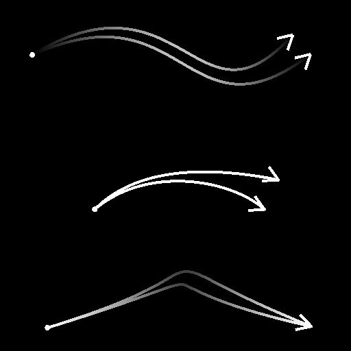

# 样条合并列表

<table>
<tr style="border: 0;">
<td style="border: 0;" valign="top">

<table>
<tr style="border: 0;">
<td width="33.33%" style="border: 0;" valign="top">

<b>In：</b>样条和路径工具>样条曲线工具

</td>
<td width="100.00%" style="border: 0;" valign="top">

## 描述

将输入列表中的所有样条合并为单个样条。

</td>
</tr>
</table>

## 输入连接器

<b>样条坐标</b> *颜色*&#x200B;在彩色图像的RGBA通道中编码的输入样条点的坐标：\
<b> R</b> - X位置\
<b> G</b> - Y位置\
<b> B</b> -Height\
<b>A</b> — 打包的数据：\
*符号：样条是封闭的（负）或开放的（正）；\
*绝对值：Thickness+ 1。

<b>样条数据</b> *颜色*&#x200B;编码在彩色图像的RGBA通道中的输入样条的其他数据。\
<b> R</b> — 切线X\
<b> G</b> — 切线Y\
<b> B</b> — 未使用\
<b> A</b> — 未使用

<b>样条量</b> *整数*&#x200B;输入样条的数量。

## 输出连接器

<b>预览</b> *灰度*&#x200B;以灰度图像形式显示的合并样条预览。

<b>样条坐标</b> *颜色*&#x200B;在彩色图像的RGBA通道中编码的合并样条点的坐标。\
<b>R</b> - X位置\
<b>G</b> - Y位置\
<b>B</b> -Height\
<b>A</b> — 打包的数据：\
*符号：样条是封闭的（负）或开放的（正）；\
*绝对值：Thickness+ 1。

<b>样条数据</b> *颜色*&#x200B;在彩色图像的RGBA通道中编码的合并样条的其他数据。\
<b>R</b> — 切线X\
<b>G</b> — 切线Y\
<b>B</b> — 未使用\
<b>A</b> — 未使用

<b>样条量</b> *整数*&#x200B;合并样条的数量。

## 参数

<b>闭合样条距离阈值</b> *浮点*&#x200B;纹理空间中的距离，在纹理空间中，同一样条的两个末端被处理为闭合该样条的一个点。\
这样可防止在沿样条散布形状或映射图像时发生重叠。

+++预览
<b>段数量</b> *整数*&#x200B;调整用于在预览输出中绘制样条可视化效果的段数。\
值越高，线条越平滑。

<b>显示方向帮助程序</b> *布尔值*&#x200B;在预览输出中，在样条线的起始处显示一个点，在其结尾处显示一个箭头。

<b>显示Thickness信封</b> *布尔值*\
在样条Thickness的边显示附加线。

<b>Thickness（像素）</b> *浮动*&#x200B;以像素为单位调整样条可视化在预览输出中的Thickness。

+++

## 示例

<table>
<tr style="border: 0;">
<td style="border: 0;" valign="top">

<table>
  <tr>
    <td>
      
       <i>之前</i>
    </td>
    <td>
      
       <i>之后</i>
    </td>
  </tr>
</table>

</td>
<td style="border: 0;" valign="top">

<table>
  <tr>
    <td>
      
       <i>之前</i>
    </td>
    <td>
      
       <i>之后</i>
    </td>
  </tr>
</table>

</td>
</tr>
</table>

</td>
<td style="border: 0;" valign="top">

</td>
<td style="border: 0;" valign="top">

</td>
</tr>
</table>
