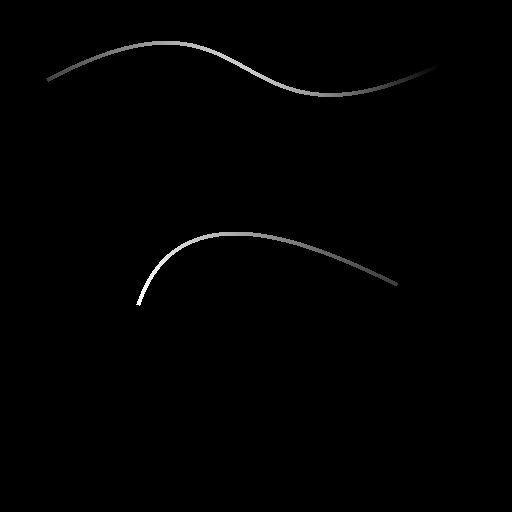

# 样条（多边形二次）

<table>
<tr style="border: 0;">
<td width="33.33%" style="border: 0;" valign="top">

<b>In：</b>样条和路径工具>样条曲线工具

</td>
<td width="100.00%" style="border: 0;" valign="top">

## 描述

沿若干点生成样条。 这些点的数量和位置可以是任意的，也可以从[点列表](../../../../../../compositing-graphs/nodes-reference-for-com/node-library/spline-paths-tools/spline-tools/point-list/point-list.md)节点收集。

</td>
</tr>
</table>

样条轨迹可以平滑离开中间点，即每个中间点是其邻域“出”切线和“入”切线的交点。

## 输入

|  |  |
|:---|:---|
| <b>预览</b> <i>灰度</i> | 作为灰度图像的输入样条的预览。 |
| <b>样条坐标</b> <i>颜色</i> | 以彩色图像的RGBA通道编码的输入样条点的坐标： <b>R</b> - X位置 <b>G</b> - Y位置 <b>B</b> -Height <b>A</b> — 压缩数据：  — 符号：样条是闭合（负）或开放（正）；  -绝对值：Thickness+ 1。 |
| <b>样条数据</b> <i>颜色</i> | 以彩色图像的RGBA通道编码的输入样条的其他数据。 <b>R</b> -正切X <b>G</b> -正切Y <b>B</b> — 未使用 <b>A</b> — 未使用 |
| <b>样条量</b> <i>整数</i> | 输入样条的数量。 |
| <b>点预览</b> <i>灰度</i> | 以灰度图像形式预览点。 |
| <b>输入点列表</b> <i>颜色</i> | （当“使用输入点列表”为True时可用）以彩色图像的RGBA通道编码的点列表： <b>R</b> - X位置 <b>G</b> - Y位置 <b>B</b> -Height <b>A</b> — 打包的数据：  -整数部分：Smoothness；  — 分数部分：Thickness。 |
| <b>点数</b> <i>整数</i> | （当“使用输入点列表”为True时可用）点数。 |

>[!IMPORTANT]
>
> <b>点列表</b>和<b>点数</b>连接器&#x200B;*不兼容*&#x200B;与<b>样条坐标</b>、<b>样条数据</b>和<b>样条量</b>连接器不兼容，因为它们依赖于不同的数据。

## 输出

|  |  |
|:---|:---|
| <b>预览</b> <i>灰度</i> | 输出样条作为灰度图像的预览。 |
| <b>样条坐标</b> <i>颜色</i> | 以彩色图像的RGBA通道编码的输出样条点的坐标。 <b>R</b> - X位置 <b>G</b> - Y位置 <b>B</b> -Height <b>A</b> — 压缩数据：  — 符号：样条是闭合（负）或开放（正）；  -绝对值：Thickness+ 1。 |
| <b>样条数据</b> <i>颜色</i> | 以彩色图像的RGBA通道编码的输出样条的其他数据。 <b>R</b> -正切X <b>G</b> -正切Y <b>B</b> — 未使用 <b>A</b> — 未使用 |
| <b>样条量</b> <i>整数</i> | 输出样条的数量。 |

## 参数

|  |  |
|:---|:---|
| <b>点数</b> <i>整数</i> | 用于构建样条的任意点数。 |
| <b>输入样条连接模式</b> <i>整数</i> | 用于连接输入样条的方法： -<i>自动：</i>最后一个输入样条的末端连接到生成的样条开头，而生成样条结尾连接到第一个输入样条开头； -<i>手动：</i>可以指定哪些输入样条应该连接到生成的样条末端，以及这些连接应该位于输入样条上的什么位置。 |
| <b>关闭样条</b> <i>布尔值</i> | 控制样条端点是否应连接到其起始点。 在起点和终点处应用于样条的平滑由这些点的Smoothness值指定。 |
| <b>翻转方向</b> <i>布尔值</i> | 反转样条方向。 |
| <b>使用输入点列表</b> <i>布尔值</i> | 使用提供给“输入点列表”和“点号”输入连接器的点列表，而不是任意点列表。 点列表可由[点列表](../../../../../../compositing-graphs/nodes-reference-for-com/node-library/spline-paths-tools/spline-tools/point-list/point-list.md)节点提供。 |
| <b>连接起始点到输入样条</b> <i>布尔值</i> | 如果为True，则生成的样条的起始点连接到输入样条中最后一个样条的最后一点。 |
| <b>启动连接样条索引</b> <i>整数</i> | （当“输入样条连接模式”设置为“手动”且“连接起始点到输入样条”设置为“真”时可用）应连接到所生成样条起始点的输入样条索引。 |
| <b>开始连接位置</b> <i>浮动</i> | （当“输入样条连接模式”设置为“手动”且“连接起点到输入样条”设置为“真”时可用）所选输入样条上与所生成样条起点的连接应到达的位置。 此值是所选输入样条的规范化长度。 |
| <b>将端点连接到输入样条</b> <i>布尔值</i> | 如果为True，则生成的样条的一端连接到输入样条中第一样条的第一点。 |
| <b>结束连接样条索引</b> <i>整数</i> | （当“输入样条连接模式”设置为“手动”且“将端点连接到输入样条”设置为“真”时可用）应连接到所生成样条端点的输入样条索引。 |
| <b>结束连接位置</b> <i>Float</i> | （当“输入样条连接模式”设置为“手动”且“将端点连接到输入样条”设置为“真”时可用）在所选输入样条上所生成样条与端点的连接应处于的位置。 此值是所选输入样条的规范化长度。 |
| <b>均匀分布</b> <i>布尔值</i> | 为True时，样条点的间距从起点到终点均匀。 |
| <b>追加输入样条</b> <i>布尔值</i> | 将生成的样条添加到连接到<b>样条</b>输入的样条列表的末尾。 |
| <b>非方形校正</b> <i>布尔值</i> | 调整点的位置和Thickness以保持样条形状的非方形分辨率。 这也会影响均匀分布。 |
| <b>全局Smoothness调整</b> <i>Float</i> | 对所有点的Smoothness值应用统一的偏移。 生成的Smoothness值被固定在[0；1]范围内。 |
| <b>点属性</b> |  |
| <b>p#属性</b> <i>Float3</i> | 设置p#点的属性。 - <i>Height：</i>调整较低值表示较低或较深位置的点的Height； - <i>Smoothness：</i>在p#处偏移样条平滑化的开始，其中值0产生硬轨迹，值1产生完全平滑的轨迹； - <i>Thickness：</i>在p#处调整样条的Thickness。 Thickness由特定的Spline节点使用。 |
| <b>点坐标</b> |  |
| <b>p#</b> <i>浮点2</i> | 设置p#点在纹理空间中的位置。 |
| <b>预览</b> |  |
| <b>显示切线</b> <i>布尔值</i> | 在“预览”输出中显示p1和p3指向p2的正切。 |
| <b>显示方向帮助程序</b> <i>布尔值</i> | 在“预览”输出中，在样条的起始处显示一个点，在其结尾处显示一个箭头。 |
| <b>显示Thickness信封</b> <i>布尔值</i> | 在样条Thickness的边显示附加线。 |
| <b>显示积分标签</b> <i>布尔值</i> | 在“预览”输出中，每个点旁边都显示该点的名称。 |
| <b>点标签大小</b> <i>浮动</i> | （当“显示点标签”设置为“真”时可用）纹理空间中每个点的标签大小，其中0.1是纹理宽度的十分之一。 |
| <b>显示点数</b> <i>布尔值</i> | 显示样条的控制点。 |
| <b>点大小</b> <i>浮动</i> | （当“显示点数”设置为“真”时可用）纹理空间中点的半径，其中0.1是纹理宽度的十分之一。 |
| <b>段数量</b> <i>整数</i> | 调整用于在预览输出中绘制样条可视化效果的段数。 值越高，线条越平滑。 |
| <b>Thickness（像素）</b> <i>浮动</i> | 调整预览输出中样条可视化的Thickness（以像素为单位）。 |

## 示例

<table>
<tr style="border: 0;">
<td style="border: 0;" valign="top">

<table>
  <tr>
    <td>
      
       <i>之前</i>
    </td>
    <td>
      
       <i>之后</i>
    </td>
  </tr>
</table>

</td>
<td style="border: 0;" valign="top">

</td>
</tr>
</table>
