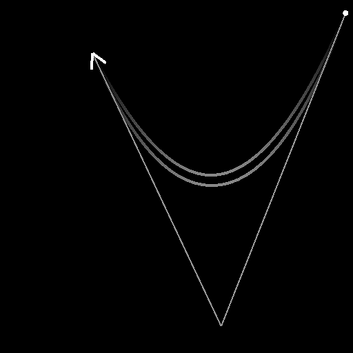

# 样条（二次）

<table>
<tr style="border: 0;">
<td width="33.33%" style="border: 0;" valign="top">

<b>In：</b>样条和路径工具>样条曲线工具

</td>
<td width="100.00%" style="border: 0;" valign="top">

## 描述

在任意位置生成两点<b>p1</b>和<b>p3</b>之间的单个样条。

样条线的轨迹由<b>p1</b>的“出”切线和<b>p3</b>、*两个*&#x200B;的“入”切线控制，这两个切线由一个点<b>p3</b>控制。

由样条形成的弧的跨度是&#x200B;*可调*，因此其从末端的一些轨迹可以保持笔直。

</td>
</tr>
</table>

## 输入连接器

|  |  |
| --- | --- |
| <b>预览</b> *灰度* | 作为灰度图像的输入样条的预览。 |
| <b>样条坐标</b> *颜色* | 以彩色图像RGBA通道编码的输入样条点的坐标： <b>R</b> - X位置<b>G</b> - Y位置<b>B</b> - Height<b>A</b> — 压缩数据： — 符号：样条是闭合（负）或开放（正）； — 绝对值：Thickness+ 1。 |
| <b>样条数据</b> *颜色* | 在彩色图像的RGBA通道中编码的输入样条的其他数据： <b>R</b> - Tangents X <b>G</b> - Tangents Y <b>B</b> - Tangents Z <b>A</b> — 未使用 |
| <b>样条量</b> *整数* | 输入样条的数量。 |

## 输出连接器

|  |  |
| --- | --- |
| <b>预览</b> *灰度* | 输出样条作为灰度图像的预览。 |
| <b>样条坐标</b> *颜色* | 以彩色图像RGBA通道编码的输出样条点的坐标： <b>R</b> - X位置<b>G</b> - Y位置<b>B</b> - Height<b>A</b> — 压缩数据： — 符号：样条是闭合（负）或开放（正）； — 绝对值：Thickness+ 1。 |
| <b>样条数据</b> *颜色* | 在彩色图像的RGBA通道中编码的输出样条的其他数据： <b>R</b> - Tangents X <b>G</b> - Tangents Y <b>B</b> - Tangents Z <b>A</b> — 未使用 |
| <b>样条量</b> *整数* | 输出样条的数量。 |

## 参数

|  |  |
| --- | --- |
| <b>翻转方向</b> *布尔值* | 反转样条方向。 |
| <b>均匀分布</b> *布尔值* | 当&#x200B;*True*&#x200B;时，样条点的间距从起点到终点均匀。 |
| <b>追加输入样条</b> *布尔值* | 将生成的样条添加到连接到<b>样条</b>输入的样条列表的末尾。 |
| <b>非方形校正</b> *布尔值* | 调整点的位置和Thickness以保持样条形状的非方形分辨率。 这也会影响均匀分布。 |
| <b>Smoothness</b> *浮动* | 调整样条形成的圆弧&#x200B;*的*&#x200B;跨度，其中1表示样条全长，0表示样条完全笔直。 圆弧从点<b>p3</b>沿着样条一直到其末端。 |

+++高度

|  |  |
| --- | --- |
| <b>启动Height</b> *浮动* | 调整<b>p1</b>点的Height，较低的值表示较低或较深的位置。  这会影响<b>p1</b>处的样条的Height。 |
| <b>结束Height</b> *浮动* | 调整<b>p3</b>点的Height，较低的值表示较低或较深的位置。  这会影响<b>p3</b>处的样条的Thickness。 |
| <b>自动切线Height</b> *布尔值* | 调整<b>p3</b>点的Height，较低的值表示较低或较深的位置。  这会影响<b>p3</b>处的样条的Thickness。 |
| <b>正切Height</b> *浮动* | 调整由<b>p2</b>点控制的切线驱动的Height。  这会影响样条沿线的Height，因为它从<b>p1</b>引向<b>p3</b>。   *注意：*&#x200B;此参数仅在<b>自动切线Height</b>设置为“False”时可用。 |

+++

+++粗细

|  |  |
| --- | --- |
| <b>启动Thickness</b> *浮动* | 调整<b>p1</b>点的Thickness。 这会影响<b>p1</b>处的样条的Thickness。   *注意：* Thickness由特定样条节点使用。 |
| <b>结束Thickness</b> *浮动* | 调整<b>p3</b>点的Thickness。 这会影响<b>p3</b>处的样条的Thickness。   *注意：* Thickness由特定样条节点使用。 |
| <b>自动切线Thickness</b> *布尔值* | 自动设置样条切线的Thickness，以从<b>起始Thickness</b>线性插值到<b>结束Thickness</b>。   *注意：* Thickness由特定样条节点使用。 |
| <b>正切Thickness</b> *浮动* | 调整由<b>p2</b>点控制的切线驱动的Thickness。  这会影响样条沿线的Thickness，因为它从<b>p1</b>引向<b>p3</b>。   *注意：* Thickness由特定样条节点使用。  *注意2：*&#x200B;此参数仅在<b>自动切线Thickness</b>设置为“False”时可用。 |

+++

+++点坐标

|  |  |
| --- | --- |
| <b>p1</b> *浮点2* | 设置纹理空间中<b>p1</b>点的位置。 |
| <b>p2</b> *浮点2* | 设置纹理空间中<b>p2</b>点的位置。  <b>p2</b>点控制<b>p1</b>和<b>p3</b>点的&#x200B;*切线*。 |
| <b>p3</b> *浮点2* | 设置纹理空间中<b>p3</b>点的位置。 |

+++

+++预览

|  |  |
| --- | --- |
| <b>显示切线</b> *布尔值* | 在<b>预览</b>输出中显示<b>p1</b>点“out”切线和<b>p3</b>点“in”切线。反转样条线的方向。 |
| <b>显示方向帮助程序</b> *布尔值* | 在<b>预览</b>输出中，在样条线的起始处显示一个点，在其结尾处显示一个箭头。 |
| <b>显示Thickness信封</b> *布尔值* | 在样条Thickness的边显示附加线。 |
| <b>段数量</b> *整数* | 调整用于在<b>预览</b>输出中绘制样条可视化效果的段数。  值越高，线条越平滑。 |
| <b>Thickness（像素）</b> *浮动* | 在<b>预览</b>输出中调整样条可视化的Thickness（以像素为单位）。 |

+++

## 示例

<table>
<tr style="border: 0;">
<td style="border: 0;" valign="top">

{zoomable="yes"}

</td>
<td style="border: 0;" valign="top">

{zoomable="yes"}

</td>
</tr>
</table>

<table>
<tr style="border: 0;">
<td style="border: 0;" valign="top">

{zoomable="yes"}

</td>
<td style="border: 0;" valign="top">

</td>
</tr>
</table>
