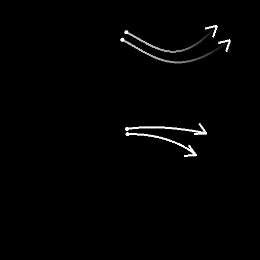

# 样条选择

<table>
<tr style="border: 0;">
<td style="border: 0;" valign="top">

<table>
<tr style="border: 0;">
<td width="33.33%" style="border: 0;" valign="top">

<b>In：</b>样条和路径工具>样条曲线工具

</td>
<td width="100.00%" style="border: 0;" valign="top">

## 描述

根据指定的条件在输入列表中选择样条，并输出仅包括所选样条的新列表。

也可以修剪选定的样条。

</td>
</tr>
</table>

## 输入连接器

<b>预览</b> *灰度*&#x200B;作为灰度图像的输入样条的预览。

<b>样条坐标</b> *颜色*&#x200B;在彩色图像的RGBA通道中编码的输入样条点的坐标：\
<b> R</b> - X位置\
<b> G</b> - Y位置\
<b> B</b> -Height\
<b>A</b> — 打包的数据：\
*符号：样条是封闭的（负）或开放的（正）；\
*绝对值：Thickness+ 1。

<b>样条数据</b> *颜色*&#x200B;编码在彩色图像的RGBA通道中的输入样条的其他数据。\
<b> R</b> — 切线X\
<b> G</b> — 切线Y\
<b> B</b> — 未使用\
<b> A</b> — 未使用

<b>样条量</b> *整数*&#x200B;输入样条的数量。

## 输出连接器

<b>预览</b> *灰度*&#x200B;输出样条作为灰度图像的预览。

<b>样条坐标</b> *颜色*&#x200B;以彩色图像的RGBA通道编码的输出样条点的坐标。\
<b>R</b> - X位置\
<b>G</b> - Y位置\
<b>B</b> -Height\
<b>A</b> — 打包的数据：\
*符号：样条是封闭的（负）或开放的（正）；\
*绝对值：Thickness+ 1。

<b>样条数据</b> *颜色*&#x200B;以彩色图像的RGBA通道编码的输出样条的附加数据。\
<b>R</b> — 切线X\
<b>G</b> — 切线Y\
<b>B</b> — 未使用\
<b>A</b> — 未使用

<b>样条量</b> *整数*&#x200B;输出样条的数量。

## 参数

<b>选择模式</b> *整数*&#x200B;在输入列表中选择样条的方法：\
*- First*：选择列表中的第一个样条；\
*— 最后*：选择列表中的最后一个样条；\
*— 索引*：选择具有指定索引的样条；\
*— 范围*：选择指定范围内包含索引的样条。

<b>样条索引</b> *整数* （“选择模式”设置为“索引”时可用）应选择的样条索引。

<b>范围开始</b> *整数*（在“选择模式”设置为“范围”时可用）选定样条范围中的最低索引。

<b>范围结束</b> *整数*（在“选择模式”设置为“范围”时可用）所选样条范围中的最高索引。<b></b>

<b>开始</b> *浮动*&#x200B;偏移应选择的样条部分的起点。 这有效地修剪了样条。\
该值表示样条的规范化长度。

<b>结束</b> *浮动*&#x200B;偏移应选择的样条部分的端点。 这有效地修剪了样条。\
该值表示样条的规范化长度。

+++预览
<b>段数量</b> *整数*&#x200B;调整用于在预览输出中绘制样条可视化效果的段数。\
值越高，线条越平滑。

<b>显示方向帮助程序</b> *布尔值*&#x200B;在预览输出中，在样条线的起始处显示一个点，在其结尾处显示一个箭头。

<b>显示Thickness信封</b> *布尔值*\
在样条Thickness的边显示附加线。

<b>Thickness（像素）</b> *浮动*&#x200B;以像素为单位调整样条可视化在预览输出中的Thickness。

+++

## 示例

<table>
<tr style="border: 0;">
<td style="border: 0;" valign="top">

<table>
  <tr>
    <td>
      
       <i>之前</i>
    </td>
    <td>
      
       <i>之后</i>
    </td>
  </tr>
</table>

</td>
<td style="border: 0;" valign="top">

<table>
  <tr>
    <td>
      
       <i>之前</i>
    </td>
    <td>
      
       <i>之后</i>
    </td>
  </tr>
</table>

</td>
</tr>
</table>

<table>
<tr style="border: 0;">
<td style="border: 0;" valign="top">

</td>
<td style="border: 0;" valign="top">

</td>
</tr>
</table>

</td>
<td style="border: 0;" valign="top">

</td>
<td style="border: 0;" valign="top">

</td>
</tr>
</table>
