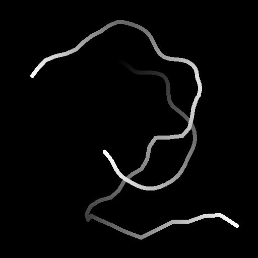

# 样条变形

<table>
<tr style="border: 0;">
<td style="border: 0;" valign="top">

<table>
<tr style="border: 0;">
<td width="33.33%" style="border: 0;" valign="top">

<b>In：</b>样条和路径工具>样条曲线工具

</td>
<td width="100.00%" style="border: 0;" valign="top">

## 描述

根据输入强度映射或矢量映射置换输入样条。

可以使用衰减控件沿样条调整变形效果的强度。

</td>
</tr>
</table>

## 输入连接器

<b>预览</b> *灰度*&#x200B;作为灰度图像的输入样条的预览。

<b>样条坐标</b> *颜色*&#x200B;在彩色图像的RGBA通道中编码的输入样条点的坐标：\
<b> R</b> - X位置\
<b> G</b> - Y位置\
<b> B</b> -Height\
<b>A</b> — 打包的数据：\
*符号：样条是封闭的（负）或开放的（正）；\
*绝对值：Thickness+ 1。

<b>样条数据</b> *颜色*&#x200B;编码在彩色图像的RGBA通道中的输入样条的其他数据。\
<b> R</b> — 切线X\
<b> G</b> — 切线Y\
<b> B</b> — 未使用\
<b> A</b> — 未使用

<b>样条量</b> *整数*&#x200B;输入样条的数量。

<b>强度图</b> *灰度*（在“使用矢量图”设置为“False”时可用）\
用于控制输入样条上变形效果的方向和强度的输入灰度图像。\
图像中每个像素的颜色指定乘数，用于沿样条点的法线（即，与样条垂直的方向）将样条点移动到图像的整个范围。\
当读取为乘数： 0和1时，图像中的[0； 1]值被重新映射到[-1； 1]范围，使样条以相同的距离移位，但方向相反。 0.5使样条保持不变。

<b>矢量图</b> *灰度*（在“使用矢量映射”设置为“True”时可用）用于控制输入样条上变形效果的方向和强度的输入彩色图像。\
图像中每个像素的颜色指定矢量(X，Y)，坐标以红色(X)和绿色(Y)通道编码。 +X表示正确，+Y表示失败。\
当读取为矢量坐标时，图像中的[0； 1]值将重新映射到[-1； 1]范围：0个红色替换点左侧，0个绿色替换点上侧。 0.5红色和绿色保留花键位置。

<b>衰减曲线</b> *灰度*&#x200B;使用第一行像素的值描述曲线的图像。\
在使用衰减曲线参数设置为True时，此输入用于控制变形效果在样条开始和结束附近的衰减。\
曲线提供了衰减的配置文件，行中的第一个像素是样条起始处变形效果的强度，最后一个像素是结尾处的强度。 灰度值是强度。\
可以使用“曲线”节点创建曲线。

## 输出连接器

<b>预览</b> *灰度*&#x200B;输出样条作为灰度图像的预览。

<b>样条坐标</b> *颜色*&#x200B;以彩色图像的RGBA通道编码的输出样条点的坐标。\
<b>R</b> - X位置\
<b>G</b> - Y位置\
<b>B</b> -Height\
<b>A</b> — 打包的数据：\
*符号：样条是封闭的（负）或开放的（正）；\
*绝对值：Thickness+ 1。

<b>样条数据</b> *颜色*&#x200B;以彩色图像的RGBA通道编码的输出样条的附加数据。\
<b>R</b> — 切线X\
<b>G</b> — 切线Y\
<b>B</b> — 未使用\
<b>A</b> — 未使用

<b>样条量</b> *整数*&#x200B;输出样条的数量。

## 参数

<b>变形强度</b> *浮动*&#x200B;样条被位移的强度。

<b>变形中心</b> *浮动*&#x200B;指定与保留样条相对应的“强度映射”值。\
值为0或1表示样条只能在一侧移动。

<b>采样模式</b> *整数*&#x200B;将强度映射或矢量映射中的值映射到样条的方法：\
*— 纹理空间*：这些值将应用于样条，如果使用纹理的UV坐标将这些值放置在纹理中，则将这些值应用于样条。 这有效地将值应用于样条“就位”；\
*— 沿样条水平*：值直接应用于编码样条坐标（请参阅样条坐标输入），其中从上到下每行应用于不同的样条；\
*— 小时。 沿样条线(rand. 偏移X)*：值直接应用于已编码的样条坐标（请参阅样条坐标输入），并且在每个样条的“比例映射”（即，样条坐标中的每一行）中具有随机水平偏移；\
*— 小时。 沿样条线(rand. 偏移Y)*：值直接应用于已编码的样条坐标（请参阅样条坐标输入），并且在每个样条的“比例映射”（即，样条坐标中的每一行）中具有随机垂直偏移。

<b>使用矢量图</b> *布尔型*&#x200B;将替换样条的方法切换为使用矢量映射输入来指定位移的方向。\
图像中每个像素的颜色指定矢量(X，Y)，坐标以红色(X)和绿色(Y)通道编码。 +X表示正确，+Y表示失败。\
当读取为矢量坐标时，图像中的[0； 1]值将重新映射到[-1； 1]范围：0个红色替换点左侧，0个绿色替换点上侧。 0.5红色和绿色保留花键位置。

<b>使用衰减曲线</b> *布尔值*&#x200B;允许使用衰减曲线输入图像中编码的曲线来控制样条上变形效果的强度。<b></b>

<b>强度图拼贴</b> *浮点*（在“采样模式”未设置为“纹理空间”时可用）直接映射到样条坐标时调整强度映射的拼贴（请参阅样条坐标输入）。<b></b>

<b>开始衰减</b> *浮点*（在“使用衰减曲线”设置为“False”时可用）用于衰减样条起始点附近的变形效果的乘数。\
值为1表示对样条的起始处不应用变形。

<b>结束衰减</b> *浮点*（在“使用衰减曲线”设置为“False”时可用）用于衰减样条末端附近的变形效果的乘数。\
值为1表示对样条末端不应用变形。<b></b>

<b>重新计算切线</b> *布尔值*&#x200B;为True时，在应用变形效果后重新计算样条的切线。\
这确保在节点（如样条上的散点或样条流映射器）中使用样条切线时，样条切线与其轨迹保持一致。

+++预览
<b>段数量</b> *整数*&#x200B;调整用于在预览输出中绘制样条可视化效果的段数。\
值越高，线条越平滑。

<b>显示方向帮助程序</b> *布尔值*&#x200B;在预览输出中，在样条线的起始处显示一个点，在其结尾处显示一个箭头。

<b>显示Thickness信封</b> *布尔值*\
在样条Thickness的边显示附加线。

<b>Thickness（像素）</b> *浮动*&#x200B;以像素为单位调整样条可视化在预览输出中的Thickness。

<b>背景预览强度</b> *浮动*\
值与背景预览输入图像相乘。

+++

## 示例

<table>
<tr style="border: 0;">
<td style="border: 0;" valign="top">

<table>
  <tr>
    <td>
      
       <i>之前</i>
    </td>
    <td>
      
       <i>之后</i>
    </td>
  </tr>
</table>

</td>
<td style="border: 0;" valign="top">

<table>
  <tr>
    <td>
      
       <i>之前</i>
    </td>
    <td>
      
       <i>之后</i>
    </td>
  </tr>
</table>

</td>
</tr>
</table>

<table>
<tr style="border: 0;">
<td style="border: 0;" valign="top">

</td>
<td style="border: 0;" valign="top">

</td>
</tr>
</table>

</td>
<td style="border: 0;" valign="top">

</td>
<td style="border: 0;" valign="top">

</td>
</tr>
</table>
