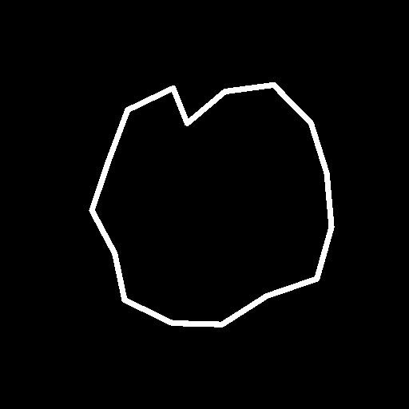

# 使用路径和样条曲线工具

路径和样条工具集是一个节点集合，可让您创作和编辑用于绘制、映射和散点图像的不区分分辨率的形状和曲线。

## 概述

### 什么是路径和样条？

<b>路径</b>是一系列连接到直线上的点。

<b>样条</b>是平滑曲线，其轨迹由控制点和这些点的切线形成。\
每个点还控制样条的Height和Thickness属性，这些属性用于驱动图像的映射、变形和散布。

每个都可以构建闭合或开放形状。

<table>
<tr style="border: 0;">
<td width="100.00%" style="border: 0;" valign="top">

### 节点输出

节点输出包含表示路径和样条的<b>编码数据</b>的图像。

例如，右侧的图像表示[路径多边形](../../../../../compositing-graphs/nodes-reference-for-com/node-library/spline-paths-tools/path-tools/paths-polygon/paths-polygon.md)节点输出的图像。

</td>
<td width="33.33%" style="border: 0;" valign="top">

</td>
</tr>
</table>

因此，它们生成的图像不能直接用作图形元素。 它们需要由工具集中的其他节点处理，这些节点可以将它们转换为图形结果，然后可以与其他可用于Substance图形的节点一起使用。

在处理路径和样条时，您可以使用路径专用[预览路径](../../../../../compositing-graphs/nodes-reference-for-com/node-library/spline-paths-tools/path-tools/preview-paths/preview-paths.md)节点和样条专用<b>预览</b>输出来预览在图像中映射的对象。

<table>
<tr style="border: 0;">
<td width="100.00%" style="border: 0;" valign="top">

### 2D视图交互

工具集中的大量节点提供了使用控制小工具直接在[2D视图](../../../../../interface/2d-view/2d-view.md)中执行编辑的功能。 这些小工具包括位置小工具和变换矩阵。

例如，样条生成节点，如[样条（三次）](../../../../../compositing-graphs/nodes-reference-for-com/node-library/spline-paths-tools/spline-tools/spline-cubic/spline-cubic.md)或[样条（多边形二次）](../../../../../compositing-graphs/nodes-reference-for-com/node-library/spline-paths-tools/spline-tools/spline-poly-quadratic/spline-poly-quadratic.md)允许您移动样条的控制点。 对于路径，[路径上的四元变换](../../../../../compositing-graphs/nodes-reference-for-com/node-library/spline-paths-tools/path-tools/quad-transform-on-path/quad-transform-on-path.md)在选中时具有类似的控件。

</td>
<td width="33.33%" style="border: 0;" valign="top">

</td>
</tr>
</table>

### Performance

路径和样条曲线工具需要大量计算，因此，在使用工具集时，您应该注意一些设置，以确保实现最佳性能和响应速度：

1. 该工具集广泛使用了<b>Substance 引擎</b>功能，这些功能在GPU上的运行速度要快得多。 因此，请对您的系统使用GPU版本的引擎： <b>Direct3D</b> (Windows)或<b>OpenGL</b> (macOS)。\
   您可以通过按<b>F9</b>键或转到主菜单栏中的<b>引擎>切换引擎...</b>来切换工具。
1. 然后，我们强烈建议在[首选项](../../../../../interface/preferences-window/preferences-window.md)的<b>图形</b>部分中关闭<b>上下文编辑</b>（转到主菜单栏中的<b>编辑>首选项……</b>以访问此窗口）。\
   使用上下文编辑功能，您可以在宿主图形的上下文中打开实例化，这虽然非常方便，但也会产生副作用，如成倍地增加工具集的图像缓存所需的计算。

当将这两个设置中的任何一个更改为推荐状态时，您应该会注意到性能的大幅提升。

## 路径工具

### 生成路径

[路径多边形](../../../../../compositing-graphs/nodes-reference-for-com/node-library/spline-paths-tools/path-tools/paths-polygon/paths-polygon.md)生成具有指定半径和边数的多边形形状的路径。

或者，可以使用[蒙版到路径](../../../../../compositing-graphs/nodes-reference-for-com/node-library/spline-paths-tools/path-tools/mask-to-paths/mask-to-paths.md)灰度图像从节点中提取路径。\
这是当前生成复杂形状的唯一方法，它允许您利用[图形节点](../../../../../compositing-graphs/nodes-reference-for-com/nodes-reference-for-substance-compositing-graphs.md)的整个库来生成最终将转换为路径的形状。

{width="600px"}

### 编辑路径

[路径2D变换](../../../../../compositing-graphs/nodes-reference-for-com/node-library/spline-paths-tools/path-tools/path-2d-transform/path-2d-transform.md)、[路径变形](../../../../../compositing-graphs/nodes-reference-for-com/node-library/spline-paths-tools/path-tools/paths-warp/paths-warp.md)和[路径上的四边变换](../../../../../compositing-graphs/nodes-reference-for-com/node-library/spline-paths-tools/path-tools/quad-transform-on-path/quad-transform-on-path.md)允许您编辑路径的形状。

您也可以使用[路径选择](../../../../../compositing-graphs/nodes-reference-for-com/node-library/spline-paths-tools/path-tools/paths-select/paths-select.md)节点，通过按索引或按长度选择路径来删除不需要的路径。

借助[路径顶点处理器](../../../../../compositing-graphs/nodes-reference-for-com/node-library/spline-paths-tools/path-tools/paths-vertex-processor/paths-vertex-processor.md)节点，可以对路径的每个点进行更复杂的处理。 存在[更简单的版本](../../../../../compositing-graphs/nodes-reference-for-com/node-library/spline-paths-tools/path-tools/paths-vertex-processor-1/paths-vertex-processor-simple.md)，可进行更轻松的调整。

<table>
<tr style="border: 0;">
<td width="100.00%" style="border: 0;" valign="top">

### “预览路径”节点

使用专用的[预览路径](../../../../../compositing-graphs/nodes-reference-for-com/node-library/spline-paths-tools/path-tools/preview-paths/preview-paths.md)节点预览路径节点的结果。\
此节点没有输出。 双击节点上的LMB以在[2D 视图](../../../../../interface/2d-view/2d-view.md)中显示预览。

单独的路径在预览中具有唯一的颜色，以便轻松地区分每个路径。

</td>
<td width="33.33%" style="border: 0;" valign="top">

</td>
</tr>
</table>

### 样条路径

通过使用[路径到样条](../../../../../compositing-graphs/nodes-reference-for-com/node-library/spline-paths-tools/path-tools/paths-to-spline/paths-to-spline.md)节点将路径转换为样条，您可以利用专用于带有路径的样条的整个工具集。

请记住，样条是曲线，因此不能保持路径的锐度。 在将路径转换为样条时，预计形状会出现一些平滑效果。

以下是通过路径利用样条刀具集的非常有用的组合：

<b>蒙版>路径蒙版>样条路径</b>

### 路径格式规范

需要“预览路径”节点，因为“路径”节点输出以彩色图像编码的路径的数据。\
此编码遵循[路径格式规范](../../../../../compositing-graphs/nodes-reference-for-com/node-library/spline-paths-tools/path-tools/paths-format-spe/paths-format-specifications.md)页面中描述的规范。

您可以使用此规范生成您自己的节点，并充分利用[路径顶点处理器](../../../../../compositing-graphs/nodes-reference-for-com/node-library/spline-paths-tools/path-tools/paths-vertex-processor/paths-vertex-processor.md)节点。

## 样条曲线工具

### 生成样条

可以使用[样条圆](../../../../../compositing-graphs/nodes-reference-for-com/node-library/spline-paths-tools/spline-tools/spline-circle/spline-circle.md)、[样条（三次）](../../../../../compositing-graphs/nodes-reference-for-com/node-library/spline-paths-tools/spline-tools/spline-cubic/spline-cubic.md)或[样条（多边形二次）](../../../../../compositing-graphs/nodes-reference-for-com/node-library/spline-paths-tools/spline-tools/spline-poly-quadratic/spline-poly-quadratic.md)等节点生成样条。 这些节点允许您根据节点使用不同的控件绘制任意轨迹的样条。

或者，可以使用[路径到样条](../../../../../compositing-graphs/nodes-reference-for-com/node-library/spline-paths-tools/path-tools/paths-to-spline/paths-to-spline.md)节点从路径中提取样条。\
请记住，样条是曲线，因此不能保持路径的锐度。 在将路径转换为样条时，预计形状会出现一些平滑效果。

以下是通过路径利用样条刀具集的非常有用的组合：

<b>蒙版>路径蒙版>样条路径</b>

样条还可以帮助您生成更多样条。 例如，[样条桥（2样条）](../../../../../compositing-graphs/nodes-reference-for-com/node-library/spline-paths-tools/spline-tools/spline-bridge-2-splines/spline-bridge-2-splines.md)和[样条桥（列表）](../../../../../compositing-graphs/nodes-reference-for-com/node-library/spline-paths-tools/spline-tools/spline-bridge-list/spline-bridge-list.md)生成按顺序遍历样条列表的样条。

### 编辑样条

[样条2D变换](../../../../../compositing-graphs/nodes-reference-for-com/node-library/spline-paths-tools/spline-tools/spline-2d-transform/spline-2d-transform.md)和[样条变形](../../../../../compositing-graphs/nodes-reference-for-com/node-library/spline-paths-tools/spline-tools/spline-warp/spline-warp.md)允许您编辑样条的形状。

您也可以通过使用[样条选择](../../../../../compositing-graphs/nodes-reference-for-com/node-library/spline-paths-tools/spline-tools/spline-select/spline-select.md)节点按索引选择路径以及修剪样条来删除不需要的样条。

除了其运动轨迹外，还可以在实际使用后使用[样条采样Height](../../../../../compositing-graphs/nodes-reference-for-com/node-library/spline-paths-tools/spline-tools/spline-sample-height/spline-sample-height.md)和[样条采样Thickness](../../../../../compositing-graphs/nodes-reference-for-com/node-library/spline-paths-tools/spline-tools/spline-sample-thickness/spline-sample-thickness.md)调整样条的Height和Thickness属性。

最后，借助[样条合并列表](../../../../../compositing-graphs/nodes-reference-for-com/node-library/spline-paths-tools/spline-tools/spline-merge-list/spline-merge-list.md)节点，可以将单独的样条合并为单个样条。

### 附加样条

在创建和编辑样条时，可能需要将多个样条组合在一起，以便同时调整或使用所有样条。

请务必记住，样条是以<b>有序列表</b>的形式存储和处理的。

使用[样条附加](../../../../../compositing-graphs/nodes-reference-for-com/node-library/spline-paths-tools/spline-tools/spline-append/spline-append.md)节点完成组合样条。 追加是指在有序实体的末尾添加内容的行为。 实际上，节点通过将第二组添加到第一组的末尾来组合两个样条列表。

因此，考虑将样条附加在一起的顺序非常重要。

这会影响需要合并样条的节点，如[样条桥（列表）](../../../../../compositing-graphs/nodes-reference-for-com/node-library/spline-paths-tools/spline-tools/spline-bridge-list/spline-bridge-list.md)、[样条桥映射器](../../../../../compositing-graphs/nodes-reference-for-com/node-library/spline-paths-tools/spline-tools/spline-bridge-mapper-gra/spline-bridge-mapper-grayscale.md)和[样条合并列表](../../../../../compositing-graphs/nodes-reference-for-com/node-library/spline-paths-tools/spline-tools/spline-merge-list/spline-merge-list.md)。

### 样条输入和输出

使用一组连接器将样条从一个节点传递到另一个节点：

* <b>样条坐标&#x200B;</b>*颜色*&#x200B;在彩色图像的RGBA通道中编码的输入样条点的坐标。
* <b>样条数据&#x200B;</b>*颜色*&#x200B;在彩色图像的RGBA通道中编码的输入样条的其他数据。
* <b>样条量&#x200B;</b>*整数*&#x200B;输入样条数。

源节点的每个输出连接器都应连接到目标节点中匹配名称的输入连接器。

若要更快地建立这些连接，您可以使用<b>材质</b>或<b>紧凑材质</b> [链接创建模式](../../../../../interface/the-graph-view/link-creation-modes/link-creation-modes.md)。 这样，只需一次操作即可连接三个样条连接器。

<table>
<tr style="border: 0;">
<td style="border: 0;" valign="top">

### 预览输出

大多数节点都提供<b>预览</b>输出，用于渲染图像中的样条，以便您可以了解其轨迹和属性。

可使用<b>预览</b>组中的参数在节点参数中调整此预览。

</td>
<td style="border: 0;" valign="top">

</td>
</tr>
</table>

<table>
<tr style="border: 0;">
<td width="100.00%" style="border: 0;" valign="top">

### 渲染为区段

样条是没有固有分辨率的曲线，这意味着它们可以无限放大或缩小，准确表示它们的唯一限制是存储数据的精度。

要将样条绘制为像素，工具集可将样条简化为沿样条轨迹绘制的直线或线段。

</td>
<td width="33.33%" style="border: 0;" valign="top">

</td>
</tr>
</table>

这意味着您可能需要注意用于在图像中绘制样条线的线段数量，因为该数量可能太低，无法绘制平滑的曲线，或者太高，对目标分辨率造成浪费。

在图像中绘制样条的节点具有<b>段数量</b>参数，使用该参数可以控制段的数量。 值越高，曲线就越平滑，但会降低性能。

### 从样条创建图像

完成样条的创作和编辑后，可以使用它们生成可利用Substance图形节点的其余部分的图像。

使用样条生成图形主要有三种方法：

* 使用[样条渲染](../../../../../compositing-graphs/nodes-reference-for-com/node-library/spline-paths-tools/spline-tools/spline-render/spline-render.md)或[样条填充](../../../../../compositing-graphs/nodes-reference-for-com/node-library/spline-paths-tools/spline-tools/spline-fill/spline-fill.md)节点使用其形状和属性来渲染样条；
* 沿带有映射节点的样条映射图像，如[样条映射器](../../../../../compositing-graphs/nodes-reference-for-com/node-library/spline-paths-tools/spline-tools/spline-mapper-grayscale/spline-mapper-grayscale.md)、[样条桥映射器](../../../../../compositing-graphs/nodes-reference-for-com/node-library/spline-paths-tools/spline-tools/spline-bridge-mapper-gra/spline-bridge-mapper-grayscale.md)和[样条流映射器](../../../../../compositing-graphs/nodes-reference-for-com/node-library/spline-paths-tools/spline-tools/spline-flow-mapper/spline-flow-mapper.md)；
* 沿样条与[样条上的散点](../../../../../compositing-graphs/nodes-reference-for-com/node-library/spline-paths-tools/spline-tools/scatter-spline-grayscale/scatter-on-spline-grayscale.md)散点的图案。
