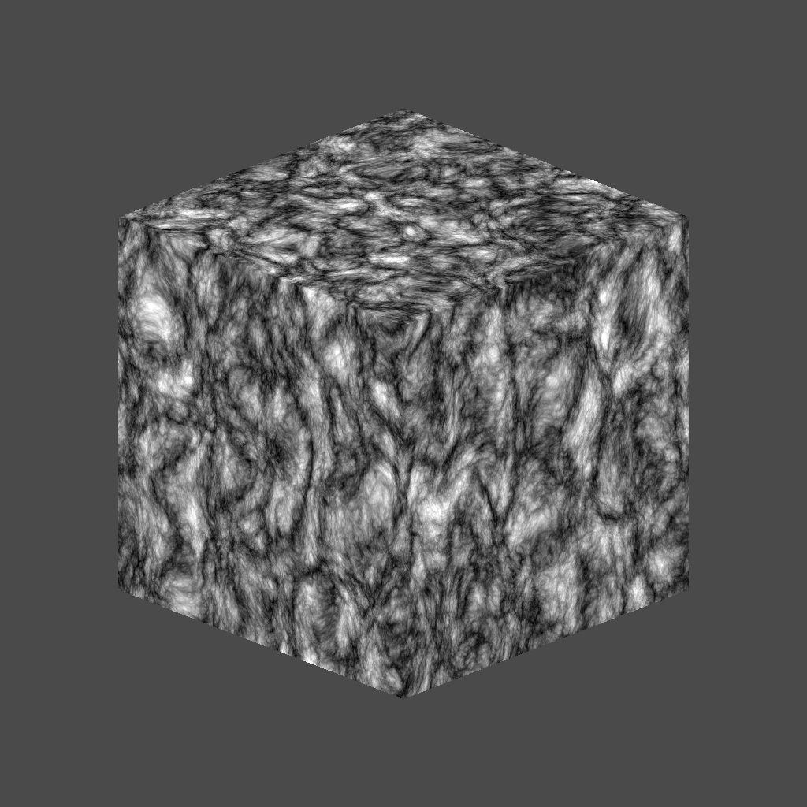

# 三维脊状噪声分形

<table>
<tr style="border: 0;">
<td width="33.33%" style="border: 0;" valign="top">

{width="200px"}

<b>进入：</b>纹理生成器>噪声

</td>
<td width="100.00%" style="border: 0;" valign="top">

## 描述

“<b>3D脊状噪声分形</b>”节点基于“<b>位置映射</b>”输入在3D空间中生成“<i>分形</i>”脊状噪声。

此节点可以使用[Cube 3D GBuffers](../../../../../../compositing-graphs/nodes-reference-for-com/node-library/texture-generators/patterns/cube-3d-gbuffers/cube-3d-gbuffers.md)作为输入而不是实际已烘焙贴图进行测试（如下面的示例图像所示）。

</td>
</tr>
</table>

>[!WARNING]
>
> 此噪声仅适用于<i>GPU引擎</i>（即<b>Direct3D</b>或<b>OpenGL</b>）。 转到<b>工具>切换引擎……</b>或按<b>F9</b>键以选择所需的引擎。

## 参数

|  |  |
|:---|:---|
| <b>反转</b> <i>布尔值</i> | 反转输出图像。 |
| <b>缩放</b> <i>浮动</i> | 控制分形3D脊状杂色的缩放比例。 |
| <b>大小</b> <i>浮点3</i> | 控制<b>X</b>、<b>Y</b>和<b>Z</b>轴中的分形3D脊状噪声的大小。 非均匀值导致<i>拉伸或挤压</i>效果。 |
| <b>偏移</b> <i>浮点3</i> | 将偏移应用于<b>X</b>、<b>Y</b>和<b>Z</b>轴中的分形3D脊状噪点<i>位置</i>。 |
| <b>扭曲强度</b> <i>浮动</i> | 控制应用于分形3D脊状噪点<i>变形效果</i>的强度。 |
| <b>扭曲比例乘数</b> <i>浮动</i> | 控制变形效果中使用的<i>变形图案</i>的比例，该比例由<b>扭曲强度</b>控制。 |
| <b>最小级别</b> <i>整数</i> | 分形图案中使用的最小<i>重复级别</i>。 更宽的最小值/最大值范围会生成<i>更丰富的图案</i>，并且随更多频率范围而变化。 |
| <b>最大级别</b> <i>整数</i> | 分形图案中使用的最大重复级别<i>为</i>。 更宽的最小值/最大值范围会生成<i>更丰富的图案</i>，并且随更多频率范围而变化。 |
| <b>粗糙度</b> <i>浮动</i> | 控制分形图案中低和高<i>重复级别</i>之间的<i>平衡</i>。  <i>注意</i>：值<b>0</b>导致输出<i>与随后的其他低值不符</i>。 这是预期的。 |
| <b>隙度</b> <i>浮动</i> | 控制应用的分形图案<i>填充空间</i>的方式。 <i>较高的</i>值会使图案中的间隙减少<i>，从而产生<i>更密</i>的杂色。</i> |
| <b>全局不透明度</b> <i>浮动</i> | 在<b>基线</b>值</i>周围控制分形3D脊状噪声值的<i>范围</i>。<i> |
| <b>基线</b> <i>浮动</i> | 将<i>偏移</i>应用于3D脊状噪声值分布的基线<i>明亮度</i>值。 |
| <b>对比度</b> <i>浮动</i> | 调整3D边框噪声的对比度。 |
| <b>启用拼贴</b> <i>布尔值</i> | 调整3D脊状噪声，使其生成的图案<i>在X、Y和Z轴中重复</i>。 |

## 示例

<table style="margin-top: 32px; margin-bottom: 32px">
    <tr style="border: 0">
        <td style="border: 0; background: transparent">
            
        </td>
        <td style="border: 0; background: transparent">
            
        </td>
    </tr>
</table>
