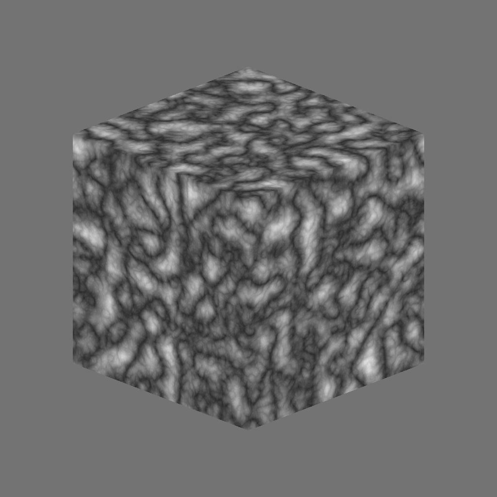

# 3D脊形噪声分形

<table>
<tr style="border: 0;">
<td width="41.60%" style="border: 0;" valign="top">

{width="200px"}

**在：** *纹理生成器**/噪声*

**中级**

</td>
<td width="58.30%" style="border: 0;" valign="top">

## 描述

**3D脊状噪声分形**&#x200B;节点根据&#x200B;**位置映射**&#x200B;输入在3D空间中生成&#x200B;*分形*&#x200B;脊状噪声。

此节点可以使用[Cube 3D GBuffers](../../../../../../compositing-graphs/nodes-reference-for-com/node-library/texture-generators/patterns/cube-3d-gbuffers/cube-3d-gbuffers.md)作为输入而不是实际已烘焙贴图进行测试（如下面的示例图像所示）。

>[!WARNING]
>
> 此噪声仅适用于&#x200B;*GPU引擎*（即&#x200B;**Direct3D**&#x200B;或&#x200B;**OpenGL**）。 转到&#x200B;**工具>切换引擎...**&#x200B;或按&#x200B;**F9**&#x200B;键以选择所需的引擎。

</td>
</tr>
</table>

## 参数

* **反转** *布尔值*\
  反转输出图像。
* **缩放** *Float*\
  控制分形3D边缘噪声的比例。
* **大小** *Float3*\
  在&#x200B;**X**、**Y**&#x200B;和&#x200B;**Z**&#x200B;轴中控制分形3D边缘噪声的大小。 值不一致会产生&#x200B;*拉伸或挤压*&#x200B;效果。
* **偏移** *Float3*\
  将偏移应用于&#x200B;**X**、**Y**&#x200B;和&#x200B;**Z**&#x200B;轴中的分形3D边缘噪声的&#x200B;*位置*。
* **扭曲强度** *Float*\
  控制应用于分形3D脊形噪声的&#x200B;*变形效果*&#x200B;的强度。
* **扭曲比例乘数** *Float*\
  控制变形效果中使用的&#x200B;*变形图案*&#x200B;的比例，该比例由&#x200B;**扭曲强度**&#x200B;控制。
* **最小级别** *整数*\
  分形图案中使用的最小&#x200B;*重复级别*。 更宽的最小值/最大值范围会生成&#x200B;*更丰富的图案*，并且随更多频率范围而变化。
* **最大级别** *整数*\
  分形图案中使用的最大重复级别&#x200B;*为*。 更宽的最小值/最大值范围会生成&#x200B;*更丰富的图案*，并且随更多频率范围而变化。
* **粗糙度** *Float*\
  控制分形图案中&#x200B;*低重复级别与高重复级别*&#x200B;之间的平衡&#x200B;**。\
  *注意*： **0**&#x200B;的值导致输出为&#x200B;*不在行*&#x200B;中，并在行之后出现其他低值。 这是预期的。
* **隙度** *Float*\
  控制应用的分形图案&#x200B;*填充空间*&#x200B;的方式。 *较高的*&#x200B;值使图案中的间隙减少&#x200B;*，噪声增加*&#x200B;密度&#x200B;*。*
* **全局不透明度** *Float*\
  在&#x200B;**基线**&#x200B;值&#x200B;*周围控制分形3D脊状噪声值的*&#x200B;范围&#x200B;*。*
* **基线** *Float*\
  将&#x200B;*偏移*&#x200B;应用于3D脊状噪声值分布的基线&#x200B;*明亮度*&#x200B;值。
* **对比度** *Float*\
  调整3D边框噪声的对比度。
* **启用拼贴** *布尔值*\
  调整3D脊状噪声，使其生成的图案&#x200B;*在X、Y和Z轴中重复*。

## 示例图像

<table>
<tr style="border: 0;">
<td style="border: 0;" valign="top">

{width="256px"}

</td>
<td style="border: 0;" valign="top">

{width="256px"}

</td>
</tr>
</table>
