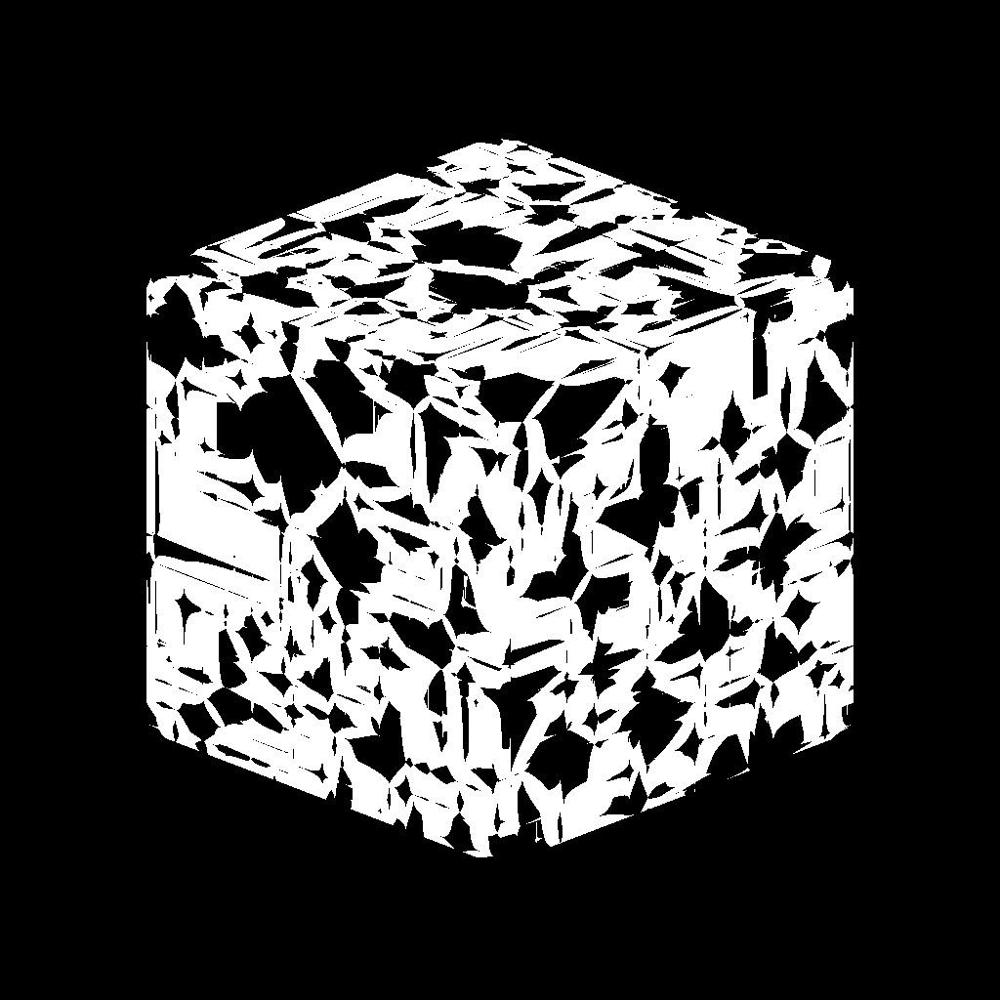

# 3D Voronoi

<table>
<tr style="border: 0;">
<td width="33.33%" style="border: 0;" valign="top">

{width="200px"}

<b>进入：</b>纹理生成器>噪声

</td>
<td width="100.00%" style="border: 0;" valign="top">

## 描述

<b>3D Voronoi</b>节点基于<b>位置映射</b>输入在3D空间中生成Voronoi噪声。

此节点可以使用[Cube 3D GBuffers](../../../../../../compositing-graphs/nodes-reference-for-com/node-library/texture-generators/patterns/cube-3d-gbuffers/cube-3d-gbuffers.md)作为输入而不是实际已烘焙贴图进行测试（如下面的示例图像所示）。

</td>
</tr>
</table>

>[!WARNING]
>
> 此噪声仅适用于<i>GPU引擎</i>（即<b>Direct3D</b>或<b>OpenGL</b>）。 转到<b>工具>切换引擎...</b>或按<b>F9</b>键以选择所需的引擎。

## 参数

|  |  |
|:---|:---|
| <b>反转</b> <i>布尔值</i> | 反转输出图像。 |
| <b>缩放</b> <i>Float</i> | 控制3D Voronoi噪声的比例。  <i>注意</i>：在<i>任何轴</i>上启用<b>拼贴</b>时，比例调整为<i>分步</i>。 这是预期的。 |
| <b>大小</b> <i>Float3</i> | 控制<b>X</b>、<b>Y</b>和<b>Z</b>轴中的3D Voronoi噪声的大小。 非均匀值导致<i>拉伸或挤压</i>效果。  <i>注意</i>：在<i>任何轴</i>上启用<b>拼贴</b>时，大小调整为<i>步进</i>。 这是预期的。 |
| <b>偏移</b> <i>Float3</i> | 在<b>X</b>、<b>Y</b>和<b>Z</b>轴中对3D Voronoi噪声的<i>位置</i>应用偏移。 |
| <b>无序</b> <i>Float3</i> | 应用于<b>X</b>、<b>Y</b>和<b>Z</b>轴中每个噪声点的<i>随机偏移</i>的强度。 |
| <b>扭曲强度</b> <i>浮动</i> | 控制应用于3D Voronoi噪声的<i>变形效果</i>的强度。 |
| <b>扭曲比例乘数</b> <i>浮动</i> | 控制变形效果中使用的<i>变形图案</i>的比例，该比例由<b>扭曲强度</b>控制。 |
| <b>圆角曲线</b> <i>浮动</i> | 围绕噪声的每个点对<i>斜率</i>进行圆整，使其成为<i>凸形</i>。  <i>注意</i>：当<b>Style</b>参数设置为<i>Edge</i>时，此参数不可用。 |
| <b>距离刻度</b> <i>浮动</i> | 调整渐变</i>在每个噪声点周围的<i>距离。 |
| <b>距离模式</b> <i>整数</i> | 将方法设置为<i>计算噪声的每个点周围的距离渐变</i>：  - <i>欧几里德</i> - <i>曼哈顿</i> - <i>切比雪夫</i> - <i>明科夫斯基</i> |
| <b>闵可夫斯基数值</b> <i>浮动</i> | Minkowski距离的顺序<i>p</i>。 如果将距离渐变划分为几个象限，则此数值将对这些象限产生如下影响：   - p是<i>刚好</i> 1：笔直 - p是<i>低</i>比1：凹形 - p是<i>大</i>比1：凸形  有趣的值： - <i>1.0</i>：曼哈顿距离 - <i>2.0</i>：欧几里德距离 - <i>无限远</i>：切比雪夫distance  <i>注意</i>：此参数仅在<b>Distance Mode</b>参数设置为<i>Minkowski</i>时可用。 |
| <b>样式</b> <i>整数</i> | 设置3D Voronoi噪声的方法<i>渲染数据</i>，考虑到噪声基于3D空间中的一组点：  - <i>F1</i>：到3D空间中<i>最近点</i>的距离 - <i>F2</i>：到3D空间中<i>第二个最近点</i>的距离 - <i>F2-F1</i> - <i>F1\*F2</i> - <i>F f1/F2</i> - <i>边缘</i>：3D空间中噪声的每个单元格之间的</i>边缘<i>- <i>随机颜色</i>：为3D空间中噪声的每个单元格分配<i>随机平色</i>  |
| <b>边缘Thickness</b> <i>浮动</i> | 调整3D Voronoi噪声的细胞之间检测到的边缘的Thickness。 在X、Y和Z轴中检测到边缘，因此某些厚度可能比其他厚度增加得更快，具体取决于单元格的<i>深度</i>。  <i>注意</i>：仅当<b>Style</b>参数设置为<i>Edge</i>时，此参数才可用。 |
| <b>启用拼贴</b> <i>布尔值</i> | 调整3D Voronoi噪声，使其生成的图案在X、Y和Z轴上<i>重复</i>。 |

## 示例

<table style="margin-top: 32px; margin-bottom: 32px">
    <tr style="border: 0">
        <td style="border: 0; background: transparent">
            
        </td>
        <td style="border: 0; background: transparent">
            
        </td>
        <td style="border: 0; background: transparent">
            
        </td>
    </tr>
    <tr style="border: 0; background: transparent">
        <td style="border: 0; background: transparent">
            
        </td>
        <td style="border: 0; background: transparent">
            
        </td>
        <td style="border: 0; background: transparent">
            
        </td>
    </tr>
</table>
