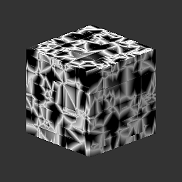

# 3D Worley Noise

<table>
<tr style="border: 0;">
<td width="33.33%" style="border: 0;" valign="top">

{width="128px"}

<b>进入：</b>纹理生成器>噪声

</td>
<td width="100.00%" style="border: 0;" valign="top">

## 描述

它是库中最通用和高级的噪声之一，它根据输入位置映射在3D空间中生成Worley噪声。 它具有许多选项，可以使它比基于[细胞](../../../../../../compositing-graphs/nodes-reference-for-com/node-library/texture-generators/noises/cells-1/cells-1.md)或[距离](../../../../../../compositing-graphs/nodes-reference-for-com/atomic-nodes/distance/distance.md)的标准噪声更加强大。

</td>
</tr>
</table>

## 参数

|  |  |
|:---|:---|
| <b>缩放</b> <i>1 - 64</i> | 设置效果的全局比例。 |
| <b>大小</b> <i>0.0 - 1.0</i> | 分别对X、Y和Z轴执行非均匀缩放。 |
| <b>模式</b> <i>欧几里德，曼哈顿，切比雪夫，明科夫斯基</i> | 更改距离度量。 允许使用一些非常不同的噪声类型。 |
| <b>闵可夫斯基数值</b> <i>0.0 - 20.0</i> | 只有明科夫斯基距离度量才有。 不同类型度量之间的混合。 |
| <b>样式</b> <i>F1，F2，F2-F1，边框，随机颜色</i> | 设置度量组合的数学。 支持更多组合。 |
| <b>边框宽度</b> <i>0.0 - 1.0</i> | 当“边框组合”math处于活动状态时，控制边框的宽度。 |
| <b>圆形</b> <i>0.0 - 1.0</i> | 仅适用于F1、F2和F2-F1模式。 设置级别中间位置。 |
| <b>反转</b> <i>False/True</i> | 反转结果。 |

## 示例

<table style="margin-top: 32px; margin-bottom: 32px">
    <tr style="border: 0">
        <td style="border: 0; background: transparent">
            
        </td>
        <td style="border: 0; background: transparent">
            
        </td>
        <td style="border: 0; background: transparent">
            
        </td>
        <td style="border: 0; background: transparent">
            
        </td>
    </tr>
</table>
