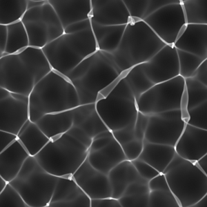

# 焦散

<table>
<tr style="border: 0;">
<td width="33.33%" style="border: 0;" valign="top">

{width="128px"}

<b>进入：</b>纹理生成器>噪声

</td>
<td width="100.00%" style="border: 0;" valign="top">

## 描述

基于高度图和光方向生成投影焦散线。有灰度版本和颜色版本时，差异都非常细微，但颜色版本会添加颜色分散效果。 从单点强制转换光源，不使用环境图。

</td>
</tr>
</table>

## 参数

|  |  |
|:---|:---|
| <b>输出色彩空间</b> <i>原始，sRGB</i> | 设置输出色彩空间。 |
| <b>光子网格大小</b> <i>自动、512、1024、2048、4096</i> | 通过调整网格大小设置品质，但默认为匹配输入。 可用于加速计算。 |
| <b>表面Height缩放</b> <i>0.0 - 1.0</i> | 用于确定如何解释Height的乘数。 |
| <b>表面Height位置</b> <i>0.0 - 1.0</i> | 设置折射曲面到投影的距离。 |
| <b>表面IOR</b> <i>1.0 - 2.0</i> | 设置折射率，在色散版本中，这将添加更多颜色颜色。 |
| <b>光子大小</b> <i>1.0 - 50.0</i> | 光子大小影响效果的锐度。 |
| <b>色散</b> <i>0.0 - 0.01（仅限颜色版本）</i> | 仅影响颜色色散。 IOR值较低时不可见。 |
| <b>抖动</b> <i>0.0 - 1.0</i> | 为强制转换光子粒子添加不规则抖动。 |
| <b>光源位置</b> | 移动光源位置。 还通过2D 视图中的小工具完成。 |
| <b>背景颜色</b> <i>（颜色值）（仅限颜色版本）</i> | 更改背景颜色。 灰度版本仅限黑色。 |
| <b>非正方形扩展</b> <i>False/True</i> | 启用使用非方形比率补偿挤压和拉伸。 |

## 示例

<table style="margin-top: 32px; margin-bottom: 32px">
    <tr style="border: 0">
        <td style="border: 0; background: transparent">
            
        </td>
    </tr>
</table>
