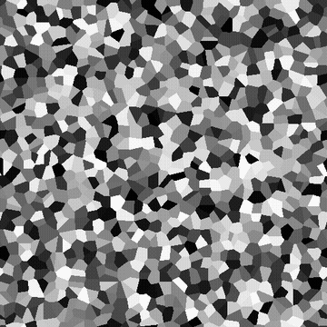

# 细胞4

<table>
<tr style="border: 0;">
<td width="33.33%" style="border: 0;" valign="top">

{width="200px"}

<b>在：</b>纹理生成器>杂色

</td>
<td width="100.00%" style="border: 0;" valign="top">

## 描述

<b>细胞</b>壁噪声的变体。

每个单元格被分配一种平坦颜色，该颜色可以是随机的，也可以是从输入图像中取样的。

另请参阅：[细胞1](../../../../../../compositing-graphs/nodes-reference-for-com/node-library/texture-generators/noises/cells-1/cells-1.md)、[细胞2](../../../../../../compositing-graphs/nodes-reference-for-com/node-library/texture-generators/noises/cells-2/cells-2.md)、[细胞3](../../../../../../compositing-graphs/nodes-reference-for-com/node-library/texture-generators/noises/cells-3/cells-3.md)

</td>
</tr>
</table>

## 输入

|  |  |
|:---|:---|
| <b>输入</b> <i>灰度</i> |  |

## 输出

|  |  |
|:---|:---|
| <b>输出</b> <i>灰度</i> | 生成的杂色作为灰度位图。 |

## 参数

|  |  |
|:---|:---|
| <b>缩放</b> <i>整数</i> | 使用网格细分生成噪声拼贴。    值越高，所绘制的拼贴就越多，噪音也越浓。 |
| <b>无序</b> <i>浮动</i> | 替换噪点的成分。    这可用于为噪声设置动画。 |
| <b>无序速度</b> <i>浮动</i> | 调整<b>无序</b>参数应用的位移的距离。    这可用于在制作噪声动画时控制位移的速度。 |
| <b>颜色源</b> <i>整数</i> | 应用于单元格的单色源：<ul data-preserve-html="true"> <li data-preserve-html="true"><b><i>随机：</i></b>使用由节点的随机种子控制的随机颜色</li> <li data-preserve-html="true"><b><i>伪随机：</i></b>使用由单独的用户集值植入的随机颜色</li> <li data-preserve-html="true"><b><i>图像输入：</i></b>使用在输入图像中的单元格位置取样的颜色</li> </ul> |
| <b>伪随机种子</b> <i>整数</i>   *当“颜色源”设置为“伪随机”时可用* | 允许独立于节点种子更改颜色的种子。 |
| <b>非方形扩展</b> <i>布尔值</i> | 在非方形图像中，保持生成的拼贴方形，并将杂色生成扩展到图像边界。 |

## 示例

<table>
<tr style="border: 0;">
<td style="border: 0;" valign="top">

{zoomable="yes"}

</td>
<td style="border: 0;" valign="top">

{zoomable="yes"}

</td>
</tr>
</table>
