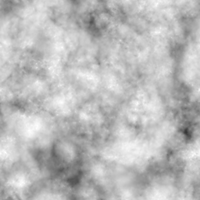

# 云彩2

<table>
<tr style="border: 0;">
<td style="border: 0;" valign="top">

<table>
<tr style="border: 0;">
<td width="33.33%" style="border: 0;" valign="top">

{width="200px"}

<b>在：</b>纹理生成器>杂色

</td>
<td width="100.00%" style="border: 0;" valign="top">

## 描述

粗糙<b>云</b>噪声的变化。

另请参阅：[云1](../../../../../../compositing-graphs/nodes-reference-for-com/node-library/texture-generators/noises/clouds-1/clouds-1.md)、[云3](../../../../../../compositing-graphs/nodes-reference-for-com/node-library/texture-generators/noises/clouds-3/clouds-3.md)

</td>
</tr>
</table>

## 输出

|  |  |
| --- | --- |
| <b>输出</b> *灰度* | 生成的杂色作为灰度位图。 |

## 参数

|  |  |
| --- | --- |
| <b>缩放</b>整数 | 使用网格细分生成噪声拼贴。    值越高，所绘制的拼贴就越多，噪音也越浓。 |
| <b>无序</b>浮动 | 替换噪点的成分。    这可用于为噪声设置动画。 |
| <b>无序速度</b>浮动 | 调整<b>无序</b>参数应用的位移的距离。    这可用于在制作噪声动画时控制位移的速度。 |
| <b>无序各向异性</b>浮动 | 控制<b>无序</b>参数应用的位移的方向跨度，值越高，方向越窄，定义越明确。    方向由<b>无序各向异性角</b>参数控制。 |
| <b>无序各向异性角度</b>浮动 | 当<b>无序位移</b>参数不为零时，控制<b>无序</b>参数应用的各向异性的方向。 |
| <b>拼贴偏移</b>浮动2 | 控制用于渲染噪声的无限平面部分的位置。 |
| <b>非方形扩展</b>布尔值 | 在非方形图像中，保持生成的拼贴为方形，并将噪声生成扩展到图像边界。 |

## 示例

<table>
<tr style="border: 0;">
<td style="border: 0;" valign="top">

{zoomable="yes"}

</td>
<td style="border: 0;" valign="top">

{zoomable="yes"}

</td>
</tr>
</table>

<table>
<tr style="border: 0;">
<td style="border: 0;" valign="top">

{zoomable="yes"}

</td>
<td style="border: 0;" valign="top">

{zoomable="yes"}

</td>
</tr>
</table>

</td>
<td style="border: 0;" valign="top">

</td>
<td style="border: 0;" valign="top">

</td>
</tr>
</table>
