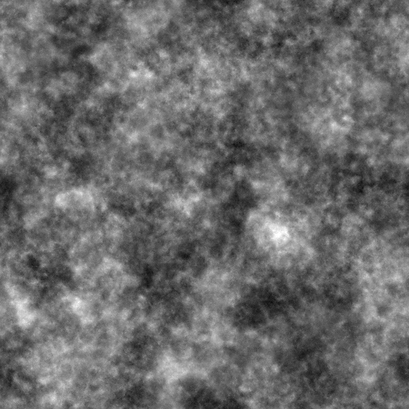
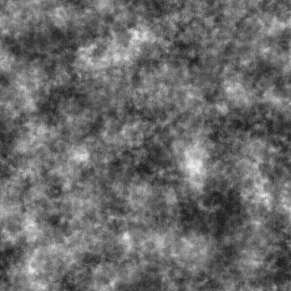
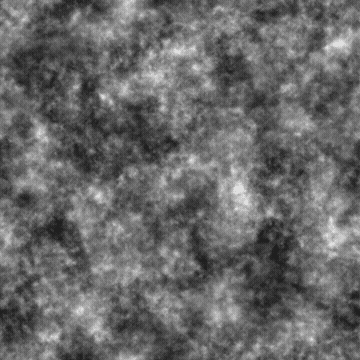
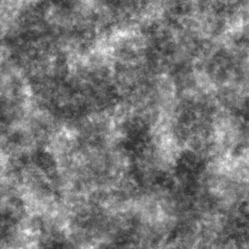

# 云彩3

<table>
<tr style="border: 0;">
<td width="33.33%" style="border: 0;" valign="top">

{width="200px"}

<b>进入：</b>纹理生成器>噪声

</td>
<td width="100.00%" style="border: 0;" valign="top">

## 描述

粗糙<b>云彩</b>噪声的变体。

另请参阅：[云1](../../../../../../compositing-graphs/nodes-reference-for-com/node-library/texture-generators/noises/clouds-1/clouds-1.md)、[云2](../../../../../../compositing-graphs/nodes-reference-for-com/node-library/texture-generators/noises/clouds-2/clouds-2.md)

</td>
</tr>
</table>

## 输出

|  |  |
|:---|:---|
| <b>输出</b> <i>灰度</i> | 生成的灰度位图噪声。 |

## 参数

|  |  |
|:---|:---|
| <b>缩放</b> <i>整数</i> | 用于生成噪声拼贴的网格细分。    值越高，绘制的拼贴越多，噪声越密。 |
| <b>无序</b> <i>Float</i> | 置换噪声的组成部分。    这可用于为噪声制作动画。 |
| <b>无序速度</b> <i>Float</i> | 调整<b>无序</b>参数应用的位移的距离。    在为噪声制作动画时，这可用于控制位移的速度。 |
| <b>无序各向异性</b> <i>Float</i> | 控制<b>无序</b>参数应用的位移的方向跨度，值越高，方向越窄，定义越明确。    方向由<b>无序各向异性角</b>参数控制。 |
| <b>无序anisotropy angle</b> <i>浮动</i> | 当<b>无序位移</b>参数不为零时，控制<b>无序</b>参数应用的各向异性的方向。 |
| <b>拼贴偏移</b> <i>浮点2</i> | 控制用于渲染杂色的无限平面部分的位置。 |
| <b>非方形扩展</b> <i>布尔值</i> | 在非方形图像中，保持生成的拼贴方形，并将杂色生成扩展到图像边界。 |

## 示例

<table style="table-layout:fixed">
    <tr style="border: 0;">
        <td style="border: 0;">
            
        </td>
        <td style="border: 0;">
            
        </td>
        <td style="border: 0;">
            
        </td>
    </tr>
    <tr style="border: 0;">
        <td style="border: 0;">
            
        </td>
        <td style="border: 0;"></td>
        <td style="border: 0;"></td>
    </tr>
</table>
