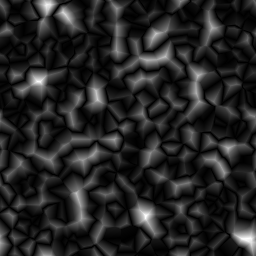
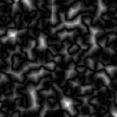

# 水晶1

<table>
<tr style="border: 0;">
<td width="33.33%" style="border: 0;" valign="top">

{width="128px"}

<b>进入：</b>纹理生成器>噪声

</td>
<td width="100.00%" style="border: 0;" valign="top">

## 描述

生成Worlye Voronoi类型的噪声，使用稍多一些angular距离度量。 它可用于某些angular和几何目的。

</td>
</tr>
</table>

## 参数

|  |  |
|:---|:---|
| <b>缩放</b> <i>1 - 256</i> | 设置效果的全局比例。 |
| <b>无序</b> <i>0.0 - 1.0</i> | 对噪声进行相移以引入较小的变化。 |
| <b>非正方形扩展</b> <i>False/True</i> | 启用压缩补偿并使用非正方形比例拉伸。 |

## 示例

<table style="table-layout:fixed">
    <tr style="border: 0;">
        <td style="border: 0;">
            
        </td>
        <td style="border: 0;"></td>
        <td style="border: 0;"></td>
    </tr>
</table>
