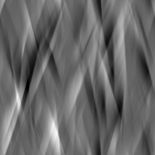

# 水晶2

<table>
<tr style="border: 0;">
<td width="33.33%" style="border: 0;" valign="top">

{width="128px"}

<b>进入：</b>纹理生成器>噪声

</td>
<td width="100.00%" style="border: 0;" valign="top">

## 描述

生成angular的布料折痕状图案。 类似于[折痕杂色](../../../../../../compositing-graphs/nodes-reference-for-com/node-library/texture-generators/noises/creased/creased.md)。

这是一种小众噪音：它适用于需要处理此类细节的极少数情况，例如重新创作细微的大理石图案或布料时。

</td>
</tr>
</table>

## 参数

|  |  |
|:---|:---|
| <b>缩放</b> <i>1 - 16</i> | 设置效果的全局比例。 |
| <b>无序</b> <i>0.0 - 1.0</i> | 对噪声进行相移以引入较小的变化。 |
| <b>非正方形扩展</b> <i>False/True</i> | 启用以非方形比例补偿挤压和拉伸。 |

## 示例

<table style="margin-top: 32px; margin-bottom: 32px">
    <tr style="border: 0">
        <td style="border: 0; background: transparent">
            
        </td>
    </tr>
</table>
