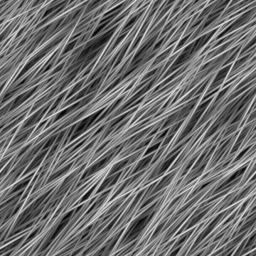
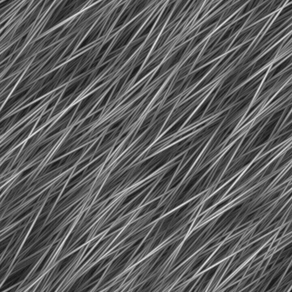

# 方向划痕

<table>
<tr style="border: 0;">
<td width="33.33%" style="border: 0;" valign="top">

{width="200px"}

<b>在：</b>纹理生成器>杂色

</td>
<td width="100.00%" style="border: 0;" valign="top">

## 描述

具有可调角度和大小的划痕图案的随机散射。

</td>
</tr>
</table>

## 输出

|  |  |
|:---|:---|
| <b>输出</b> <i>灰度</i> | 生成的杂色作为灰度位图。 |

## 参数

|  |  |
|:---|:---|
| <b>缩放</b> <i>整数</i> | 使用网格细分生成噪声拼贴。    值越高，所绘制的拼贴就越多，噪音也越浓。 |
| <b>无序</b> <i>浮动</i> | 替换噪点的成分。    这可用于为噪声设置动画。 |
| <b>无序速度</b> <i>浮动</i> | 调整<b>无序</b>参数应用的位移的距离。    这可用于在制作噪声动画时控制位移的速度。 |
| <b>无序各向异性</b> <i>浮动</i> | 控制<b>无序</b>参数应用的位移的方向跨度，值越高，方向越窄，定义越明确。    方向由<b>无序各向异性角</b>参数控制。 |
| <b>无序anisotropy angle</b> <i>浮动</i> | 当<b>无序位移</b>参数不为零时，控制<b>无序</b>参数应用的各向异性的方向。 |
| <b>角度</b> <i>浮动</i> | 用来设置划痕方向的角度，以旋转次数以及从右下方开始。 |
| <b>角度随机</b> <i>浮动</i> | 应用于<b>角度</b>值的随机变化的最大值（轮次数）。 |
| <b>图案数量</b> <i>浮动</i> | 用于散布的划痕图案量的乘数。 |
| <b>图案大小</b> <i>浮点2</i> | 暂存图案定界框的大小。    Y值控制划痕的最大长度。 |
| <b>图案大小随机</b> <i>浮点2</i> | 应用于划痕的随机缩减量的乘数。    Y值将该值应用于划痕的长度。 |
| <b>拼贴偏移</b> <i>浮点2</i> | 控制用于渲染杂色的无限平面部分的位置。 |
| <b>非方形扩展</b> <i>布尔值</i> | 在非方形图像中，保持生成的拼贴方形，并将杂色生成扩展到图像边界。 |

## 示例

<table>
<tr style="border: 0;">
<td style="border: 0;" valign="top">

{zoomable="yes"}

</td>
<td style="border: 0;" valign="top">

{zoomable="yes"}

</td>
</tr>
</table>

<table>
<tr style="border: 0;">
<td style="border: 0;" valign="top">

{zoomable="yes"}

</td>
<td style="border: 0;" valign="top">

{zoomable="yes"}

</td>
</tr>
</table>

<table>
<tr style="border: 0;">
<td style="border: 0;" valign="top">

{zoomable="yes"}

</td>
<td style="border: 0;" valign="top">

</td>
</tr>
</table>
