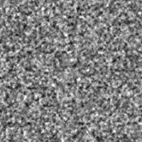
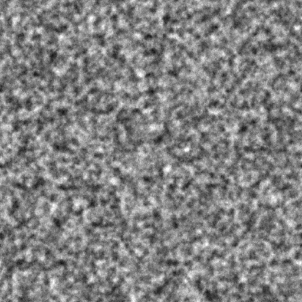

# 分形求和3

<table>
<tr style="border: 0;">
<td width="33.33%" style="border: 0;" valign="top">

{width="200px"}

<b>进入：</b>纹理生成器>噪声

</td>
<td width="100.00%" style="border: 0;" valign="top">

## 描述

<b>分形求和</b>噪声的变体。

另请参阅：[分形求和库](../../../../../../compositing-graphs/nodes-reference-for-com/node-library/texture-generators/noises/fractal-sum-base/fractal-sum-base.md)、[分形求和1](../../../../../../compositing-graphs/nodes-reference-for-com/node-library/texture-generators/noises/fractal-sum-1/fractal-sum-1.md)、[分形求和2](../../../../../../compositing-graphs/nodes-reference-for-com/node-library/texture-generators/noises/fractal-sum-2/fractal-sum-2.md)、[分形求和4](../../../../../../compositing-graphs/nodes-reference-for-com/node-library/texture-generators/noises/fractal-sum-4/fractal-sum-4.md)

</td>
</tr>
</table>

## 输出

|  |  |
|:---|:---|
| <b>输出</b> <i>灰度</i> | 生成的灰度位图噪声。 |

## 参数

|  |  |
|:---|:---|
| <b>无序</b> <i>Float</i> | 置换噪声的组成部分。    这可用于为噪声制作动画。 |
| <b>无序速度</b> <i>Float</i> | 调整<b>无序</b>参数应用的位移的距离。    在为噪声制作动画时，这可用于控制位移的速度。 |
| <b>非方形扩展</b> <i>布尔值</i> | 在非方形图像中，保持生成的拼贴为方形，并将噪声生成扩展到图像边界。 |

## 示例

<table style="table-layout:fixed">
    <tr style="border: 0;">
        <td style="border: 0;">
            
        </td>
        <td style="border: 0;">
            
        </td>
        <td style="border: 0;"></td>
    </tr>
</table>
