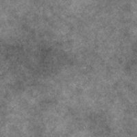

# 分形求和基础

<table>
<tr style="border: 0;">
<td style="border: 0;" valign="top">

<table>
<tr style="border: 0;">
<td width="33.33%" style="border: 0;" valign="top">

{width="200px"}

<b>在：</b>纹理生成器>杂色

</td>
<td width="100.00%" style="border: 0;" valign="top">

## 描述

一种可自定义的分形噪声，具有可调的范围和八度音阶平衡。

<b>分形求和</b>系列噪声均基于此节点。

另请参阅：[分形求和1](../../../../../../compositing-graphs/nodes-reference-for-com/node-library/texture-generators/noises/fractal-sum-1/fractal-sum-1.md)、[分形求和2](../../../../../../compositing-graphs/nodes-reference-for-com/node-library/texture-generators/noises/fractal-sum-2/fractal-sum-2.md)、[分形求和3](../../../../../../compositing-graphs/nodes-reference-for-com/node-library/texture-generators/noises/fractal-sum-3/fractal-sum-3.md)、[分形求和4](../../../../../../compositing-graphs/nodes-reference-for-com/node-library/texture-generators/noises/fractal-sum-4/fractal-sum-4.md)

</td>
</tr>
</table>

## 输出

|  |  |
| --- | --- |
| <b>输出</b> *灰度* | 生成的杂色作为灰度位图。 |

## 参数

|  |  |
| --- | --- |
| <b>粗糙度</b>浮点 | 噪声八度音量达到平衡。    值越大，显示的频率越高，八度音越明显。 |
| <b>分钟。 级别</b>整数 | 噪声中使用的最小八度音阶。    值越大，噪声频率越高。 |
| <b>最大 级别</b>整数 | 噪声中使用的最大八度音阶。    值越大，噪声频率越高。 |
| <b>无序</b>浮动 | 替换噪点的成分。    这可用于为噪声设置动画。 |
| <b>无序速度</b>浮动 | 调整<b>无序</b>参数应用的位移的距离。    这可用于在制作噪声动画时控制位移的速度。 |
| <b>对比度</b>浮动 | 最终结果的对比度。 |
| <b>全局不透明度</b>浮点 | 噪声八度不透明度叠加在最终结果中。    较高的值可能导致某些区域被烧成白色。 |
| <b>非方形扩展</b>布尔值 | 在非方形图像中，保持生成的拼贴方形，并将杂色生成扩展到图像边界。 |

## 示例

<table>
<tr style="border: 0;">
<td style="border: 0;" valign="top">

{zoomable="yes"}

</td>
<td style="border: 0;" valign="top">

{zoomable="yes"}

</td>
</tr>
</table>

</td>
<td style="border: 0;" valign="top">

</td>
<td style="border: 0;" valign="top">

</td>
</tr>
</table>
