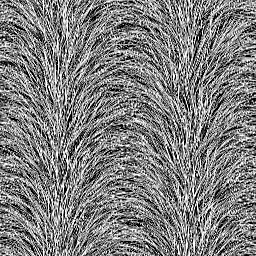

# 皮毛3

<table>
<tr style="border: 0;">
<td style="border: 0;" valign="top">

{width="128px"}

## 皮毛3

**在：** *纹理生成器**/噪声*

**简单**

</td>
<td style="border: 0;" valign="top">

## 描述

这将生成扩散/硬毛刷类型噪声。

## 参数

* **缩放**： *1 - 8*\
  设置效果的全局比例。
* **无序**： *0.0 - 1.0*\
  对噪声进行相移以引入较小的变化。
* **波形量**： *0.0 - 8.0*
* **非正方形扩展**： *False/True*\
  启用以非方形比例补偿挤压和拉伸。

## 示例图像

</td>
</tr>
</table>
