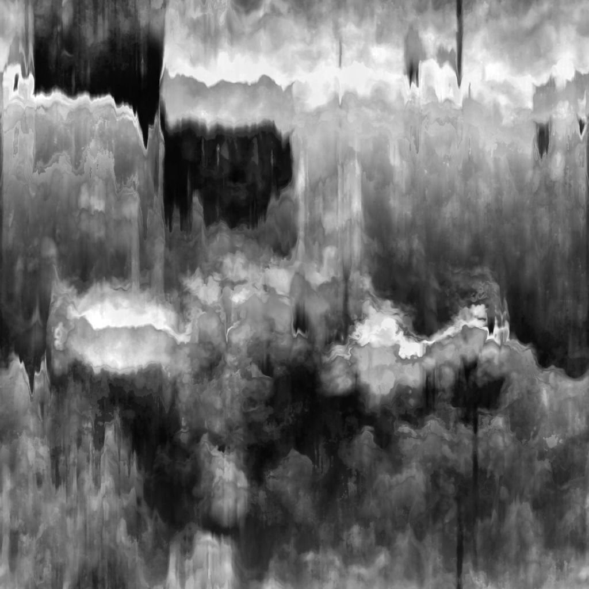

# 污渍泄漏

<table>
<tr style="border: 0;">
<td width="33.33%" style="border: 0;" valign="top">

{width="200px"}

<b>在：</b>纹理生成器>杂色

</td>
<td width="100.00%" style="border: 0;" valign="top">

## 描述

**污渍泄漏**&#x200B;节点会生成类似于滴落到油面上的污渍图。

</td>
</tr>
</table>

## 参数

|  |  |
|:---|:---|
| <b>余额</b> <i>浮动</i> | 调整暗值和亮值之间的平衡。 |
| <b>对比度</b> <i>浮动</i> | 调整图像的对比度。 |
| <b>反转</b> <i>布尔值</i> | 使用`1-x`操作反转图像的输出。 |
| <b>非正方形扩展</b> <i>布尔值</i> | 启用以非方形比例补偿挤压和拉伸。 |
| <b>高级</b> |  |
| <b>水滴长度</b> <i>浮动</i> | 调整水滴线条的长度。 |
| <b>形状对比度</b> <i>浮动</i> | 在明亮形状和暗形状之间切换，形成滴落的对比。 |
| <b>水滴的清晰度</b> <i>浮动</i> | 调整水滴的锐利度和冷缩度。 |
| <b>锐化强度</b> <i>浮动</i> | 调整图像的整体粗糙感。 |

## 示例

<table style="margin-top: 32px; margin-bottom: 32px">
    <tr style="border: 0">
        <td style="border: 0; background: transparent">
            
        </td>
        <td style="border: 0; background: transparent">
            
        </td>
    </tr>
</table>
