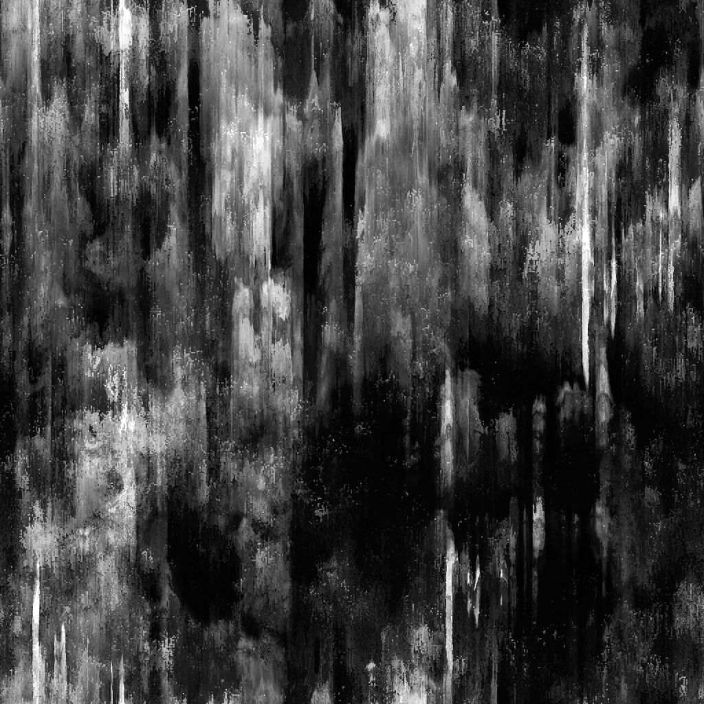

# 污渍泄漏

<table>
<tr style="border: 0;">
<td width="41.60%" style="border: 0;" valign="top">

{width="200px"}

**位置：** *纹理生成器* */杂色*

**简单**

</td>
<td width="58.30%" style="border: 0;" valign="top">

## 描述

**污渍泄漏**&#x200B;节点会生成类似于滴落到油面上的污渍图。

</td>
</tr>
</table>

## 参数

* **平衡** *浮动*&#x200B;调整暗值和亮值之间的平衡。
* **对比度** *浮动*&#x200B;调整图像的对比度。
* **反转** *布尔值*&#x200B;使用`1-x`操作反转图像的输出。
* **非正方形扩展***布尔值*&#x200B;启用以非方形比率补偿挤压和拉伸。
* 高级
  * **液滴长度** *浮动*&#x200B;调整液滴条纹的长度。
  * **形状对比度***浮动*&#x200B;在明亮和暗形状之间移动，形成滴落的对比。
  * **水滴的清晰度** *浮动*&#x200B;调整水滴的锐度和冷度。
  * **锐化强度***浮动*&#x200B;调整图像的整体粗糙度。

## 示例图像

<table>
<tr style="border: 0;">
<td style="border: 0;" valign="top">

{width="256px"}

</td>
<td style="border: 0;" valign="top">

{width="256px"}

</td>
</tr>
</table>
