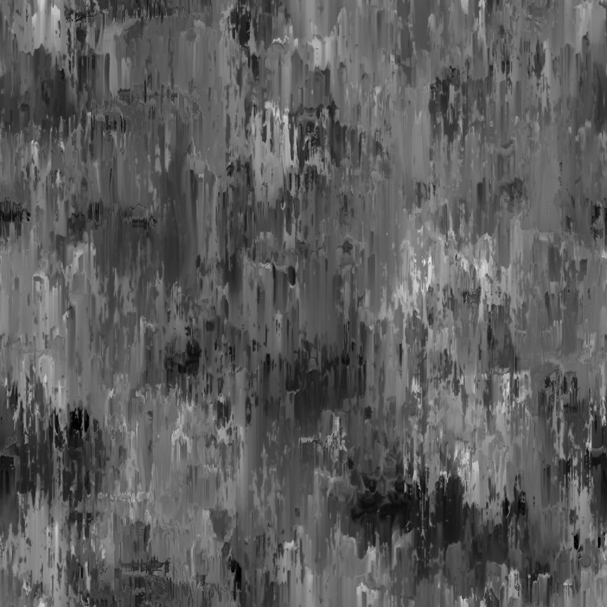

# 污渍渗漏油漆

<table>
<tr style="border: 0;">
<td width="33.33%" style="border: 0;" valign="top">

{width="200px"}

<b>在：</b>纹理生成器>杂色

</td>
<td width="100.00%" style="border: 0;" valign="top">

## 描述

**污渍渗漏绘画**&#x200B;节点会生成一个类似于通过渗漏滴油绘画的污渍映射。

</td>
</tr>
</table>

## 参数

|  |  |
|:---|:---|
| <b>余额</b> <i>浮动</i> | 调整暗值和亮值之间的平衡。 |
| <b>对比度</b> <i>浮动</i> | 调整图像的对比度。 |
| <b>反转</b> <i>布尔值</i> | 使用`1-x`操作反转图像的输出。 |
| <b>非正方形扩展</b> <i>布尔值</i> | 启用以非方形比例补偿挤压和拉伸。 |
| <b>高级</b> |  |
| <b>泄漏强度</b> <i>浮动</i> | 调整液滴的密度和强度。 |
| <b>泄漏缩放</b> <i>整数</i> | 调整液滴分离的比例。 |
| <b>泄漏角度随机</b> <i>浮动</i> | 调整&#x200B;*最大角度*&#x200B;滴可以随机旋转为&#x200B;*圈数*。 |
| <b>泄漏清晰度</b> <i>浮动</i> | 调整滴落的清晰度和锐度。 |

## 示例

<table style="margin-top: 32px; margin-bottom: 32px">
    <tr style="border: 0">
        <td style="border: 0; background: transparent">
            
        </td>
        <td style="border: 0; background: transparent">
            
        </td>
    </tr>
</table>
