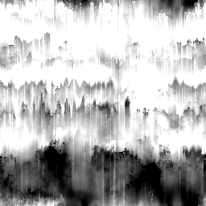
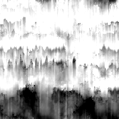

# 污渍图006

<table>
<tr style="border: 0;">
<td width="33.33%" style="border: 0;" valign="top">

{width="128px"}

<b>在：</b>纹理生成器>杂色

</td>
<td width="100.00%" style="border: 0;" valign="top">

## 描述

这将生成一个复杂的组合噪声映射。 作为详细的程序，它可以非常有用，但请记住，这些程序非常消耗性能，因此生成速度较慢。

</td>
</tr>
</table>

## 参数

|  |  |
|:---|:---|
| <b>余额</b> <i>0.0 - 1.0</i> | 在黑白图像之间改变结果的平衡，就像亮度调整一样。 |
| <b>对比度</b> <i>0.0 - 1.0</i> | 调整结果的对比度。 |
| <b>反转</b> <i>False/True</i> | 反转结果。 |
| <b>画笔图案</b> <i>0.0 - 1.0</i> | 用作画笔Alpha时，可在边缘周围添加蒙版。 |
| <b>非正方形扩展</b> <i>False/True</i> | 启用以非方形比例补偿挤压和拉伸。 |

## 示例

<table style="margin-top: 32px; margin-bottom: 32px">
    <tr style="border: 0">
        <td style="border: 0; background: transparent">
            
        </td>
    </tr>
</table>
