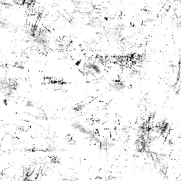
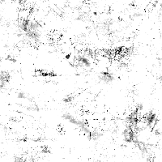

# 污渍图012

<table>
<tr style="border: 0;">
<td style="border: 0;" valign="top">

{width="128px"}

## 污渍图012

**在：** *纹理生成器**/噪声*

**简单**

</td>
<td style="border: 0;" valign="top">

## 描述

这将生成一个复杂的组合噪声映射。 作为详细的程序化，它可以非常有用，但请记住，这些模板非常消耗性能，因此生成速度较慢。

## 参数

* **余额**： *0.0 - 1.0*\
  在黑白图像之间改变结果的平衡，就像亮度调整一样。
* **对比度**： *0.0 - 1.0*\
  调整结果的对比度。
* **反转**： *False/True*\
  反转结果。
* **画笔图案**： *0.0 - 1.0*\
  用作画笔Alpha时，可在边缘周围添加蒙版。
* **非正方形扩展**： *False/True*\
  启用压缩补偿并使用非正方形比例拉伸。

## 示例图像

</td>
</tr>
</table>
