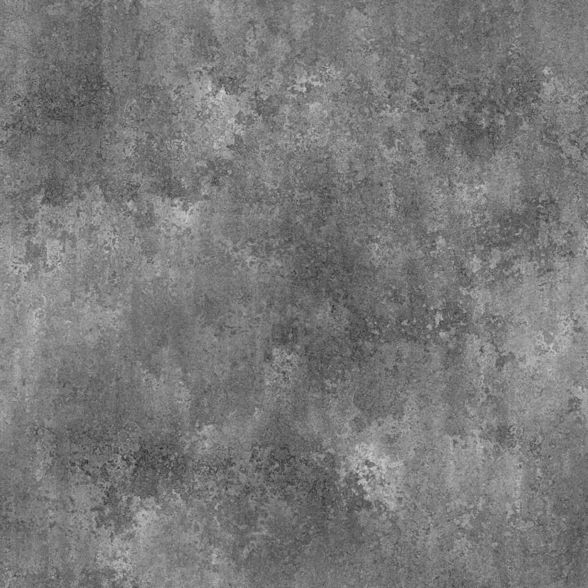

# Scratches已脏

<table>
<tr style="border: 0;">
<td width="41.60%" style="border: 0;" valign="top">

{width="200px"}

**位置：** *纹理生成器* */杂色*

**简单**

</td>
<td width="58.30%" style="border: 0;" valign="top">

## 描述

**Scratches脏**&#x200B;节点生成类似于精细划痕的脏表面的污渍映射。

</td>
</tr>
</table>

## 参数

* **平衡** *浮动*&#x200B;调整暗值和亮值之间的平衡。
* **对比度** *浮动*&#x200B;调整图像的对比度。
* **反转** *布尔值*&#x200B;使用`1-x`操作反转图像的输出。
* **非正方形扩展***布尔值*&#x200B;启用以非方形比率补偿挤压和拉伸。
* 高级
  * **基础污渍强度** *浮动*&#x200B;调整应用于基础表面的污渍映射的强度。
  * **Scratches强度***浮动*&#x200B;调整基础曲面上划痕的强度。

## 示例图像

<table>
<tr style="border: 0;">
<td style="border: 0;" valign="top">

{width="256px"}

</td>
<td style="border: 0;" valign="top">

{width="256px"}

</td>
</tr>
</table>
