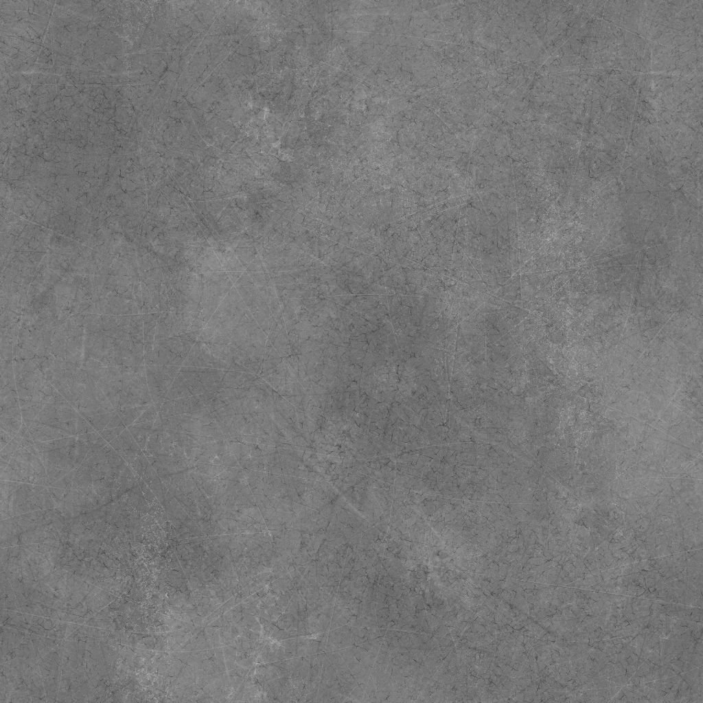
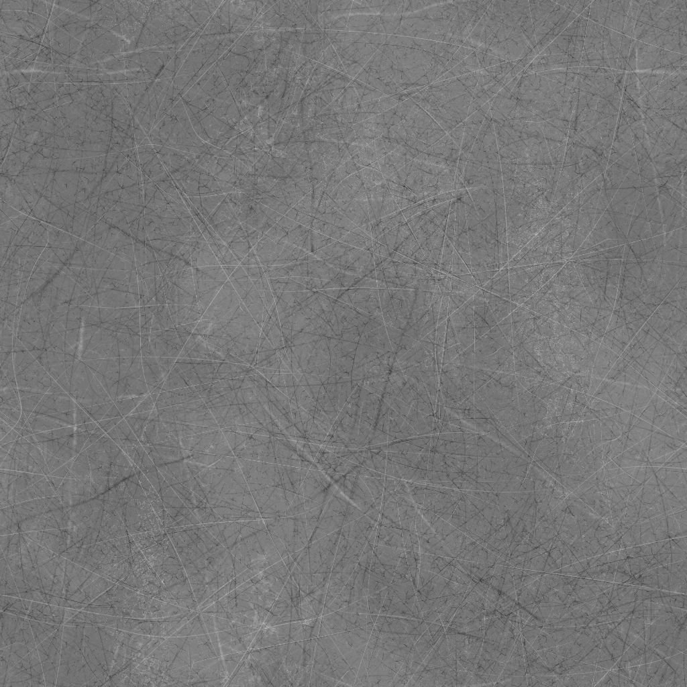
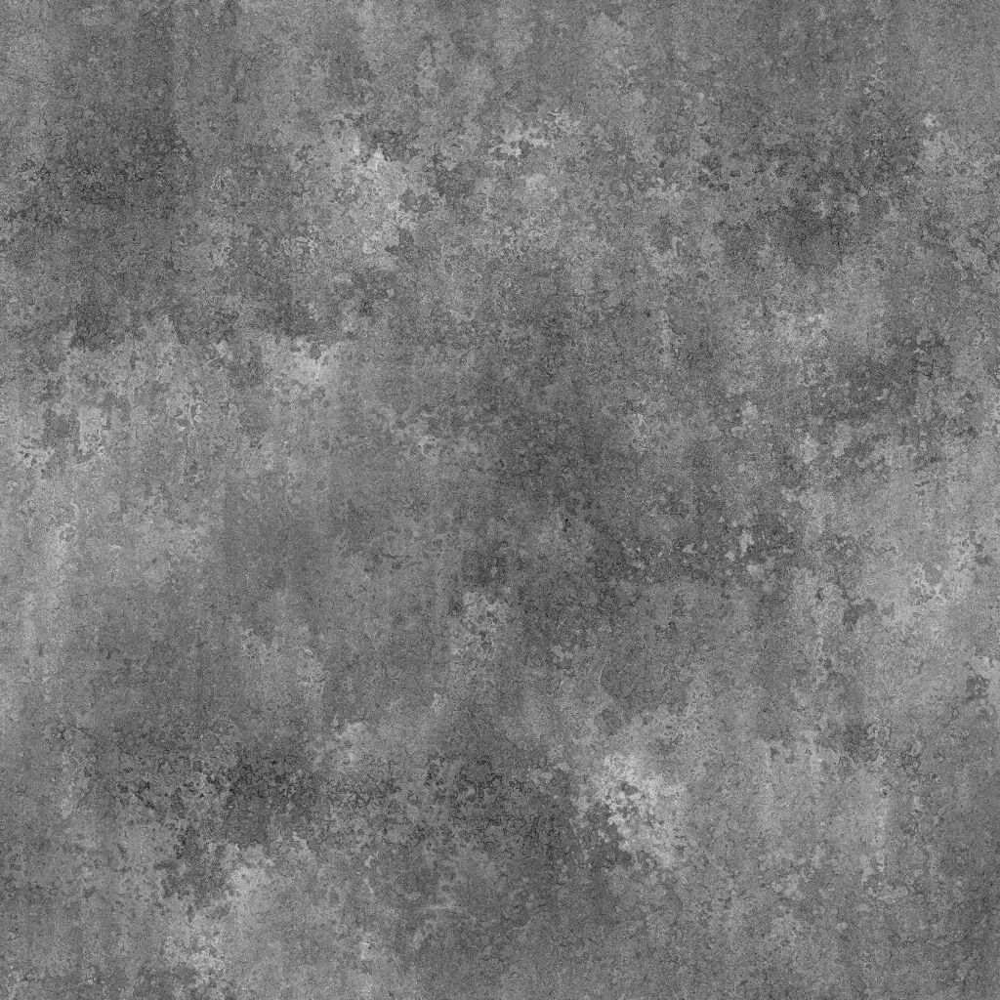

# Scratches已脏

<table>
<tr style="border: 0;">
<td width="33.33%" style="border: 0;" valign="top">

{width="200px"}

<b>进入：</b>纹理生成器>噪声

</td>
<td width="100.00%" style="border: 0;" valign="top">

## 描述

**Scratches脏**&#x200B;节点生成类似于精细划痕的脏表面的污渍映射。

</td>
</tr>
</table>

## 参数

|  |  |
|:---|:---|
| <b>余额</b> <i>Float</i> | 调整暗值和亮值之间的平衡。 |
| <b>对比度</b> <i>Float</i> | 调整图像的对比度。 |
| <b>反转</b> <i>布尔值</i> | 使用`1-x`操作反转图像的输出。 |
| <b>非正方形扩展</b> <i>布尔值</i> | 启用压缩补偿并使用非正方形比例拉伸。 |
| <b>高级</b> |  |
| <b>基本污渍强度</b> <i>Float</i> | 调整应用于基础曲面的污渍映射的强度。 |
| <b>Scratches强度</b> <i>Float</i> | 调整基础曲面上的划痕强度。 |

## 示例

<table style="table-layout:fixed">
    <tr style="border: 0;">
        <td style="border: 0;">
            
        </td>
        <td style="border: 0;">
            
        </td>
        <td style="border: 0;"></td>
    </tr>
</table>
