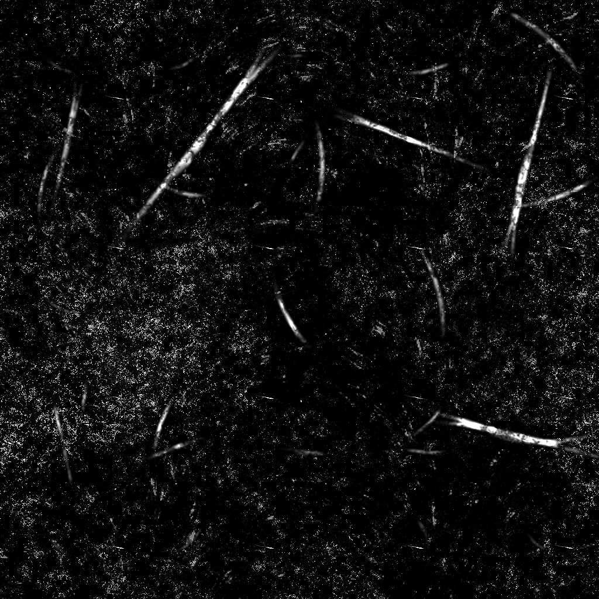

# Scratches粗糙

<table>
<tr style="border: 0;">
<td width="41.60%" style="border: 0;" valign="top">

{width="200px"}

**位置：** *纹理生成器* */杂色*

**简单**

</td>
<td width="58.30%" style="border: 0;" valign="top">

## 描述

**Scratches粗糙**&#x200B;节点生成一个类似于大致划痕的灰尘表面的污渍映射。

</td>
</tr>
</table>

## 参数

* **平衡***Float*&#x200B;调整明暗值之间的平衡。
* **对比度** *浮动*&#x200B;调整图像的对比度。
* **反转** *布尔值*&#x200B;使用`1-x`操作反转图像的输出。
* **非正方形扩展***布尔值*&#x200B;启用以非方形比率补偿挤压和拉伸。
* 高级
  * **划痕量** *浮动*&#x200B;调整表面的划痕量。
  * **划痕拼贴** *整数*&#x200B;调整应用于划痕的拼贴量。
  * **划痕模糊***浮动*&#x200B;调整划痕的模糊效果。
  * **划痕宽度** *Float*&#x200B;调整划痕的宽度。
  * **划痕长度** *Float*&#x200B;调整划痕的长度。
  * **划痕蒙版***浮动*&#x200B;调整应用于部分划痕的蒙版强度。
  * **划痕污迹***Float*&#x200B;调整划痕的污迹，这会破坏划痕的锐度和连续性。
  * **双划痕***Float*&#x200B;调整每个划痕旁边应用的第二个划痕的不透明度，并带有一点变形效果。
  * **划痕点强度***Float*&#x200B;调整划痕旁边应用的损坏点的强度。
  * **划痕点拼贴***整数*&#x200B;调整损坏点的拼贴。
  * **Dust强度** *浮动*&#x200B;调整Dust叠加的强度。
  * **Dust拼贴** *整数*&#x200B;调整Dust叠加的拼贴。
  * **锐化强度***浮动*&#x200B;调整全局锐化效果的强度。

## 示例图像

<table>
<tr style="border: 0;">
<td style="border: 0;" valign="top">

{width="256px"}

</td>
<td style="border: 0;" valign="top">

{width="256px"}

</td>
</tr>
</table>
