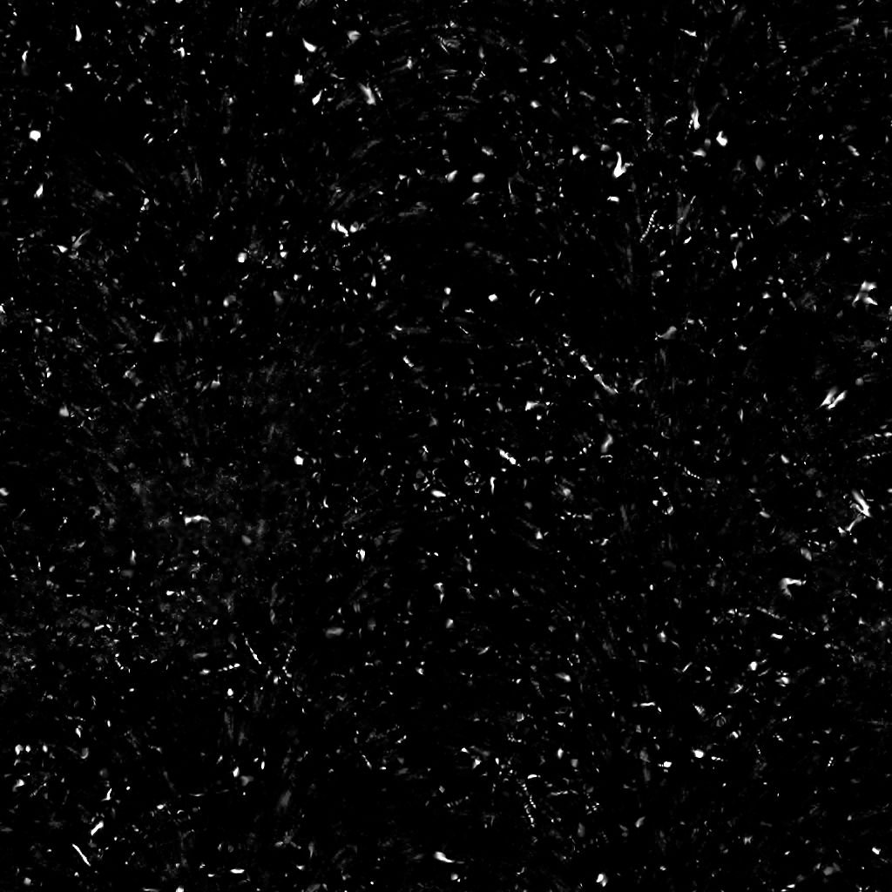

# 污渍切碎

<table>
<tr style="border: 0;">
<td width="41.60%" style="border: 0;" valign="top">

{width="200px"}

**在：** *纹理生成器* */噪声*

**简单**

</td>
<td width="58.30%" style="border: 0;" valign="top">

## 描述

[Substance 3D Designer](https://www.adobe.com/cn/products/substance3d-designer.html)中的&#x200B;**污渍切片**&#x200B;节点会生成类似于散落在曲面上的切片的污渍映射。

</td>
</tr>
</table>

## 参数

* **平衡***Float*&#x200B;调整明暗值之间的平衡。
* **对比度***Float*&#x200B;调整图像的对比度。
* **反转** *布尔值*&#x200B;使用`1-x`操作反转图像的输出。
* **非正方形扩展***布尔值*&#x200B;启用压缩补偿并使用非正方形比率拉伸。
* 高级
  * 用于生成切口的划痕效果的&#x200B;**划痕数量***Float*&#x200B;数量和&#x200B;*覆盖率*。
  * **划痕拼贴***整数*&#x200B;用于生成切口的划痕效果拼贴量。
  * **Dust强度***Float*&#x200B;表面上的Dust叠加强度。
  * **锐化强度***Float*&#x200B;全局锐化效果的强度。

## 示例图像

<table>
<tr style="border: 0;">
<td style="border: 0;" valign="top">

{width="256px"}

</td>
<td style="border: 0;" valign="top">

{width="256px"}

</td>
</tr>
</table>
