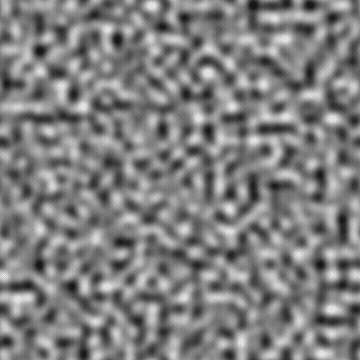

# Perlin噪声

<table>
<tr style="border: 0;">
<td style="border: 0;" valign="top">

<table>
<tr style="border: 0;">
<td width="33.33%" style="border: 0;" valign="top">

{width="200px"}

<b>在：</b>纹理生成器>杂色

</td>
<td width="100.00%" style="border: 0;" valign="top">

## 描述

生成Perlin噪声，一种广泛使用的灰度值平滑分布。

</td>
</tr>
</table>

<table>
<tr style="border: 0;">
<td style="border: 0;" valign="top">

### 输出

</td>
<td style="border: 0;" valign="top">

### 参数

</td>
<td style="border: 0;" valign="top">

### 示例

</td>
</tr>
</table>

## 输出

|  |  |
| --- | --- |
| <b>输出</b> *灰度* | 生成的杂色作为灰度位图。 |

## 参数

|  |  |
| --- | --- |
| <b>缩放</b>整数 | 使用网格细分生成噪声拼贴。    值越高，所绘制的拼贴就越多，噪音也越浓。 |
| <b>无序</b>浮动 | 替换噪点的成分。    这可用于为噪声设置动画。 |
| <b>无序速度</b>浮动 | 调整<b>无序</b>参数应用的位移的距离。    这可用于在制作噪声动画时控制位移的速度。 |
| <b>拼贴偏移</b>浮动2 | 控制用于渲染杂色的无限平面部分的位置。 |
| <b>非方形扩展</b>布尔值 | 在非方形图像中，保持生成的拼贴方形，并将杂色生成扩展到图像边界。 |

## 示例

<table>
<tr style="border: 0;">
<td style="border: 0;" valign="top">

{zoomable="yes"}

</td>
<td style="border: 0;" valign="top">

{zoomable="yes"}

</td>
</tr>
</table>

</td>
<td style="border: 0;" valign="top">

</td>
<td style="border: 0;" valign="top">

</td>
</tr>
</table>
