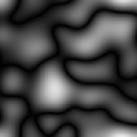

# 等离子体

<table>
<tr style="border: 0;">
<td width="33.33%" style="border: 0;" valign="top">

{width="128px"}

<b>进入：</b>纹理生成器>噪声

</td>
<td width="100.00%" style="border: 0;" valign="top">

## 描述

这将生成稍有不同的[高斯噪声](../../../../../../compositing-graphs/nodes-reference-for-com/node-library/texture-generators/noises/gaussian-noise/gaussian-noise.md)变体，将较长的深色条纹作为凹谷。 它具有类似的距离比例控制，可保持拼贴。

</td>
</tr>
</table>

## 参数

|  |  |
|:---|:---|
| <b>缩放</b> <i>1 - 128</i> | 设置效果的全局比例。 |
| <b>无序</b> <i>0.0 - 1.0</i> | 对噪声进行相移以引入较小的变化。 |
| <b>非正方形扩展</b> <i>False/True</i> | 启用以非方形比例补偿挤压和拉伸。 |

## 示例

<table style="margin-top: 32px; margin-bottom: 32px">
    <tr style="border: 0">
        <td style="border: 0; background: transparent">
            
        </td>
    </tr>
</table>
