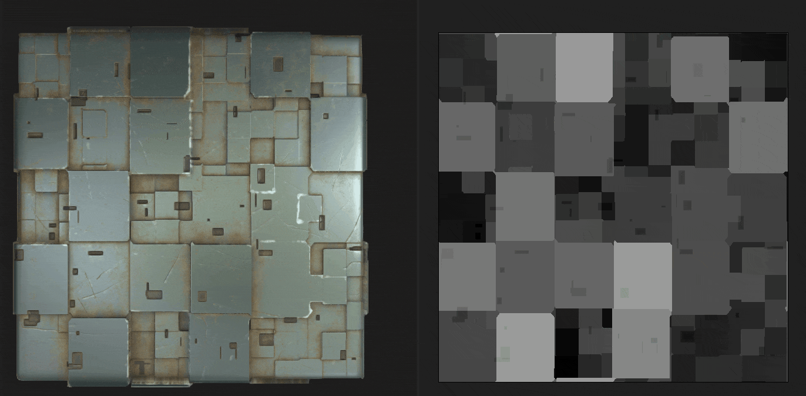

# Voronoi分形

<table>
<tr style="border: 0;">
<td width="33.33%" style="border: 0;" valign="top">

{width="200px"}

<b>进入：</b>纹理生成器>噪声

</td>
<td width="100.00%" style="border: 0;" valign="top">

## 描述

**Voronoi分形**&#x200B;节点使用&#x200B;*Z-down噪声*&#x200B;生成映射到2D图像的&#x200B;*分形* 3D Voronoi投影。

此节点可以使用[Cube GBuffers](../../../../../../compositing-graphs/nodes-reference-for-com/node-library/texture-generators/patterns/cube-3d-gbuffers/cube-3d-gbuffers.md)作为输入而不是实际已烘焙贴图进行测试（如下面的示例图像所示）。

>[!WARNING]
>
> 此噪声仅适用于&#x200B;*GPU引擎*（即&#x200B;**Direct**&#x200B;或&#x200B;**OpenGL**）。 转到&#x200B;**工具>切换引擎……**&#x200B;或按&#x200B;**F9**&#x200B;键以选择所需的引擎。

</td>
</tr>
</table>

## 参数

|  |  |
|:---|:---|
| <b>反转</b> <i>布尔值</i> | 反转输出图像。 |
| <b>缩放</b> <i>浮动</i> | 控制分形Voronoi噪声的比例。  *注意*：在&#x200B;*任意轴*&#x200B;上启用&#x200B;**拼贴**&#x200B;时，比例调整为&#x200B;*分步*。 这是预期的。 |
| <b>大小</b> <i>浮点3</i> | 在&#x200B;**X**、**Y**&#x200B;和&#x200B;**Z**&#x200B;轴中控制分形Voronoi噪声的大小。 非均匀值导致&#x200B;*拉伸或挤压*&#x200B;效果。  *注意*：在&#x200B;*任何轴*&#x200B;上启用&#x200B;**拼贴**&#x200B;时，大小调整为&#x200B;*步进*。 这是预期的。 |
| <b>偏移</b> <i>浮点3</i> | 将偏移应用于&#x200B;**X**、**Y**&#x200B;和&#x200B;**Z**&#x200B;轴中的分形Voronoi噪声的&#x200B;*位置*。 |
| <b>无序</b> <i>浮点3</i> | 应用于&#x200B;**X**、**Y**&#x200B;和&#x200B;**Z**&#x200B;轴中每个噪声点的&#x200B;*随机偏移*&#x200B;的强度。 |
| <b>扭曲强度</b> <i>浮动</i> | 控制应用于分形Voronoi噪声的&#x200B;*变形效果*&#x200B;的强度。 |
| <b>扭曲比例乘数</b> <i>浮动</i> | 控制变形效果中使用的&#x200B;*变形图案*&#x200B;的比例，该比例由&#x200B;**扭曲强度**&#x200B;控制。 |
| <b>最小级别</b> <i>整数</i> | 分形图案中使用的最小&#x200B;*重复级别*。 更宽的最小值/最大值范围会生成&#x200B;*更丰富的图案*，并且随更多频率范围而变化。 |
| <b>最大级别</b> <i>整数</i> | 分形图案中使用的最大重复级别&#x200B;*为*。 更宽的最小值/最大值范围会生成&#x200B;*更丰富的图案*，并且随更多频率范围而变化。 |
| <b>粗糙度</b> <i>浮动</i> | 控制分形图案中低和高&#x200B;*重复级别*&#x200B;之间的&#x200B;*平衡*。  *注意*：值&#x200B;**0**&#x200B;导致输出&#x200B;*与随后的其他低值不符*。 这是预期的。  *注意2*：仅当&#x200B;**混合模式**&#x200B;参数设置为&#x200B;*添加*&#x200B;时，此参数才可用。 |
| <b>隙度</b> <i>浮动</i> | 控制应用的分形图案&#x200B;*填充空间*&#x200B;的方式。 *较高的*&#x200B;值会使图案中的间隙减少&#x200B;*，从而产生*&#x200B;更密&#x200B;*的杂色。* |
| <b>全局不透明度</b> <i>浮动</i> | 从0控制分形Perlin噪声值的&#x200B;*范围*。 |
| <b>圆角曲线</b> <i>浮动</i> | 围绕噪声的每个点对&#x200B;*斜率*&#x200B;进行圆整，使其成为&#x200B;*凸形*。  *注意*：当&#x200B;**Style**&#x200B;参数设置为&#x200B;*Edge*&#x200B;时，此参数不可用。 |
| <b>距离刻度</b> <i>浮动</i> | 调整渐变&#x200B;*在每个噪声点周围的*&#x200B;距离。 |
| <b>距离模式</b> <i>整数</i> | 将方法设置为&#x200B;*计算噪声的每个点周围的距离渐变*：  - *欧几里德* - *曼哈顿* - *切比雪夫* - *明科夫斯基* |
| <b>闵可夫斯基数值</b> <i>浮动</i> | Minkowski距离的顺序&#x200B;*p*。 如果将距离渐变划分为几个象限，则此数值将对这些象限产生如下影响：   - p是&#x200B;*刚好* 1：笔直 - p是&#x200B;*低*&#x200B;比1：凹形 - p是&#x200B;*大*&#x200B;比1：凸形  有趣的值：  - *1.0*：曼哈顿距离 - *2.0*：欧几里德距离 - *无限远*：切比雪夫distance   *注意*：此参数仅在&#x200B;**Distance Mode**&#x200B;参数设置为&#x200B;*Minkowski*&#x200B;时可用。 |
| <b>混合模式</b> <i>整数</i> | 设置空间中&#x200B;*重叠单元格*&#x200B;的值混合的方法：  - *相加*：相加值 - *最大值*：保留&#x200B;*最高*&#x200B;值 - *最小*：保留&#x200B;*最低*&#x200B;值 |
| <b>样式</b> <i>整数</i> | 设置分形Voronoi噪声的数据渲染&#x200B;*方法，考虑到噪声基于空间中的一组点：  -* F1 *：到空间中*&#x200B;最近点&#x200B;*的距离 -* F2 *：到空间中*&#x200B;秒最近点&#x200B;*的距离 -* F2-F1 * -* F1\*F2* - *F1/F2* - *边缘*：空间中噪声的每个单元格&#x200B;*之间的*&#x200B;边缘 - *随机颜色*：为空间中噪声的每个单元格分配&#x200B;*随机平面颜色** |
| <b>边缘Thickness</b> <i>浮动</i> | 调整分形Voronoi噪声的细胞之间检测到的边缘的Thickness。 在X、Y和Z轴中检测到边缘，因此某些厚度可能比其他厚度增加得更快，具体取决于单元格的&#x200B;*深度*。  *注意*：仅当&#x200B;**Style**&#x200B;参数设置为&#x200B;*Edge*&#x200B;时，此参数才可用。 |
| <b>随机颜色种子模式</b> <i>整数</i> | 设置&#x200B;*获取*&#x200B;每个单元格颜色选择的随机种子的方法：  - *全局随机种子*：使用节点&#x200B;*继承*- *手动种子*：使用&#x200B;*离散*&#x200B;种子&#x200B;  *注意*：仅当&#x200B;**Style**&#x200B;参数设置为&#x200B;*随机颜色*&#x200B;时，此参数才可用。  |
| <b>随机颜色种子</b> <i>整数</i> | 应该用于每个单元格的颜色选择的离散随机植入。  *注意*：此参数仅在&#x200B;**Style**&#x200B;参数设置为&#x200B;*Random color*&#x200B;且&#x200B;**Random Color Seed Mode**&#x200B;参数设置为&#x200B;*Manual Seed*&#x200B;时可用。 |
| <b>启用拼贴</b> <i>布尔值</i> | 调整分形Voronoi噪声，使其生成的图案&#x200B;*在X、Y和Z轴中重复*。 |

## 示例

<table style="margin-top: 32px; margin-bottom: 32px">
    <tr style="border: 0">
        <td style="border: 0; background: transparent">
            
        </td>
        <td style="border: 0; background: transparent">
            
        </td>
        <td style="border: 0; background: transparent">
            
        </td>
        <td style="border: 0; background: transparent">
            
        </td>
        <td style="border: 0; background: transparent">
            
        </td>
        <td style="border: 0; background: transparent">
            
        </td>
        <td style="border: 0; background: transparent">
            
        </td>
        <td style="border: 0; background: transparent">
            
        </td>
    </tr>
</table>
