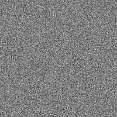
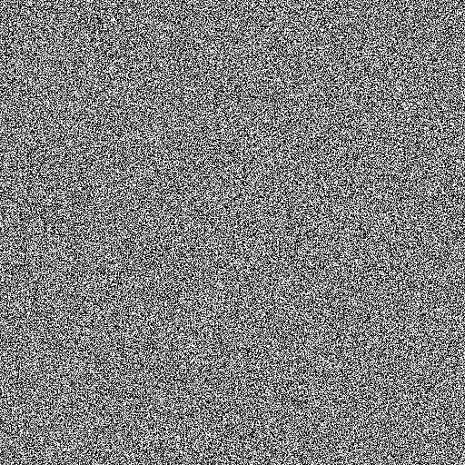
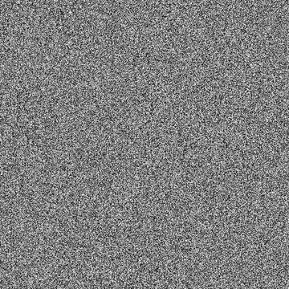

# 白杂色

<table>
<tr style="border: 0;">
<td width="33.33%" style="border: 0;" valign="top">

{width="200px"}

<b>进入：</b>纹理生成器>噪声

</td>
<td width="100.00%" style="border: 0;" valign="top">

## 描述

使用针对不同直方图形状的三种方法之一生成白色噪声：均匀、高斯和三角形。

</td>
</tr>
</table>

## 输出

|  |  |
|:---|:---|
| <b>输出</b> <i>灰度</i> | 生成的灰度位图噪声。 |

## 参数

|  |  |
|:---|:---|
| <b>噪声分发</b> <i>整数</i> | 将食材分布到目标直方图形状的方法：<ul data-preserve-html="true"> <li data-preserve-html="true"><i>一致：</i>平面直方图。</li> <li data-preserve-html="true"><i>高斯：</i>表示正态分布的直方图，类似于钟形曲线。</li> <li data-preserve-html="true"><i>三角形：</i>三角形直方图。</li> </ul> |
| <b>无序</b> <i>Float</i> | 置换噪声的组成部分。    这可用于为噪声制作动画。 |
| <b>无序速度</b> <i>Float</i> | 调整<b>无序</b>参数应用的位移的距离。    在为噪声制作动画时，这可用于控制位移的速度。 |

## 示例

<table style="table-layout:fixed">
    <tr style="border: 0;">
        <td style="border: 0;">
            
        </td>
        <td style="border: 0;">
            
        </td>
        <td style="border: 0;"></td>
    </tr>
</table>
