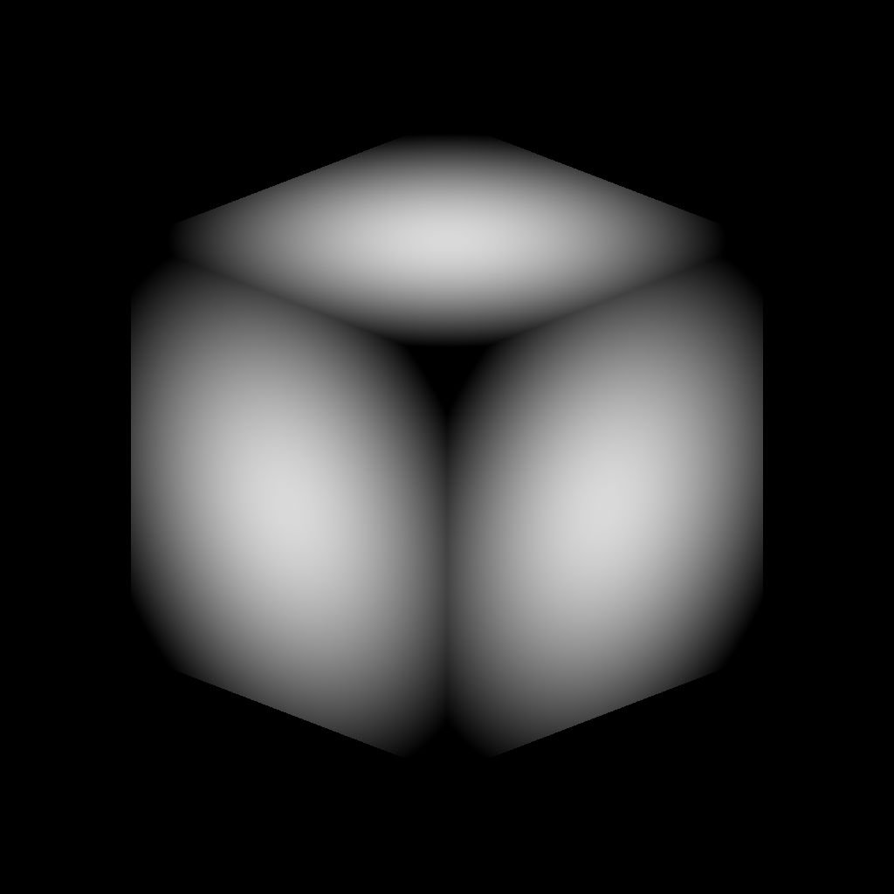

# 3D体积蒙版

<table>
<tr style="border: 0;">
<td width="41.60%" style="border: 0;" valign="top">

{width="256px"}

**进入：**&#x200B;生成器*/Pattern*

**简单**

</td>
<td width="58.30%" style="border: 0;" valign="top">

## 描述

**3D体积蒙版**&#x200B;节点基于&#x200B;**位置**&#x200B;输入图生成&#x200B;*基本形状*&#x200B;的表示形式。

</td>
</tr>
</table>

## 参数

### 输入

* **位置** *颜色*\
  描述基元的&#x200B;*3D空间坐标*&#x200B;的映射表示为。\
  **X/Y/Z**&#x200B;坐标分别映射到&#x200B;**R/G/B**&#x200B;通道。

### 参数

* **形状** *整数*\
  应表示的原始形状：
  * *多维数据集*- *圆柱体*- *球体*
* **缩放** *Float*\
  定义基元的&#x200B;*全局*&#x200B;缩放，在所有轴上统一应用&#x200B;**。
* **大小** *Float3*\
  定义每个轴上的形状大小。
* **位置输入** *整数*\
  *通过&#x200B;**位置**输入表示空间*&#x200B;的方法：
  * *UV位置*：使用&#x200B;*UV映射*。 X/Y(U/V)坐标分别映射到R/G通道。 假设Z轴为&#x200B;*正交正向*&#x200B;向量。
  * *世界空间位置*：使用&#x200B;*位置映射*&#x200B;来映射3D空间中的基元。 X/Y/Z坐标分别映射到R/G/B通道。
* **位置UV** *Float2*\
  图元在UV空间中的位置。\
  *注意*：仅当&#x200B;**位置输入**&#x200B;参数设置为&#x200B;*UV位置*&#x200B;时，此参数才可用。
* **位置** *Float3*\
  图元在世界空间中的位置。\
  *注意*：仅当&#x200B;**位置输入**&#x200B;参数设置为&#x200B;*世界空间位置*&#x200B;时，此参数才可用。
* **旋转** *Float3*\
  定义形状在世界空间中的旋转。
* **羽化宽度** *Float*\
  从基元表面向内调整&#x200B;*淡化渐变*&#x200B;的宽度。

## 示例图像

<table>
<tr style="border: 0;">
<td style="border: 0;" valign="top">

{width="256px"}

</td>
<td style="border: 0;" valign="top">

{width="256px"}

</td>
<td style="border: 0;" valign="top">

{width="256px"}

</td>
<td style="border: 0;" valign="top">

{width="256px"}

</td>
</tr>
</table>
