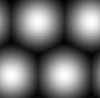

# 肺泡

<table>
<tr style="border: 0;">
<td width="33.33%" style="border: 0;" valign="top">

{width="128px"}

<b>进入：</b>纹理生成器>图案

</td>
<td width="100.00%" style="border: 0;" valign="top">

## 描述

一种软球图案，可交替生成六边形拼贴。

</td>
</tr>
</table>

## 参数

|  |  |
|:---|:---|
| <b>拼贴</b> <i>1 - 16</i> | 设置结果应平铺的次数。 |
| <b>渐变填充细胞</b> <i>False/True</i> | 切换到锐化边缘，制作边缘尖锐的六边形拼贴。 |
| <b>间隙宽度</b> <i>0.0 - 1.0</i> | 仅当上述选项设置为“False”时才有效。 更改间隙大小。 |
| <b>非正方形扩展</b> <i>False/True</i> | 启用以非方形比例补偿挤压和拉伸。 |

## 示例

<table style="margin-top: 32px; margin-bottom: 32px">
    <tr style="border: 0">
        <td style="border: 0; background: transparent">
            
        </td>
    </tr>
</table>
