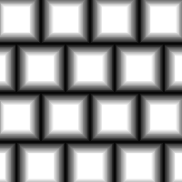

# 砖块生成器

<table>
<tr style="border: 0;">
<td width="33.33%" style="border: 0;" valign="top">

{width="128px"}

<b>进入：</b>纹理生成器>图案

</td>
<td width="100.00%" style="border: 0;" valign="top">

## 描述

高级砖形图案生成器。 有很多选项可用来专门生成人造砖纹图案

有关更多选项，请参阅[Tile Generator](../../../../../../compositing-graphs/nodes-reference-for-com/node-library/texture-generators/patterns/tile-generator/tile-generator.md)。

</td>
</tr>
</table>

## 参数

|  |  |
|:---|:---|
| <b>砖块</b> <i>1 - 64</i> | 设置X和Y轴中的砖块数量。 |
| <b>斜面</b> <i>0.0 - 1.0</i> | 更改砖块的斜面轮廓，允许在两个方向更改以及设置衰减轮廓和圆角化。 |
| <b>保持比例</b> <i>False/True</i> | 使斜角配置文件与砖块大小是否绑定。 |
| <b>间隙</b> <i>0.0 - 1.0</i> | 砖块之间要留的间隔。 请记住，斜面还会引入间隙，因此设置斜面意味着您必须对此参数进行补偿。 |
| <b>中等大小</b> <i>0.0 - 1.0</i> | 砖块模式偏移量，更改每列或每行的大小。 |
| <b>Height</b> <i>-1.0 - 1.0</i> | 修改Height配置文件。 允许引入明亮度变化和各种随机化。 |
| <b>斜率</b> <i>-1.0 - 1.0</i> | 引入每个砖块的斜率，就好像某些砖块是倾斜的。 |
| <b>偏移</b> <i>0.0 - 1.0</i> | 基于行偏移砖块，影响每行的间距。 |
| <b>非正方形扩展</b> <i>False/True</i> | 启用以非方形比例补偿挤压和拉伸。 |

## 示例

<table style="margin-top: 32px; margin-bottom: 32px">
    <tr style="border: 0">
        <td style="border: 0; background: transparent">
            
        </td>
        <td style="border: 0; background: transparent">
            
        </td>
    </tr>
</table>
