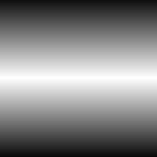

# 渐变线性3

<table>
<tr style="border: 0;">
<td width="33.33%" style="border: 0;" valign="top">

<b>进入：</b>纹理生成器>图案

</td>
<td width="100.00%" style="border: 0;" valign="top">

## 描述

最高级的线性渐变。 此节点返回一个尖锐的直线斜率，并且为中点提供了额外的控制，而不是[线性渐变2](../../../../../../compositing-graphs/nodes-reference-for-com/node-library/texture-generators/patterns/gradient-linear-2/gradient-linear-2.md)的圆形管道状轮廓。

</td>
</tr>
</table>

## 参数

|  |  |
|:---|:---|
| <b>拼贴</b> <i>1 - 16</i> | 设置结果应平铺的次数。 |
| <b>位置</b> <i>0.0 - 1.0</i> | 设置渐变的中点或峰值所在的位置。 |
| <b>旋转</b> <i>0， 90°</i> | 将方向从左右更改为上下，反之亦然。 |

## 示例

<table style="margin-top: 32px; margin-bottom: 32px">
    <tr style="border: 0">
        <td style="border: 0; background: transparent">
            
        </td>
    </tr>
</table>
