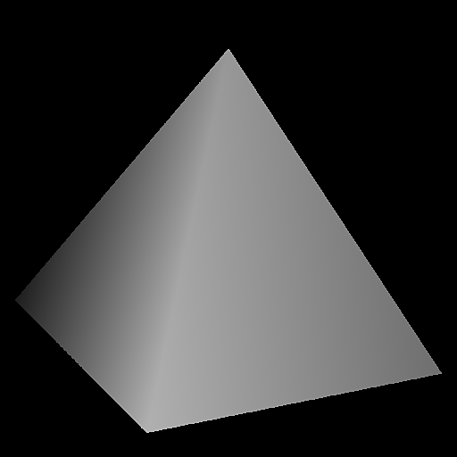

# 高度挤出

<table>
<tr style="border: 0;">
<td width="33.33%" style="border: 0;" valign="top">

{width="200px"}

<b>进入：</b>纹理生成器>图案

</td>
<td width="100.00%" style="border: 0;" valign="top">

## 描述

高度挤出从输入高度图渲染3D Z深度。 就像[形状凸出](../../../../../../compositing-graphs/nodes-reference-for-com/node-library/texture-generators/patterns/shape-extrude/shape-extrude.md)和[立方体3D](../../../../../../compositing-graphs/nodes-reference-for-com/node-library/texture-generators/patterns/cube-3d/cube-3d.md)一样，它允许您在2D 视图中旋转相机。 其主要目标是作为生成器用于从平面高图创建3D旋转形状。 然后可以将这些形状与[形状飞溅](../../../../../../compositing-graphs/nodes-reference-for-com/node-library/texture-generators/patterns/shape-splatter/shape-splatter.md)一起使用。

与[形状凸出](../../../../../../compositing-graphs/nodes-reference-for-com/node-library/texture-generators/patterns/shape-extrude/shape-extrude.md)的主要区别在于，输入图不必是二进制“alpha”类型的映射，而是全范围灰度映射。 这意味着您可以更好地控制凸出Height（有机、复杂形状），但不能控制斜面配置文件（硬表面、更简单的形状）。

</td>
</tr>
</table>

## 参数

|  |  |
|:---|:---|
| <b>相机角度</b> | 相机的欧拉角，半转。 请注意，水平旋转和缩放直接应用于输入。 |
| <b>相机比例</b> <i>0.001 - 3.0</i> | 应用于输出的全局缩放。 |
| <b>Height比例</b> <i>0.0 - 2.0</i> | 将全局因子应用于输入Height值。 |
| <b>垂直偏移</b> <i>-1.0 - 1.0</i> | 向上或向下移动最终输出。 |
| <b>地面</b> <i>关闭/打开</i> | 如果地面处于关闭状态，则会显示输入为0的黑色背景，而不是类似地面的平面。 |
| <b>正常格式</b> <i>DirectX/OpenGL</i> | <b>法线格式</b>参数可反转法线图的y坐标。 |
| <b>正常强度</b> <i>0.0 - 256.0</i> | 与<b>正常</b>节点的<b>强度</b>参数相同。 将其设置为256可在旋转时获得无共享的正常。 |
