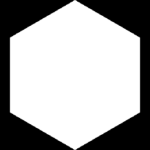

# 多边形1

<table>
<tr style="border: 0;">
<td style="border: 0;" valign="top">

{width="128px"}

## 多边形1

**英寸：** *纹理生成器**/Patterns*

**中级**

</td>
<td style="border: 0;" valign="top">

## 描述

生成多边形形状，其中包含许多调整选项。 有关更简单的版本，请参阅[多边形2](../../../../../../compositing-graphs/nodes-reference-for-com/node-library/texture-generators/patterns/polygon-2/polygon-2.md)。

## 参数

* **边数**： *3 - 32*&#x200B;设置多边形应具有的边数。
* **爆炸**： *0.0 - 1.0*&#x200B;将多边形“切片”分开。
* **三角形大小**： *0.0 - 1.0*&#x200B;调整切片/三角形的大小。 任何调整都可能使形状分离，只有1,1。 完全连接！
* **缩放**： *0.0 - 1.0*&#x200B;将整个形状作为一个整体进行缩放。
* **自动缩放**： *False/True*&#x200B;调整缩放，使整个多边形适合视图，并使用默认参数。
* **旋转**： *0.0 - 1.0*&#x200B;旋转整个形状。
* **渐变**： *False/True*&#x200B;生成渐变切片/三角形，而不是纯色切片/三角形。 注意：启用此设置后，将变得与多边形2类似。
* **渐变反转**： *False/True*&#x200B;如果启用了“渐变”，则反转渐变方向。
* **拼贴**： *1 - 16*\
  设置结果应平铺的次数。
* **非正方形扩展**： *False/True*\
  启用以非方形比例补偿挤压和拉伸。
* **非方形拼贴**&#x200B;**：** *False/True*启用非正方形扩展功能后，这将拼贴形状而不压缩。

## 示例图像

</td>
</tr>
</table>
